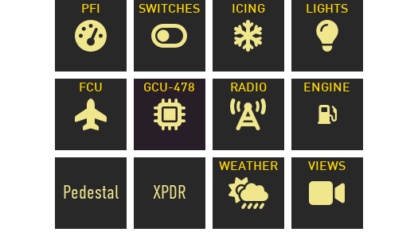
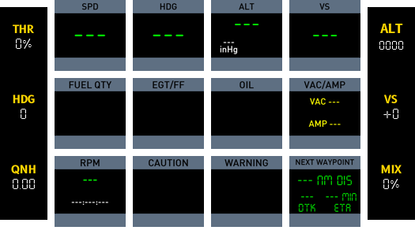
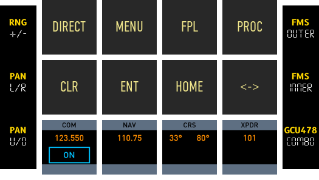

# cockpitdecks-configs
A collection of aircraft configs for [cockpitdecks](https://github.com/devleaks/cockpitdecks).

Documentation: [Cockpitdecks Configs Docs](https://dlicudi.github.io/cockpitdecks-configs/)

## Aircraft

Aircraft configs completed, planned or in progress.

### Laminar Research
- [x] LR Cessna 172 SP (Laminar Research)
- [x] LR Cirrus SR22 (Laminar Research) 
- [x] LR Beechcraft Baron 58 (Laminar Research)
- [x] LR Lancair Evolution (Laminar Research)

### Toliss
- [x] Toliss Airbus A321 Neo (devleaks)
- [ ] Toliss Airbus A320 Neo

### Aerobask
- [x] LR Robin DR401 (Aerobask)

## Installation

Install `cockpitdecks` as a Python package, then clone this repository as config data:

```sh
python3 -m venv .venv
source .venv/bin/activate
python -m pip install --upgrade pip
pip install 'cockpitdecks[xplane,loupedeck] @ git+https://github.com/dlicudi/cockpitdecks.git'
git clone https://github.com/dlicudi/cockpitdecks-configs.git
```

`cockpitdecks-configs` is not a Python package, so it should be cloned, not installed with `pip`.


## Examples

### Home


### Primary Flight Instruments


### Garmin GCU-478


## Preview Generation

Deck docs, preview images, and generated SR22 markdown can be regenerated in one step:

```sh
python3 scripts/generate_deck_docs.py
```

This produces page-only preview images and generated doc fragments from config plus sample datarefs, without requiring X-Plane to be running.


## Notes on long press buttons

> [!IMPORTANT]
> You must have either the deckconfig in the Aircraft's folder or a symlink (on MAC an alias will not work) e.g.
> `ln -s ~/Documents/GitHub/cockpitdecks-configs/decks/cessna-172-sp/deckconfig ~/X-Plane\ 12/Aircraft/Laminar\ Research/Cessna\ 172\ SP`
