# Aerobask Robin DR401

## Deck Functions

### Home
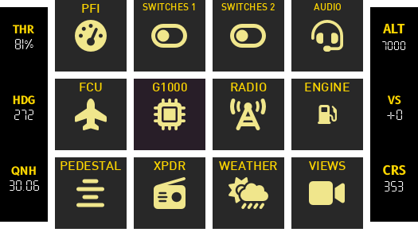{ :width="200" }

### PFI
{ :width="200" }

### Switches
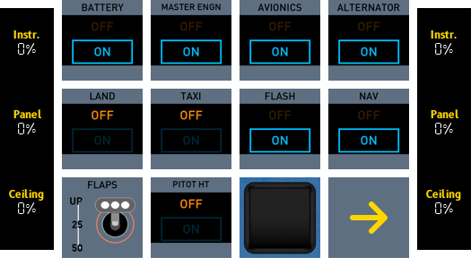{ :width="200" }
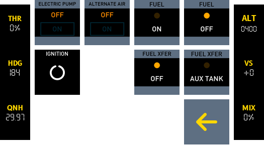{ :width="200" }

### Audio Panel
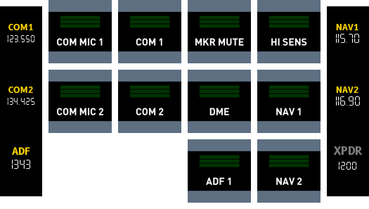{ :width="200" }

### FCU
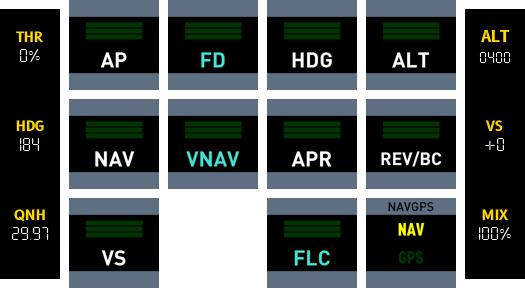{ :width="200" }

### G1000
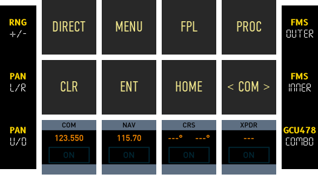{ :width="200" }

### Radio
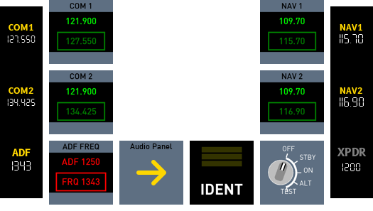{ :width="200" }

### Engine
{ :width="200" }

!!! Warning
    Engine to be corrected for engine type.

### Pedestal
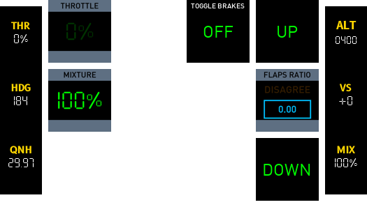{ :width="200" }

### Transponder
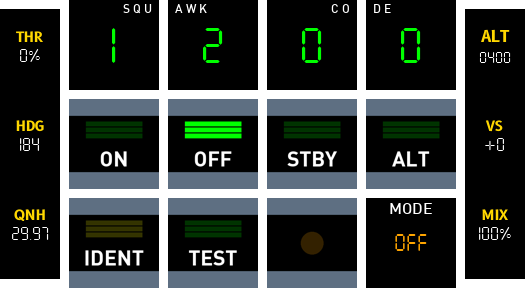{ :width="200" }

### Weather
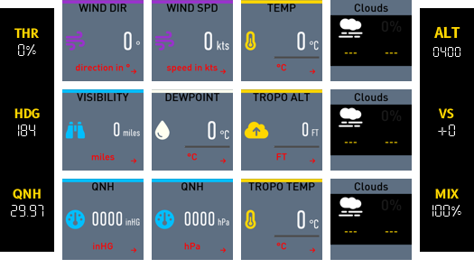{ :width="200" }

### Views
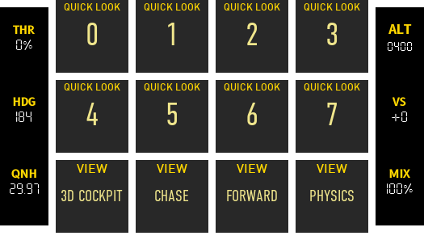{ :width="200" }
