<!-- generated by scripts/generate_deck_docs.py; do not edit directly -->

# Robin DR401

*Aerobask / X-Plane 12*

GA single-engine with G1000 glass cockpit. Layouts for Loupedeck Live and Stream Deck XL covering primary flight, engine, radio, and navigation pages.

=== "Loupedeck Live"

    Loupedeck Live layout with 13 pages.

    

    -   **Home**

        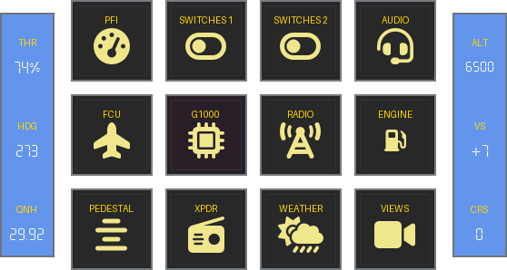

        [:material-github: `index.yaml`](https://github.com/dlicudi/cockpitdecks-configs/blob/main/decks/aerobask-robin-dr401/deckconfig/loupedecklive1/index.yaml)

    -   **PFI**

        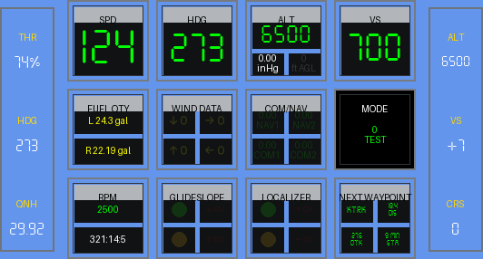

        [:material-github: `pfi.yaml`](https://github.com/dlicudi/cockpitdecks-configs/blob/main/decks/aerobask-robin-dr401/deckconfig/loupedecklive1/pfi.yaml)

    -   **Switches**

        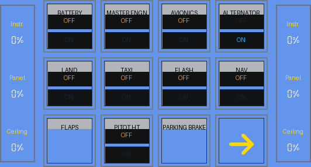

        [:material-github: `switches.yaml`](https://github.com/dlicudi/cockpitdecks-configs/blob/main/decks/aerobask-robin-dr401/deckconfig/loupedecklive1/switches.yaml)

    -   **FCU**

        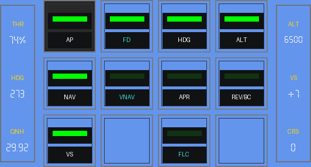

        [:material-github: `fcu.yaml`](https://github.com/dlicudi/cockpitdecks-configs/blob/main/decks/aerobask-robin-dr401/deckconfig/loupedecklive1/fcu.yaml)

    -   **Radio**

        

        [:material-github: `radio.yaml`](https://github.com/dlicudi/cockpitdecks-configs/blob/main/decks/aerobask-robin-dr401/deckconfig/loupedecklive1/radio.yaml)

    -   **Engine**

        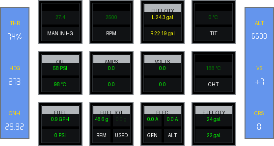

        [:material-github: `engine.yaml`](https://github.com/dlicudi/cockpitdecks-configs/blob/main/decks/aerobask-robin-dr401/deckconfig/loupedecklive1/engine.yaml)

    -   **Weather**

        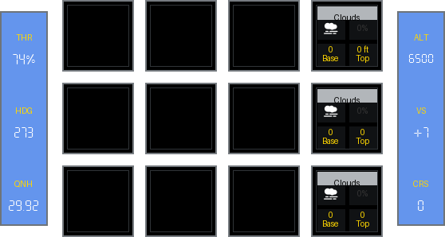

        [:material-github: `weather.yaml`](https://github.com/dlicudi/cockpitdecks-configs/blob/main/decks/aerobask-robin-dr401/deckconfig/loupedecklive1/weather.yaml)

    -   **Transponder**

        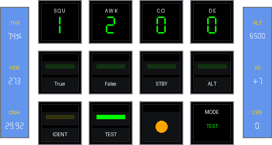

        [:material-github: `transponder.yaml`](https://github.com/dlicudi/cockpitdecks-configs/blob/main/decks/aerobask-robin-dr401/deckconfig/loupedecklive1/transponder.yaml)

    -   **Switches 2**

        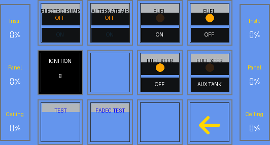

        [:material-github: `switches2.yaml`](https://github.com/dlicudi/cockpitdecks-configs/blob/main/decks/aerobask-robin-dr401/deckconfig/loupedecklive1/switches2.yaml)

    -   **Audio Panel**

        

        [:material-github: `audiopanel.yaml`](https://github.com/dlicudi/cockpitdecks-configs/blob/main/decks/aerobask-robin-dr401/deckconfig/loupedecklive1/audiopanel.yaml)

    -   **G1000**

        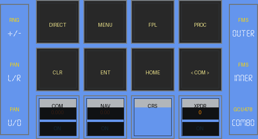

        [:material-github: `g1000.yaml`](https://github.com/dlicudi/cockpitdecks-configs/blob/main/decks/aerobask-robin-dr401/deckconfig/loupedecklive1/g1000.yaml)

    -   **Pedestal**

        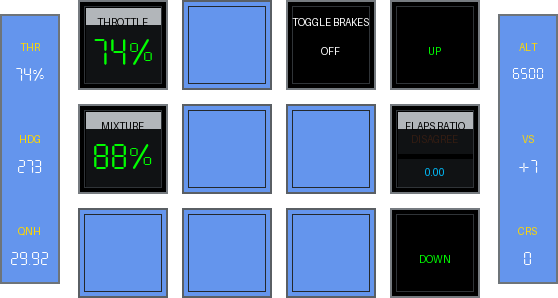

        [:material-github: `pedestal.yaml`](https://github.com/dlicudi/cockpitdecks-configs/blob/main/decks/aerobask-robin-dr401/deckconfig/loupedecklive1/pedestal.yaml)

    -   **Views**

        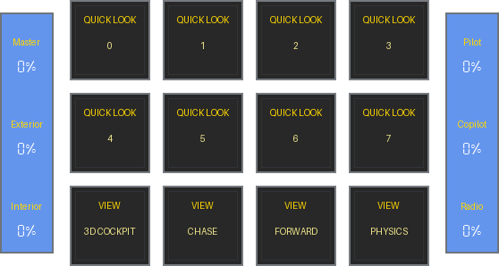

        [:material-github: `views.yaml`](https://github.com/dlicudi/cockpitdecks-configs/blob/main/decks/aerobask-robin-dr401/deckconfig/loupedecklive1/views.yaml)

    

=== "Stream Deck XL"

    Stream Deck XL layout with 12 pages.

    

    -   **Home**

        

        [:material-github: `index.yaml`](https://github.com/dlicudi/cockpitdecks-configs/blob/main/decks/aerobask-robin-dr401/deckconfig/streamdeckxl1/index.yaml)

    -   **PFD**

        

        [:material-github: `pfd.yaml`](https://github.com/dlicudi/cockpitdecks-configs/blob/main/decks/aerobask-robin-dr401/deckconfig/streamdeckxl1/pfd.yaml)

    -   **MFD**

        

        [:material-github: `mfd.yaml`](https://github.com/dlicudi/cockpitdecks-configs/blob/main/decks/aerobask-robin-dr401/deckconfig/streamdeckxl1/mfd.yaml)

    -   **Switches**

        

        [:material-github: `switches.yaml`](https://github.com/dlicudi/cockpitdecks-configs/blob/main/decks/aerobask-robin-dr401/deckconfig/streamdeckxl1/switches.yaml)

    -   **Audio Panel**

        

        [:material-github: `audiopanel.yaml`](https://github.com/dlicudi/cockpitdecks-configs/blob/main/decks/aerobask-robin-dr401/deckconfig/streamdeckxl1/audiopanel.yaml)

    -   **FCU**

        

        [:material-github: `fcu.yaml`](https://github.com/dlicudi/cockpitdecks-configs/blob/main/decks/aerobask-robin-dr401/deckconfig/streamdeckxl1/fcu.yaml)

    -   **G1000**

        

        [:material-github: `g1000.yaml`](https://github.com/dlicudi/cockpitdecks-configs/blob/main/decks/aerobask-robin-dr401/deckconfig/streamdeckxl1/g1000.yaml)

    -   **Radio**

        

        [:material-github: `radio.yaml`](https://github.com/dlicudi/cockpitdecks-configs/blob/main/decks/aerobask-robin-dr401/deckconfig/streamdeckxl1/radio.yaml)

    -   **Engine**

        

        [:material-github: `engine.yaml`](https://github.com/dlicudi/cockpitdecks-configs/blob/main/decks/aerobask-robin-dr401/deckconfig/streamdeckxl1/engine.yaml)

    -   **Transponder**

        

        [:material-github: `transponder.yaml`](https://github.com/dlicudi/cockpitdecks-configs/blob/main/decks/aerobask-robin-dr401/deckconfig/streamdeckxl1/transponder.yaml)

    -   **Weather**

        

        [:material-github: `weather.yaml`](https://github.com/dlicudi/cockpitdecks-configs/blob/main/decks/aerobask-robin-dr401/deckconfig/streamdeckxl1/weather.yaml)

    -   **Views**

        

        [:material-github: `views.yaml`](https://github.com/dlicudi/cockpitdecks-configs/blob/main/decks/aerobask-robin-dr401/deckconfig/streamdeckxl1/views.yaml)

    

## Status

!!! success "State: Stable"
