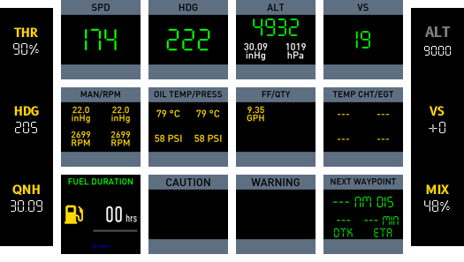
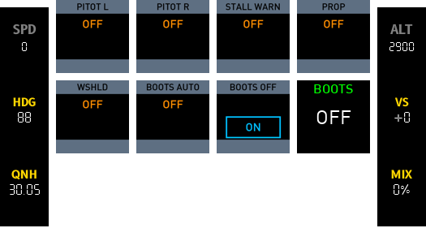
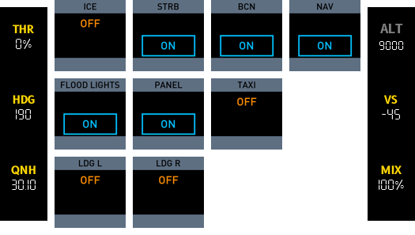
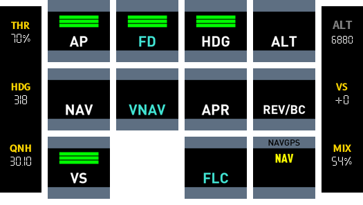
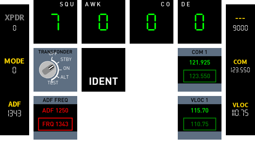
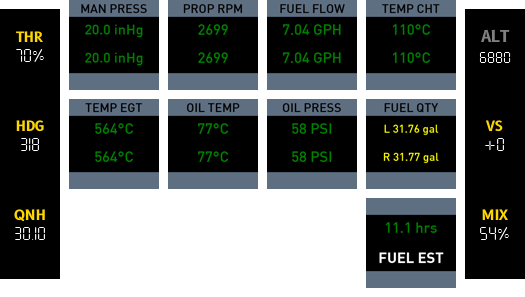
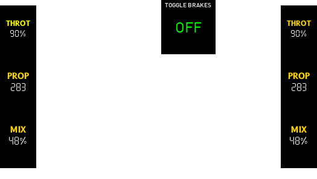
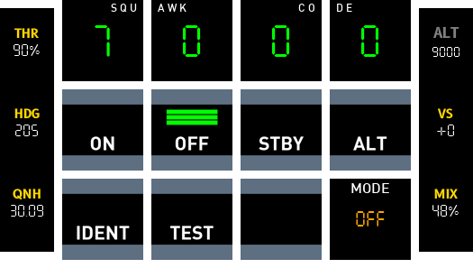

# Beechcraft Baron 58

## Cockpit Functions

### Primary Instruments
:small_blue_diamond:
**Airspeed Indicator**
:small_blue_diamond:
Attitude Indicator (AI)
:small_blue_diamond:
Horizontal Situation Indicator (HSI)
:small_blue_diamond:
Turn Coordinator
:small_blue_diamond:
**Altimeter**
:small_blue_diamond:
Distance Measuring Equipment (DME) Master Display
:small_blue_diamond:
**Vacuum Gauge**
:small_blue_diamond:
ADF (Automatic Direction Finder)
:small_blue_diamond:
**Variometer**
:small_blue_diamond:
VOR / ILS Receiver
:small_blue_diamond:

### Engine Instrumentation
:small_blue_diamond:
**Manifold Pressure**
:small_blue_diamond:
**Propeller RPM**
:small_blue_diamond:
**Fuel Flow**
:small_blue_diamond:
**Engine Temperature**
:small_blue_diamond:
**Oil Temperature and Pressure**
:small_blue_diamond:

### Avionics Panel
:small_blue_diamond:
Audio Switching Panel
:small_blue_diamond:
Transponder
:small_blue_diamond:
COMM 1 and COMM 2 Radios
:small_blue_diamond:
NAV 1 and NAV 2 Radios
:small_blue_diamond:
GNS 530
:small_blue_diamond:
ADF Frequency Selection Panel
:small_blue_diamond:

### Instrument Sub Panel
:small_blue_diamond:
Master Electrical Switches
:small_blue_diamond:
Avionics Master Power and Prop Sync
:small_blue_diamond:
Pitot Heat Switches
:small_blue_diamond:
Icing Switches
:small_blue_diamond:
Fuel Boost Pump Switches
:small_blue_diamond:
Lights Panel
:small_blue_diamond:
Landing Gear Lever
:small_blue_diamond:
Parking Brake
:small_blue_diamond:
**Fuel Gauges**
:small_blue_diamond:
Prop Amps and De-Icing Gauges
:small_blue_diamond:
Flap Lever
:small_blue_diamond:
Panel Light Dimmers
:small_blue_diamond:

### Throttle Quadrant and Center Console
:small_blue_diamond:
**Throttle Levers**
:small_blue_diamond:
Prop Levers
:small_blue_diamond:
**Mixture Levers**
:small_blue_diamond:
Rudder Trim Wheel
:small_blue_diamond:
Elevator Trim Wheel
:small_blue_diamond:
Aileron Trim Wheel
:small_blue_diamond:
Cowl Flap Levers
:small_blue_diamond:

### Autopilot
:small_blue_diamond:
**AP ON/OFF**
:small_blue_diamond:
**HDG (Heading) Mode**
:small_blue_diamond:
**FD ON**
:small_blue_diamond:
**ALT (Altitude) Mode**
:small_blue_diamond:
**NAV (Navigation) Mode**
:small_blue_diamond:
**BC (Back Course) Mode**
:small_blue_diamond:
**APPR Mode**
:small_blue_diamond:
YAW ON
:small_blue_diamond:
**DN / UP Rocker Switch**
:small_blue_diamond:

## Deck Functions

### PFI
{: width="100" }

:small_blue_diamond:
SPD
:small_blue_diamond:
HDG
:small_blue_diamond:
ALT
:small_blue_diamond:
VS
:small_blue_diamond:

:small_blue_diamond:
FUEL QTY
:small_blue_diamond:
EGT/FF
:small_blue_diamond:
OIL
:small_blue_diamond:
VAC/AMP
:small_blue_diamond:

:small_blue_diamond:
RPM
:small_blue_diamond:
CAUTION
:small_blue_diamond:
WARNING
:small_blue_diamond:
NEXT WAYPOINT
:small_blue_diamond:

### Switches
{: width="100" }
{: width="100" }
{: width="100" }

### FCU
{: width="100" }

### Radio
{: width="100" }

### Engine
{: width="100" }

### Pedestal
{: width="100" }

### Transponder
{: width="100" }

----

