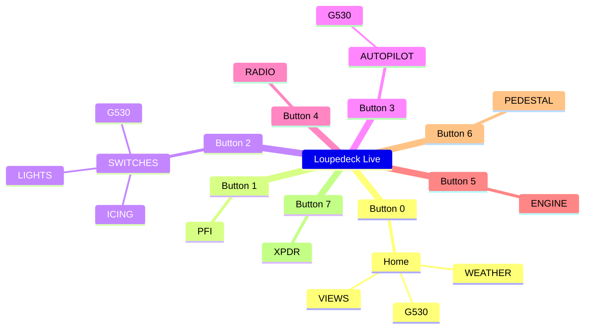
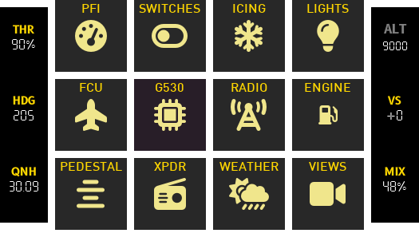
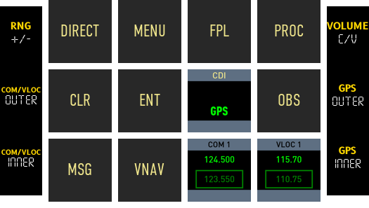
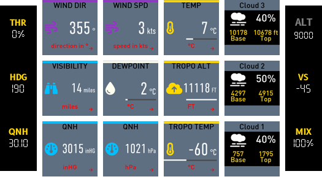
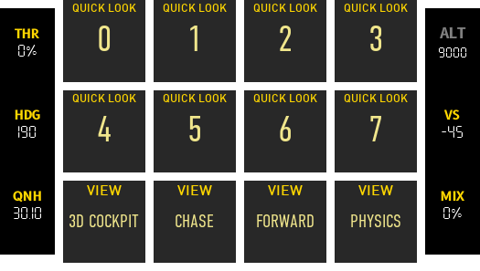

# Beechcraft Baron 58

## Cockpit Overview

{ :width="200" }

This configuration supports various cockpit functions for the Beechcraft Baron 58.

Primary Instruments (1)
Engine Instrumentations (2)
Avionics Panel (3)
Instrument Sub Panel (4)
Throttle Quadrant / Center Console (5)
Autopilot (6)
{ .annotate }

1.  **Primary Instruments**
    - [x] Airspeed Indicator
    - [x] Altimeter
    - [x] Vacuum Gauge
    - [x] Variometer
2.  **Engine Instrumentations**
    - [x] Manifold Pressure
    - [x] Propeller RPM
    - [x] Fuel Flow
    - [x] Engine Temperature
    - [x] Oil Temperature and Pressure
3.  **Avionics Panel**
    - [x] Transponder
    - [x] COMM 1 and COMM 2 Radios
    - [x] NAV 1 and NAV 2 Radios
    - [x] GNS 530
    - [x] ADF Frequency Selection Panel
4.  **Instrument Sub Panel**
    - [x] Master Electrical Switches
    - [x] Avionics Master Power and Prop Sync
    - [x] Pitot Heat Switches
    - [x] Icing Switches
    - [x] Fuel Boost Pump Switches
    - [x] Lights Panel
    - [x] Landing Gear Lever
    - [x] Parking Brake
    - [x] Fuel Gauges
5.  **Throttle Quadrant / Center Console**
    - [x] Throttle Levers
    - [x] Prop Levers
    - [x] Mixture Levers
6.  **Autopilot**  
    - [x] AP
    - [x] HDG
    - [x] FD
    - [x] ALT
    - [x] NAV
    - [x] BC
    - [x] APPR
    - [x] DN / UP Rocker Switch

## Deck Functions

This cockpit deck consists of 13 pages and 4 unique encoder configurations.

The pages can be accessed via the hardware buttons 1 through to 7 or buy navigating to the home page via the 0 button.

### Pages

#### Home
{ :width="200" }

The home page provides an index to all the various pages available (up to a total of 12).

The bottom buttons can provide quick access to up to 7 different pages.

!!! note warning
    Various pages are still work in progress (e.g. Pedestal, Views)

#### PFI
{ :width="200" }

Central to this page is data you would consider primary flight instruments.
The **speed**, **bearing**, **altitude** and **vertical speed** fill the first row.

The second row consists of engine data in a more compact form than that found in the engine page.

The third row consists of:

- Fuel duration (a calculation of time remaining based on fuel flow and fuel quantity).
- Caution annunciators.
- Warning annunciators.
- Information on the next waypoint in flight plan.

#### Switches
{ :width="200" }

This page provides buttons for **battery**, **alternators**, **avionics**, **prop sync** and **fuel pumps**.

There are also two ignition buttons **IGN 1** and **IGN 2** which are longpress buttons to start engines.

**Icing** and **lights** have had to be placed in separate pages as it was impossible to fit them here.

#### Icing
{ :width="200" }

There are buttons to cover icing functions for left and right pitot (**PITOT L** and **PITOT R**), stall warn, prop and windshield.

For boots functions there is a **BOOTS AUTO** which can set the boots to inflate automatically at intervals, a button to switch boots off (**BOOTS OFF**) and a longpress button (**BOOTS**) that can be used to manually inflate boots.

#### Lights
{ :width="200" }

Most of these are self explanatory. One possible improvement will be to add encoders for the panel lights.  

#### FCU
{ :width="200" }

#### G530
{ :width="200" }

#### Radio
{ :width="200" }

#### Engine
{ :width="200" }

#### Pedestal
{ :width="200" }

#### Transponder
{ :width="200" }

#### Weather
{ :width="200" }

This page provides comprehensive weather data including coverage for different cloud layers and tropo data.

#### Views
{ :width="200" }

Provides quick look functions (long press to memorise views).
Also provides standard views (3D Cockpit, Chase, Forward, Physics)

----

### Encoders

#### FCU
Provides barometer setting (QNH), throttle/mix (**THR**/**MIX**) controls and autopilot controls such as **HDG** and **VS**. Throttle and Mixture can be set to 100% by pressing the encoder.

-   :material-clock-fast:{ .lg .middle } __Left__

    ---
    - [x] **THR** Throttle control (both engines).
    - [x] **HDG** Heading/bearing for autopilot.
    - [x] **QNH** Altimeter barometer setting.

-   :material-clock-fast:{ .lg .middle } __Right__

    ---
    - [ ] **ALT** Not used.
    - [x] **VS** Vertical speed.
    - [x] **MIX** Fuel mixture (both engines).

#### Radio
Provides controls for XPDR, Transponder mode, ADF frequency, COM and VLOC. XPDR, ADF, COM and VLOC encoders have a coarse/fine toggle; pressing the encoder will toggle between coarse/fine adjustment.

-   :material-clock-fast:{ .lg .middle } __Left__

    ---
    - [x] **XPDR** Transponder identifier.
    - [x] **Mode** Transponder ^STBY/ON/ALT/TEST^.
    - [x] **ADF** ADF frequency.

-   :material-clock-fast:{ .lg .middle } __Right__

    ---
    - [ ] Not used.
    - [x] **COM** COM1 frequency.
    - [x] **VLOC** VLOC frequency.

#### Pedestal
Provides individual throttle, prop and mixture engine controls.

-   :material-clock-fast:{ .lg .middle } __Left__

    ---
    - [x] **THROT** Throttle for left engine.
    - [x] **PROP** Propeller speed for left engine.
    - [x] **MIX** Fuel mixture control for left engine.

-   :material-clock-fast:{ .lg .middle } __Right__

    ---
    - [x] **THROT** Throttle for right engine.
    - [x] **PROP** Propeller speed for right engine.
    - [x] **MIX** Fuel mixture control for right engine.

#### G530
These encoders provide control of G530 elements.

-   :material-clock-fast:{ .lg .middle } __Left__

    ---
    - [x] **RNG** Zoom in and out of map.
    - [x] **COM/VLOC OUTER** Coarse control for COM or VLOC frequency. 
    - [x] **COM/VLOC INNER** Fine control for COM or VLOC frequency.

-   :material-clock-fast:{ .lg .middle } __Right__

    ---
    - [x] **VOLUME** Controls COM1 or VLOC volume (push button to toggle between).
    - [x] **GPS OUTER** Coarse control for GPS knob. 
    - [x] **GPS INNER** Fine control for GPS knob.

## Procedures
Procedures in relation to Loupedeck functions.

### Before Starting Engines
- [ ] Exterior Inspection – COMPLETED
- [x] Parking Brake – ON
- [x] Power Levers – SLIGHTLY FORWARD
- [ ] Propeller Levers – FULL FORWARD
- [x] Mixture Levers – FULL FORWARD
- [x] All switches – OFF
- [x] Battery Switch – ON
- [x] Fuel Quantity – CHECK
- [ ] Check Annunciator Panel Warning Lights.

### Engine Start 

- [x] Master Battery Switch – CHECK ON
- [x] Avionics Master Switch – OFF
- [ ] Left Alternator Switch – ON
- [x] Left Magneto Switch – START (hold until engine running)

#### When Left Engine Running
- [x] Left Power Lever – IDLE (FULL BACK)
- [ ] Left Magneto Switch – CHECK BOTH
- [ ] Right Alternator Switch – ON
- [x] Right Magneto Switch – START (hold until engine running)

#### When Right Engine Running
- [x] Right Power Lever – IDLE (FULL BACK)
- [x] Right Magneto Switch – CHECK BOTH
