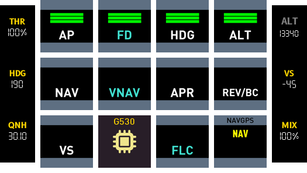
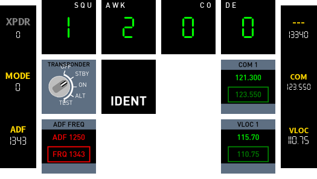
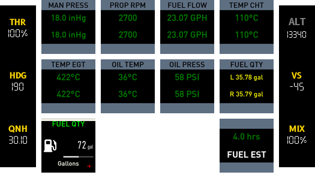
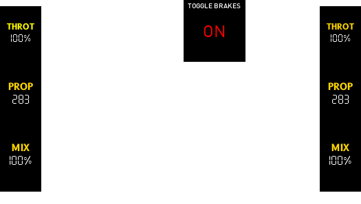
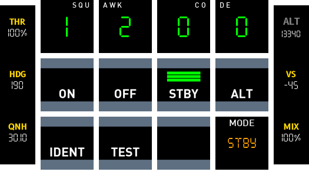

# Beechcraft Baron 58

MTOW 5,400 lbs
{: .label .label-green }

Cruise 197 kts
{: .label .label-green }

Fuel Type AVGAS
{: .label .label-green }

Load 5
{: .label .label-green }

{: width="100" }
{: width="100" }
{: width="100" }
{: width="100" }
{: width="100" }
{: width="100" }
{: width="100" }
{: width="100" }
{: width="100" }

----

## Overview
Deck consists of 7 pages which can be accessed via the lower hardware numbered button.

1
{: .label .label-green }
2
{: .label .label-blue }
3
{: .label .label-red }
4
{: .label .label-yellow }
5
{: .label .label-green }
6
{: .label .label-red }
7
{: .label .label-yellow }

1. PFI (Primary flight instruments)
2. Switches (Battery, alternator, lights etc)
   1. Icing
   2. Lights
3. FCU (Provides autopilot functions)
4. Radio (ADF, COM/NAV functions)
5. Engine (Displays engine data)
6. Pedestal (Flaps, gear)
7. Transponder (Change transponder mode and id)

----

## Supported Variants 
- [x] Cessna_172SP_G1000
- [x] Cessna_172SP_seaplane
- [x] Cessna_172SP

{: .highlight }
Additional buttons were added to support the additional G1000 AP functions (FD/VNAV/FLC).