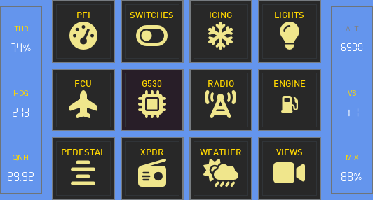
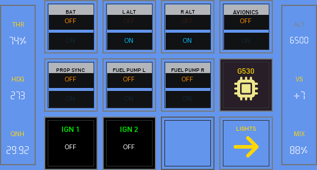
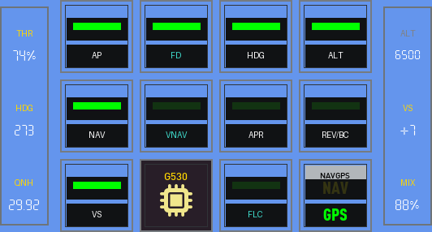
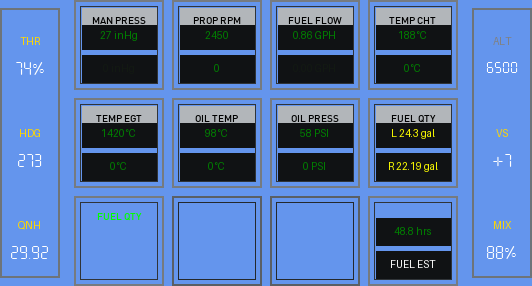
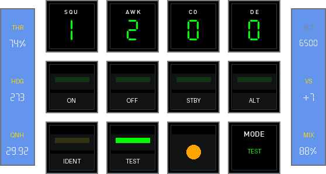
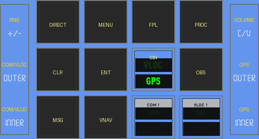
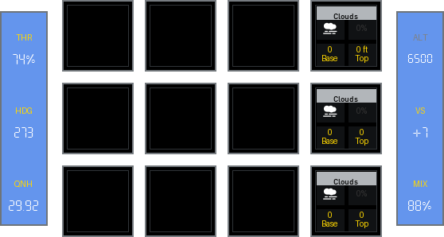
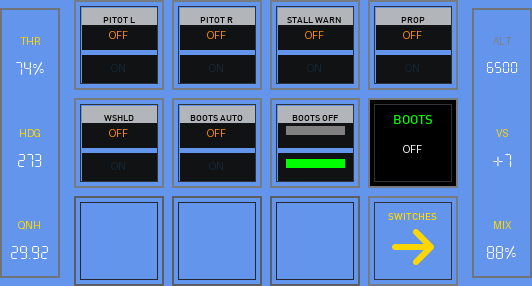
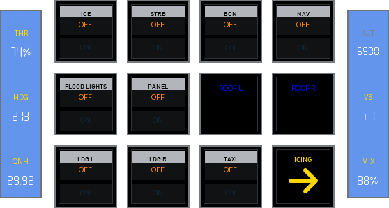

# Beechcraft Baron 58

!!! note "Auto-generated"
    This page is generated by `scripts/generate_deck_docs.py` — do not edit directly.

Decks for Beechcraft Baron 58

### Loupedeck Live

✅ <strong>Stable</strong>&emsp;📄 13 pages&emsp;🎮 Loupedeck Live

Home

<a href="https://github.com/dlicudi/cockpitdecks-configs/blob/main/decks/beechcraft-baron-58/deckconfig/loupedecklive1/index.yaml">index.yaml</a>

PFI

<a href="https://github.com/dlicudi/cockpitdecks-configs/blob/main/decks/beechcraft-baron-58/deckconfig/loupedecklive1/pfi.yaml">pfi.yaml</a>

Switches

<a href="https://github.com/dlicudi/cockpitdecks-configs/blob/main/decks/beechcraft-baron-58/deckconfig/loupedecklive1/switches.yaml">switches.yaml</a>

FCU

<a href="https://github.com/dlicudi/cockpitdecks-configs/blob/main/decks/beechcraft-baron-58/deckconfig/loupedecklive1/fcu.yaml">fcu.yaml</a>

Radio

<a href="https://github.com/dlicudi/cockpitdecks-configs/blob/main/decks/beechcraft-baron-58/deckconfig/loupedecklive1/radio.yaml">radio.yaml</a>

Engine

<a href="https://github.com/dlicudi/cockpitdecks-configs/blob/main/decks/beechcraft-baron-58/deckconfig/loupedecklive1/engine.yaml">engine.yaml</a>

Pedestal

<a href="https://github.com/dlicudi/cockpitdecks-configs/blob/main/decks/beechcraft-baron-58/deckconfig/loupedecklive1/pedestal.yaml">pedestal.yaml</a>

Transponder

<a href="https://github.com/dlicudi/cockpitdecks-configs/blob/main/decks/beechcraft-baron-58/deckconfig/loupedecklive1/transponder.yaml">transponder.yaml</a>

G530

<a href="https://github.com/dlicudi/cockpitdecks-configs/blob/main/decks/beechcraft-baron-58/deckconfig/loupedecklive1/g530.yaml">g530.yaml</a>

Weather

<a href="https://github.com/dlicudi/cockpitdecks-configs/blob/main/decks/beechcraft-baron-58/deckconfig/loupedecklive1/weather.yaml">weather.yaml</a>

Views

<a href="https://github.com/dlicudi/cockpitdecks-configs/blob/main/decks/beechcraft-baron-58/deckconfig/loupedecklive1/views.yaml">views.yaml</a>

Switch Panel

<a href="https://github.com/dlicudi/cockpitdecks-configs/blob/main/decks/beechcraft-baron-58/deckconfig/loupedecklive1/switchesicing.yaml">switchesicing.yaml</a>

Switch Panel

<a href="https://github.com/dlicudi/cockpitdecks-configs/blob/main/decks/beechcraft-baron-58/deckconfig/loupedecklive1/switcheslights.yaml">switcheslights.yaml</a>

