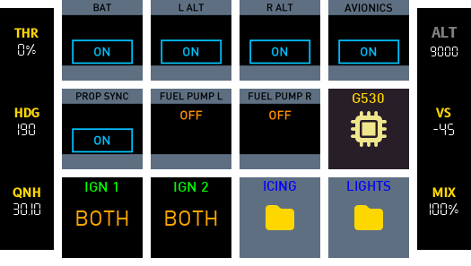
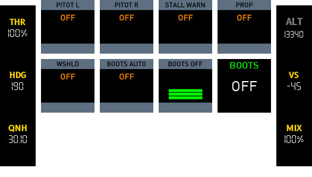

## Switch Panel

{: width="200" }
{: width="200" }
{: width="200" }

### Ignition
*Starter motor long press push button.*

PythonPlugin required for long press button (<X-Plane Path>/Resources/Plugins/PythonPlugins/PI_cockpitdecks_helper.py)

### Alternator
*On/off button for alternator (when engine is running provides power to systems and charges battery).*

### Battery
*On/off button for battery (provides power when engine is not running).*

### Fuel Pump
*On/off button for electric fuel pump. Used for priming engine before start (also substitutes mechanical pump in case of a failure).*

### Beacon
*On/off for rotating beacon light.*

### Landing lights
*On/off button for landing light.*

### Taxi lights
*On/off button for taxi light.*

### Navigation lights
*On/off button for navigation lights (wings/tail).*

### Strobe Lights
*On/off button for strobe lights (wing).*

### Pitot Heat
*On/off button for pitot tube heater.*

### Avionics Bus 1
*On/off button to power BUS1.*
- Comm Panel
- G530 GPS
- Transponder
- Autopilot
- BUS2

### Avionics Bus 2
*On/off button to power BUS2.*
- G430 GPS
- VOR2
- ADF
