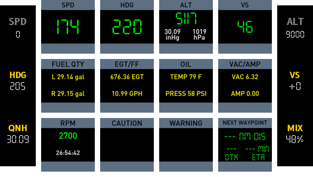
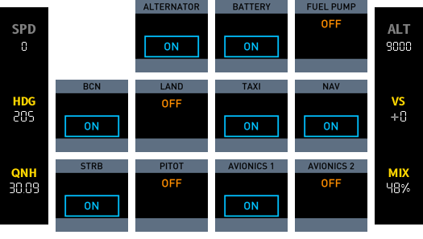
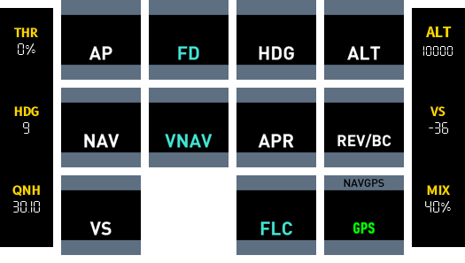
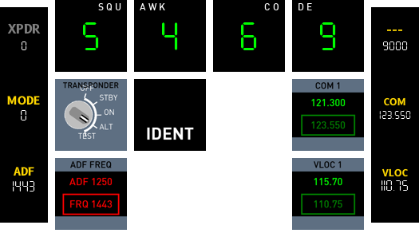
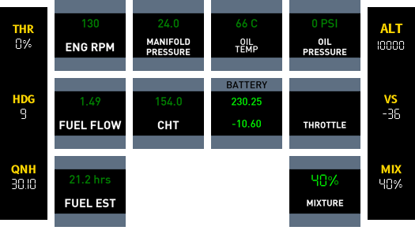
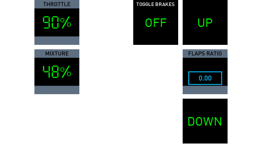
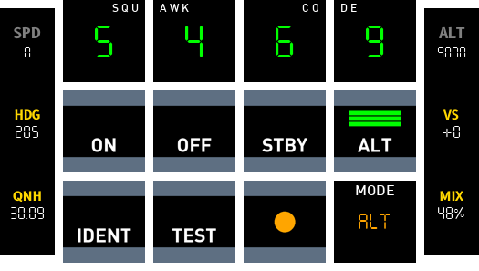

# Cessna 172 SP
{ :width="200" }

## Supported Functions

-   :material-clock-fast:{ .lg .middle } __Primary Instruments__

    ---

    - [x] Airspeed Indicator
    - [ ] Attitude Indicator
    - [x] Heading Indicator
    - [ ] Turn Coordinator
    - [x] Altimeter
    - [x] Vertical Speed Indicator
  
-   :fontawesome-brands-markdown:{ .lg .middle } __Secondary Instruments__

    ---

    - [ ] Chronometer
    - [x] Fuel
    - [x] Exhaust Gas Temp / Fuel Flow
    - [x] Oil Temperature / Pressure
    - [x] Vac Pressure / Battery Ammeter
    - [x] Propeller RPM / Hobbs Meter
    - [ ] VOR1 / ILS Receiver
    - [ ] VOR2 Receiver
    - [ ] ADF Receiver

-   :material-format-font:{ .lg .middle } __Avionics__

    ---

    - [ ] Audio Switching Panel
    - [ ] GNS 530
    - [ ] GNS 430
    - [x] Transponder Panel
    - [x] Autopilot Panel
    - [ ] ADF Panel
    - [x] NAV / GPS Button

-   :material-light-switch:{ .lg .middle } __Switch Panel__

    ---

    - [x] Magneto-Select, and Starter
    - [x] Master Alternator and Battery Switch
    - [x] Toggle Switches
    - [x] Avionics Bus Switches
    - [ ] Panel and Radio Brightness Controls
    - [ ] Pedestal and Glare-Shield Brightness Controls

-   :material-engine:{ .lg .middle } __Throttle & Mixture / Pedestal__

    ---

    - [x] Throttle Lever
    - [x] Mixture Lever
    - [ ] Elevator Trim
    - [ ] Fuel Selector
    - [ ] Panel and Radio Brightness Controls
    - [ ] Pedestal and Glare-Shield Brightness Controls

-   :warning:{ .lg .middle } __Annunciator Panel__

    ---

    - [x] L FUEL R
    - [x] OIL PRESS
    - [x] L VAC R
    - [x] VOLTS

## Supported Variants 

!!! note "G1000"
    Additional buttons were added to support the additional G1000 AP functions (FD/VNAV/FLC).# Engine

- [x] Cessna_172SP_G1000
- [x] Cessna_172SP_seaplane
- [x] Cessna_172SP

## Pages

Deck consists of 7 pages which can be accessed via the lower hardware numbered button.

### PFI (Primary flight instruments)

- **Airspeed Indicator:** Displays speed in knots.
- **Heading:** Displays magnetic bearing.
- **Altimeter:** Displays altitude and barometer setting.
- **Vertical Speed:** Displays vertical speed.
- **Fuel Quantity:**  Fuel remaining in left/right tank. Fuel converted from kg to gallons using RPN 0.264172.
- **EGT and Fuel Flow:** Displays exhaust gas temperature and fuel flow.
- **Oil:** Displays oil temperature and pressure.
- **Vacuum/Pressure and Battery Ammeter:** Vacuum pressure and battery current (positive indicates charging, negative depleting).
- **Propeller Speed:** Propeller speed in RPM. Engine RPM the same given that it is direct drive.
- **Caution Annunciators:** Oil pressure and voltage caution annunciators.
- **Warning Annunciators:** Fuel pressure and vacuum pressure warning annunciators.
- **NAVGPS mode:** Display for navigation mode and also a push button to toggle between NAV (VLOC) and GPS.
- **Next Waypoint:** If there is a flight plan being followed, this button will display data related to the next waypoint e.g. nautical miles left, desired track (bearing), and ETA in minutes.    

### Switches
Switches (Battery, alternator, lights etc)

!!! warning
    PythonPlugin required for long press button (<X-Plane Path>/Resources/Plugins/PythonPlugins/PI_cockpitdecks_helper.py)

- **Starter motor:** Long press push button functionality is facilitated by a Python plugin.
- **Alternator:** Controls power supply to systems and battery charging when the engine is running.
- **Battery:** Controls power supply when the engine is not running.
- **Fuel Pump:** Controls electric fuel pump for priming engine and as a backup for mechanical pump failure.
- **Beacon:** On/off control for rotating beacon light.
- **Landing Lights:** On/off control for landing light.
- **Taxi Lights:** On/off control for taxi light.
- **Navigation Lights:** On/off control for wing and tail lights.
- **Strobe Lights:** On/off control for wing strobe lights.
- **Pitot Heat:** On/off control for pitot tube heater.
- **Avionics Bus 1:** Powers BUS1, including Comm Panel, G530 GPS, Transponder, Autopilot, and BUS2.
- **Avionics Bus 2:** Powers BUS2, including G430 GPS, VOR2, and ADF.

### FCU
FCU (Provides autopilot functions)

!!! Note
      Some functions are not available on S-TEC 55 Autopilot (Cessna 172 G530 model).

- **AP:** Engages or disengages the autopilot system.
- **FD:** *Not available on S-TEC 55 Autopilot model.* Provides visual cues for manual flight control based on autopilot logic without actually controlling the aircraft.
- **HDG:** Heading mode. Autopilot turns the aircraft to heading selected via Heading Bug knob.
- **ALT:** Altitude mode holds the current altitude.
- **NAV:** Directs aircraft heading according to flight plan programmed into GPS (GPS mode) or to/from a radio navigation aid (VLOC mode).
- **VNAV:** *Not available on S-TEC 55 Autopilot model.* Manages aircraft's vertical path according to a predefined route or waypoint altitudes.
- **APR:** Activates an Instrument Landing System (ILS) approach mode for precision guidance during landing approaches.
- **REV/BC:** Engages mode for flying an ILS localiser back-course approach, used for approaches where the aircraft is flying away from the beacon.
- **VS:** Vertical speed mode to maintain an ascent or descent rate.
- **FLC:** *Not available on S-TEC 55 Autopilot model.* Maintains a set airspeed while climbing or descending to a selected altitude.

### Radio
Radio (ADF, COM/NAV functions)

- **ADF FREQ:** Displays ADF frequency and ADF standby frequency. Pressing button will swap frequencies.
- **COM 1:** Displays COM1 frequency and COM1 standby frequency. Pressing button will swap frequencies.
- **VLOC 1:** Displays NAV1 frequency and NAV1 standby frequency. Pressing button will swap frequencies.

### Engine
Engine (Displays engine data)

- **ENG RPM:** Displays engine/prop RPM.
- **MANIFOLD PRESSURE:** Displays manifold pressure.
- **OIL TEMP:** Displays oil temperature.
- **OIL PRESSURE:** Displays oil pressure.
- **FUEL FLOW:** Display fuel flow in GPH.
  - Formula: `fuel_flow_kg_sec 3600 * 0.8 / 3.78541 / 2 roundn`
- **CHT:** Displays cylinder head temp in celsius.
- **BATTERY:**
  1. Displays battery charge in watts per hour.
  2. Displays battery amps (negative value means battery is discharging)
- **THROTTLE:** Displays throttle as a percentage.
- **FUEL EST:** Provides an estimate on fuel remaining in hours, based on current fuel flow.
  - Formula: `fuel_flow_kg_sec[0]} 3 roundn 0.000001 + / 3600 / 1 roundn`
- **MIXTURE:** Displays fuel mixture as a percentage.

### Pedestal
Pedestal (Flaps, gear)

- **THROTTLE:** Displays throttle as a percentage.
- **TOGGLE BRAKES:** Displays the state of the parking brake. Push will toggle parking brake on/off.
- **MIXTURE:** Displays fuel mixture as a percentage.
- **FLAPS UP:** Extends flaps one notch.
- **FLAPS RATIO:** Displays flaps state as a number between 0 and 1 (0 fully retracted, 1 fully extended).
- **FLAPS DOWN:** Retracts flaps one notch.

### Transponder
Transponder (Change transponder mode and id)

- **SQUAWK CODE BUTTONS:** The top four buttons display the squawk code and serve as push buttons to increment the transponder digits.
- **Transponder Mode Buttons:**
  1. ON
  2. OFF
  3. STBY
  4. ALT
  5. TEST
- **IDENT:** Transmits radio beacon for a short period of time.
- **RADIO BEACON:** Displays an R if the transponder is broadcasting. This will display intermittently or constantly for a short period of time if IDENT is pushed.
- **MODE:** Displays the current mode of the transponder.

