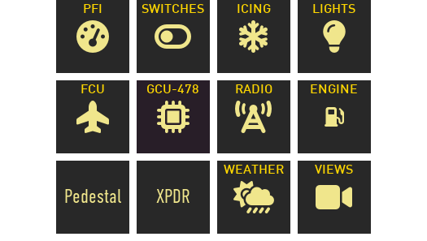
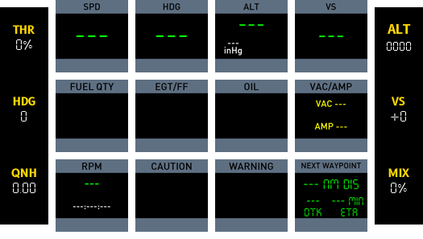
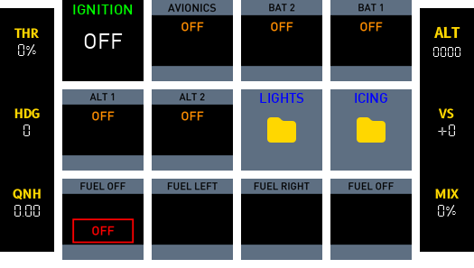
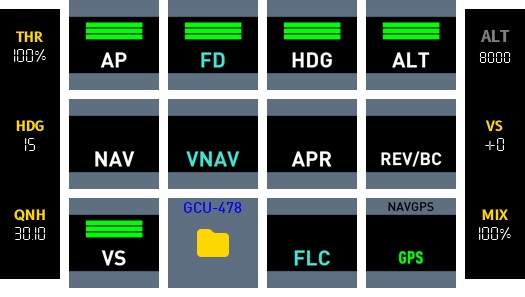
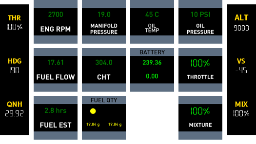
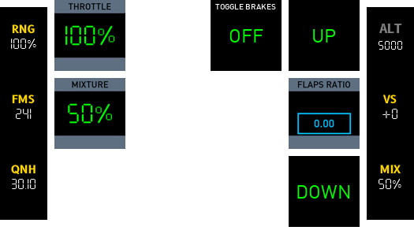
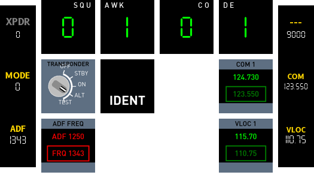
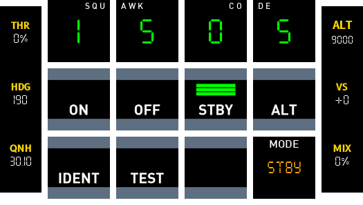

# Cirrus SR22

## Functions

Battery and Electrical Panel(1) G1000 Control Panel(2) Autopilot Controls(3) Audio Panel(4) Flap Panel(5) Throttle Quadrant(6) Backup Instrumentation(7) Parking Brake and Alternate Air Selector(8) PFD Controls & Features(9) MFD Controls & Features(10).
{ .annotate }

1.  :man_raising_hand: Battery and Electrical Panel:
    - [x] Ignition
    - [x] Electrics (BAT 1, BAT 2, ALT 1, ALT 2)
    - [x] AVIONICS
    - [x] Lights (NAV, STROBE, LAND, ICE)
    - [x] Ice Protection (PITOT HEAT, ICE PROTECT, PUMP BKUP, WIND SHLD)
    - [ ] Instrument Lighting

2.  :man_raising_hand: G1000 Control Panel:
    - [x] Direct To (a waypoint)
    - [x] MENU key
    - [x] PROC key
    - [x] FMS rotary
    - [x] COM/NAV/CRS/XPDR rotary combo
        - [x] NAV button
        - [x] COM button
        - [x] XPDR button
        - [x] CRS button
    - [ ] IDENT button
    - [ ] Frequency toggle button
    - [ ] Keypad
    - [x] Range rotary
    - [x] FPL button
    - [x] CLR button
    - [x] ENT button
    - [x] Home button

3.  :man_raising_hand: Autopilot Controls:
    - [x] Rotary
        - [x] HDG Rotary
        - [x] DN/UP VS Rotary
        - [x] ALT SEL Rotary
    - [x] APR
    - [x] AP
    - [x] LVL
    - [x] FLC
    - [x] VNV
    - [x] ALT
    - [x] VS
    - [x] FD
    - [x] NAV
    - [x] HDG

4.  :man_raising_hand: Audio Panel:
    - [ ] COM1/COM2
    - [ ] MIC1/MIC2
    - [ ] NAV1/NAV2
    - [ ] MKR MUTE

5.  :man_raising_hand: Flap Panel:
    - [x] FLAP LEVER
    - [ ] SUPPLIMENTAL OXYGEN

6.  :man_raising_hand: Throttle Quadrant:
    - [x] THROTTLE
    - [x] MIXTURE
    - [ ] FUEL (TANK) SELECTOR

7.  :man_raising_hand: Backup Instrumentation:
    Not Implemented

8.  :man_raising_hand: Parking Brake and Alternate Air selector:
    - [ ] PARKING BRAKE
    - [ ] ALTERNATE AIR SOURCE

9.  :man_raising_hand: PFD Controls & Features:
    - [ ] NAV Audio Squelch
    - [ ] Active & Stand-by NAV1 and NAV2 Frequencies
    - [ ] Attitude Indicator
    - [x] Next Waypoint
    - [ ] Active & Stand-by COM1 and COM Frequencies
    - [ ] COM Frequency Toggle
    - [ ] COM Audio Squelch
    - [ ] COM Rotary
    - [ ] CRS/BARO Rotary
    - [x] Altimeter
    - [ ] Joystick
    - [ ] Flight Plan Key Group
    - [ ] FMS Rotary
    - [ ] Horizontal Situation Indicator (HSI)
    - [ ] Soft Keys
    - [x] ALT Rotary
    - [ ] Autopilot Key Group
    - [ ] HDG Rotary
    - [x] Airspeed Indicator
    - [ ] NAV Rotary
    - [ ] NAV Frequency Toggle

10.  :man_raising_hand: MFD Controls & Features:
    - [ ] NAV Audio Squelch
    - [ ] Active & Stand-by NAV1 and NAV2 Frequencies
    - [ ] Navigation Map
    - [ ] Data Fields
    - [ ] COM Frequency Toggle
    - [ ] COM Audio Squelch
    - [ ] COM Rotary
    - [ ] CRS/BARO Control
    - [ ] Joystick
    - [ ] Flight Plan Key Group
    - [ ] FMS Rotary
    - [ ] Soft Keys
    - [ ] ALT Rotary
    - [ ] Autopilot Key Group
    - [ ] HDG Rotary
    - [ ] NAV Rotary
    - [ ] NAV Frequency Toggle
    - [ ] Engine Indication System (EIS)


## Home
Provides links to pages (up to 12).



!!! note
    The numbered buttons (1 to 7) also provide links to pages but this is limited to 7.


## PFI
Primary Flight Instruments.




Airspeed Indicator(1) Heading(2) Altimeter(3) Vertical Speed(4) Fuel Quantity(5) EGT and Fuel Flow(6) 
{ .annotate }

1.  Airspeed Indicator 
    *Displays speed in knots.*

2.  Heading
    *Displays magnetic bearing.*

3.  Altimeter
    *Displays altitude and barometer setting.*

4.  Vertical Speed
    *Displays vertical speed.*

5.  Fuel Quantity
    *Displays fuel remaining in left and right tank.*

6.  EGT and Fuel Flow

    *Displays exhaust gas temperature and fuel flow.*
    *Fuel is in kg and is converted to gallons using `RPN 0.264172 *`*

6.  Oil
    *Displays oil temperature and pressure.*

7.  Vacuum/Pressure and Battery Ammeter
    *Displays vaccuum pressure (necessary for operating of air driven instruments) and displays battery current (positive indicates charging, negative depleting).*

8.  Propeller Speed
    *The propeller speed in RPM. Engine RPM is also the same given that it is direct drive.*

9.  Caution Annunciators
    *Displays oil pressure and voltage caution annunciators.*

10. Warning Annunciators
    *Displays fuel pressure and vacuum pressure warning annunciators.*

11. NAVGPS mode
    *Display for navigation mode and also a push button to toggle between NAV (VLOC) and GPS.*

12. Next Waypoint
    *If there is a flight plan being followed this button will display data related to the next waypoint e.g. nautical miles left, desired track (bearing) and ETA in minutes.*


## Switches
Main switches and access to light and ice related functions.



IGNITION(1) AVIONICS(2) BAT 2(3) BAT 1(4)
{ .annotate }

ALT 1(5) ALT 2(6) LIGHTS(7) ICING(8)
{ .annotate }

FUEL OFF(9) FUEL LEFT(10) FUEL OFF(11)
{ .annotate }


1.  Ignition: *Starter motor long press push button.*
    PythonPlugin required for long press button `<X-Plane Path>/Resources/Plugins/PythonPlugins/PI_cockpitdecks_helper.py)`
2.  AVIONICS: *On/off button to power BUS1/BUS2.*
3.  BAT 2: *On/off button for battery 2 (provides power when engine is not running).*
4.  BAT 1: *On/off button for battery 1 (provides power when engine is not running).*
5.  ALT 1: *On/off button for alternator (when engine is running provides power to systems and charges battery 1).*
6.  ALT 2: *On/off button for alternator (when engine is running provides power to systems and charges battery 2).*
7.  LIGHTS: *Takes you to Lights page.*
8.  ICING: *Takes you to Icing page.*
9.  FUEL OFF: Sets fuel selector to left off position.
10. FUEL LEFT: Sets fuel selector to left position.
11. FUEL RIGHT: Sets fuel selector to right position.
12.  FUEL OFF: Sets fuel selector to right off position.


### Lights

NAV(1) STROBE(2) LAND(3) ICE(4)
{ .annotate }

1.  Navigation lights
    *On/off button for navigation lights (wings/tail).*
2.  Strobe Lights
    *On/off button for strobe lights (wing).*
3.  Landing lights
    *On/off button for landing light.*
4.  Ice lights
    *On/off button for ice light (Illuminates the leading edges of the wings).*


### Icing

PITOT(1) ICE PROTECT(2) PUMP BKUP(3) NORM/HIGH(4)
{ .annotate }

PROP(5) WSHLD(6)
{ .annotate }

1.  Pitot Heat
    *Activates the pitot tube heating element.*
2.  Ice Protect
    *Set to ON to inject de-icing fluid along the wing, horizontal stabilizer, and propeller blades.*
3.  PUMP BKUP
    *Activates backup de-icing fluid pump.*
4.  NORM/HIGH
    Use NORM when icing conditions are encountered and prior to icing occurring.
    Use MAX when ice buildup has occurred.
    MAX switch does not toggle – it must be held in position for the duration of the process.  
5.  PROP
    *On/off button for prop heating element.*
6.  WSHLD
    *On/off button for windshield de-icing.*


## FCU
Autopilot related functions.



AP(1) FD(2) HDG(3) ALT(4)
{ .annotate }

NAV(5) VNAV(6) APR(7) REV/BC(8)
{ .annotate }

VS(9) FLC(10) HSI GPS(11) HSI NAV(12)
{ .annotate }

1.  AP
2.  FD provides visual cues for manual flight control based on autopilot logic without actually controlling the aircraft.
3.  HDG
4.  ALT
5.  NAV
6.  VNAV manages aircraft's vertical path according to a predefined route or waypoint altitudes.
7.  APR
8.  REV/BC
9.  VS
10. FLC Maintains a set airspeed while climbing or descending to a selected altitude.
11. HSI GPS Toggles between GPS 1 and GPS 2 navigation modes.
12. HSI NAV Toggles between VOR 1 and VOR 2 navigation modes.


## Engine
Displays engine related data.



!!! note
    Fuel flow uses the following formula for GPH:
    ```fuel_flow_kg_sec 3600 * 0.8 / 3.78541 / 2 roundn```

    Fuel estimate uses the following formula:
    ```fuel_flow_kg_sec[0]} 3 roundn 0.000001 + / 3600 / 1 roundn```


## Pedestal


THROTTLE(1) TOGGLE BRAKES(2) FLAPS UP(3)
{ .annotate }

MIXTURE(4) FLAPS RATIO(5)
{ .annotate }

FLAPS DOWN(6)
{ .annotate }

1.  THROTTLE Displays throttle as a percentage.
2.  TOGGLE BRAKES Displays state of the parking brake. Push will toggle parking brake on/off.
3.  FLAPS UP Extends flaps one notch.
4.  MIXTURE Displays fuel mixture as a percentage.
5.  FLAPS RATIO Displays flaps state as a number between 0 and 1 (0 fully retracted, 1 fully extended).
6.  FLAPS DOWN Detracts flaps one notch.


## Radio



SQUAWK DIGIT 1(1) SQUAWK DIGIT 2(2) SQUAWK DIGIT 3(3) SQUAWK DIGIT 4(4)
{ .annotate }

Transponder Mode(5) Ident(6) COM 1(7)
{ .annotate }

ADF FREQ(8) VLOC 1(9)
{ .annotate }

1.  SQUAWK DIGIT 1
2.  SQUAWK DIGIT 2
3.  SQUAWK DIGIT 3
4.  SQUAWK DIGIT 4
5.  Transponder Mode
6.  IDENT
7.  COM 1 Displays COM1 frequency and COM1 standby frequency. Pressing button will swap frequencies.
8.  ADF FREQ Displays ADF frequency and ADF standby frequency. Pressing button will swap frequencies.
9.  VLOC 1 Displays NAV1 frequency and NAV1 standby frequency. Pressing button will swap frequencies.


!!! note
    Transponder functions will be deprecated after moving to a new page.## Switch Panel


## Transponder



### SQUAWK CODE BUTTONS
The top four buttons display the squawk code. They also serve as push buttons to increment the transponder digits.

### Transponder Mode Buttons
1. ON
2. OFF
3. STBY
4. ALT
5. TEST

### IDENT
Transmits radio beacon for a short period of time.

### RADIO BEACON
Displays an R if the transponder is broadcasting. This will display intermittently or constantly for short period of time if IDENT is pushed. 

### MODE
Displays current mode of the transponder.