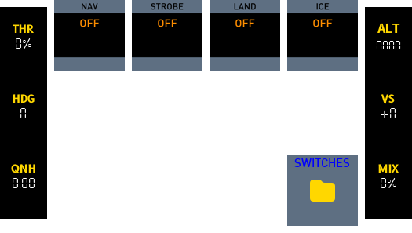
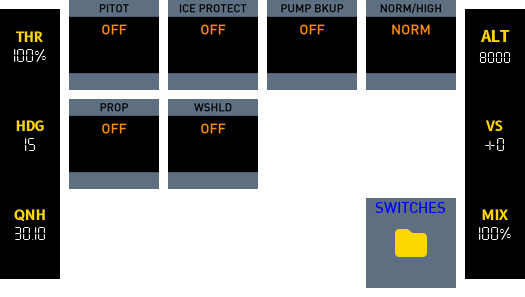
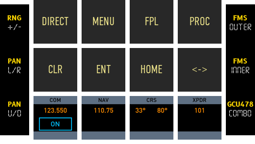

# Cirrus SR22

{: width="100" }
{: width="100" }
{: width="100" }
{: width="100" }
{: width="100" }
{: width="100" }
{: width="100" }

----


## Functions

Battery and Electrical Panel(1) G1000 Control Panel(2) Autopilot Controls(3) Audio Panel(4) Flap Panel(5) Throttle Quadrant(6) Backup Instrumentation(7) Parking Brake and Alternate Air Selector(8) PFD Controls & Features(9) MFD Controls & Features(10).
{ .annotate }

1.  :man_raising_hand: Battery and Electrical Panel:
    - [x] Ignition
    - [x] BAT 1
    - [x] BAT 2
    - [x] ALT 1
    - [x] ALT 2
    - [x] AVIONICS
    - [x] Lights
        - [x] NAV
        - [x] STROBE
        - [x] LAND
        - [x] ICE
    - [x] Ice
        - [x] PITOT HEAT
        - [x] ICE PROTECT
        - [x] PUMP BKUP
        - [x] WIND SHLD
    - [ ] Instrument Lighting

2.  :man_raising_hand: G1000 Control Panel:
    - [x] Direct To (a waypoint)
    - [x] MENU key
    - [x] PROC key
    - [x] FMS rotary
    - [x] COM/NAV/CRS/XPDR rotary combo
        - [x] NAV button
        - [x] COM button
        - [x] XPDR button
        - [x] CRS button
    - [ ] IDENT button
    - [ ] Frequency toggle button
    - [ ] Keypad
    - [x] Range rotary
    - [x] FPL button
    - [x] CLR button
    - [x] ENT button
    - [x] Home button

3.  :man_raising_hand: Autopilot Controls:
    - [x] Rotary
        - [x] HDG Rotary
        - [x] DN/UP VS Rotary
        - [x] ALT SEL Rotary
    - [x] APR
    - [x] AP
    - [x] LVL
    - [x] FLC
    - [x] VNV
    - [x] ALT
    - [x] VS
    - [x] FD
    - [x] NAV
    - [x] HDG

4.  :man_raising_hand: Audio Panel:
    - [ ] COM1/COM2
    - [ ] MIC1/MIC2
    - [ ] NAV1/NAV2
    - [ ] MKR MUTE

5.  :man_raising_hand: Flap Panel:
    - [x] FLAP LEVER
    - [ ] SUPPLIMENTAL OXYGEN

6.  :man_raising_hand: Throttle Quadrant:
    - [x] THROTTLE
    - [x] MIXTURE
    - [ ] FUEL (TANK) SELECTOR

7.  :man_raising_hand: Backup Instrumentation:
    Not Implemented

8.  :man_raising_hand: Parking Brake and Alternate Air selector:
    - [ ] PARKING BRAKE
    - [ ] ALTERNATE AIR SOURCE

9.  :man_raising_hand: PFD Controls & Features:
    - [ ] NAV Audio Squelch
    - [ ] Active & Stand-by NAV1 and NAV2 Frequencies
    - [ ] Attitude Indicator
    - [x] Next Waypoint
    - [ ] Active & Stand-by COM1 and COM Frequencies
    - [ ] COM Frequency Toggle
    - [ ] COM Audio Squelch
    - [ ] COM Rotary
    - [ ] CRS/BARO Rotary
    - [x] Altimeter
    - [ ] Joystick
    - [ ] Flight Plan Key Group
    - [ ] FMS Rotary
    - [ ] Horizontal Situation Indicator (HSI)
    - [ ] Soft Keys
    - [x] ALT Rotary
    - [ ] Autopilot Key Group
    - [ ] HDG Rotary
    - [x] Airspeed Indicator
    - [ ] NAV Rotary
    - [ ] NAV Frequency Toggle

10. :man_raising_hand: MFD Controls & Features:
    - [ ] NAV Audio Squelch
    - [ ] Active & Stand-by NAV1 and NAV2 Frequencies
    - [ ] Navigation Map
    - [ ] Data Fields
    - [ ] COM Frequency Toggle
    - [ ] COM Audio Squelch
    - [ ] COM Rotary
    - [ ] CRS/BARO Control
    - [ ] Joystick
    - [ ] Flight Plan Key Group
    - [ ] FMS Rotary
    - [ ] Soft Keys
    - [ ] ALT Rotary
    - [ ] Autopilot Key Group
    - [ ] HDG Rotary
    - [ ] NAV Rotary
    - [ ] NAV Frequency Toggle
    - [ ] Engine Indication System (EIS)


## Home
Provides links to pages (up to 12).
!!! note inline end
    The numbered buttons (1 to 7) also provide links to pages but this is limited to 7.


## PFI
Primary Flight Instruments.


### Airspeed Indicator
*Displays speed in knots.*

### Heading
*Displays magnetic bearing.*

### Altimeter
*Displays altitude and barometer setting.*

### Vertical Speed
*Displays vertical speed.*

### Fuel Quantity
*Displays fuel remaining in left and right tank.*

Fuel is in kg and is converted to gallons using RPN 0.264172 *

### EGT and Fuel Flow
*Displays exhaust gas temperature and fuel flow.*

### Oil
*Displays oil temperature and pressure.*

### Vacuum/Pressure and Battery Ammeter
*Displays vaccuum pressure (necessary for operating of air driven instruments) and displays battery current (positive indicates charging, negative depleting).*

### Propeller Speed
*The propeller speed in RPM. Engine RPM is also the same given that it is direct drive.*

### Caution Annunciators
*Displays oil pressure and voltage caution annunciators.*

### Warning Annunciators
*Displays fuel pressure and vacuum pressure warning annunciators.*

### NAVGPS mode
*Display for navigation mode and also a push button to toggle between NAV (VLOC) and GPS.*

### Next Waypoint
*If there is a flight plan being followed this button will display data related to the next waypoint e.g. nautical miles left, desired track (bearing) and ETA in minutes.*


## Switches
Main switches and access to light and ice related functions.


## FCU
Autopilot related functions.


!!! warning
    *FD/VNAV/FLC not available on S-TEC 55 Autopilot model.*

    FD provides visual cues for manual flight control based on autopilot logic without actually controlling the aircraft.

    Manages aircraft's vertical path according to a predefined route or waypoint altitudes

    Maintains a set airspeed while climbing or descending to a selected altitude.


# Engine
Displays engine related data.


!!! note
    Fuel flow uses the following formula for GPH:
    ```fuel_flow_kg_sec 3600 * 0.8 / 3.78541 / 2 roundn```

    Fuel estimate uses the following formula:
    ```fuel_flow_kg_sec[0]} 3 roundn 0.000001 + / 3600 / 1 roundn```


# Pedestal


## THROTTLE
Displays throttle as a percentage.

## TOGGLE BRAKES
Displays state of the parking brake. Push will toggle parking brake on/off.

## MIXTURE
Displays fuel mixture as a percentage.

## FLAPS UP
Extends flaps one notch.

## FLAPS RATIO
Displays flaps state as a number between 0 and 1 (0 fully retracted, 1 fully extended).

## FLAPS DOWN
Detracts flaps one notch.


# Radio functions


## ADF FREQ
Displays ADF frequency and ADF standby frequency
Pressing button will swap frequencies.

## COM 1
Displays COM1 frequency and COM1 standby frequency.
Pressing button will swap frequencies.

## VLOC 1
Displays NAV1 frequency and NAV1 standby frequency.
Pressing button will swap frequencies.


{: .highlight }
Transponder functions will be deprecated after moving to a new page.## Switch Panel


### Ignition
*Starter motor long press push button.*

PythonPlugin required for long press button (<X-Plane Path>/Resources/Plugins/PythonPlugins/PI_cockpitdecks_helper.py)

### Alternator
*On/off button for alternator (when engine is running provides power to systems and charges battery).*

### Battery
*On/off button for battery (provides power when engine is not running).*

### Fuel Pump
*On/off button for electric fuel pump. Used for priming engine before start (also substitutes mechanical pump in case of a failure).*

### Beacon
*On/off for rotating beacon light.*

### Landing lights
*On/off button for landing light.*

### Taxi lights
*On/off button for taxi light.*

### Navigation lights
*On/off button for navigation lights (wings/tail).*

### Strobe Lights
*On/off button for strobe lights (wing).*

### Pitot Heat
*On/off button for pitot tube heater.*

### Avionics Bus 1
*On/off button to power BUS1.*
- Comm Panel
- G530 GPS
- Transponder
- Autopilot
- BUS2

### Avionics Bus 2
*On/off button to power BUS2.*
- G430 GPS
- VOR2
- ADF
# Transponder


## SQUAWK CODE BUTTONS
The top four buttons display the squawk code. They also serve as push buttons to increment the transponder digits.

## Transponder Mode Buttons
1. ON
2. OFF
3. STBY
4. ALT
5. TEST

## IDENT
Transmits radio beacon for a short period of time.

## RADIO BEACON
Displays an R if the transponder is broadcasting. This will display intermittently or constantly for short period of time if IDENT is pushed. 

## MODE
Displays current mode of the transponder.