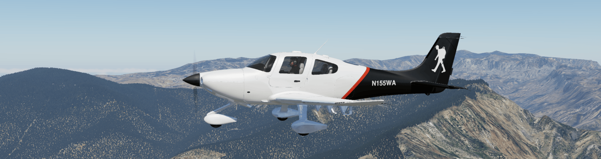

# Cirrus SR22

  

    
Laminar Research / X-Plane 12

    <h1>Cirrus SR22</h1>
    

      G1000-oriented layout for the Loupedeck Live, tuned for fast in-flight page switching and practical SR22 workflows.
    

    
<code>GA</code> <code>Loupedeck Live</code> <code>G1000</code> <code>X-Plane 12</code>

  

  

    
  

## Layouts

  <a class="cdx-card" href="loupedecklive1/">
    

      <h3>Loupedeck Live</h3>
      
`LoupedeckLive` layout with 13 pages.

    

  </a>

