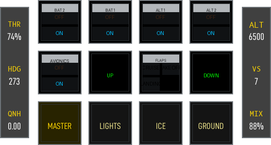
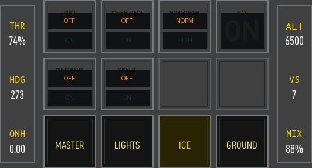
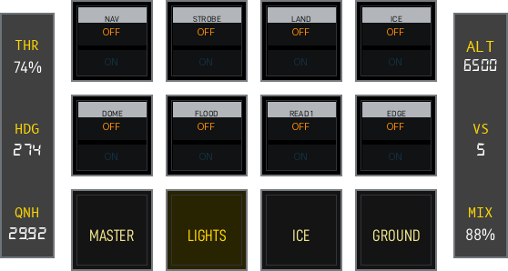
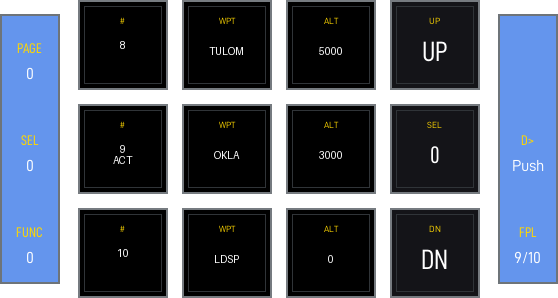
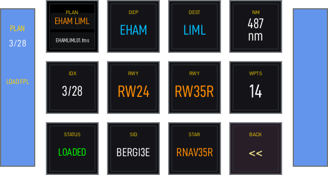
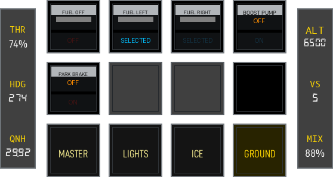
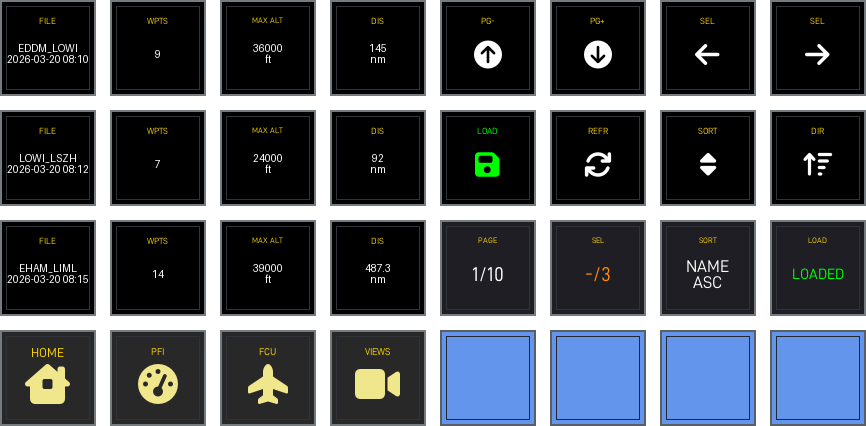

# Cirrus SR22

??? note "Auto-generated"
    This page is generated by `scripts/generate_deck_docs.py` — do not edit directly.

✈️&nbsp;<strong>SR22</strong>&emsp;🏷&nbsp;v1.0.2&emsp;✅&nbsp;<strong>Stable</strong>

Official Cockpitdecks configuration for the Laminar Research Cirrus SR22.

*Full coverage of the G1000-equipped SR22 including FCU, radios, engine monitoring, FMS, switches, and views.*

**Requires:** `Cockpitdecks`, `X-Plane`, `FMS Browser Plugin`

## Loupedeck Live

📄 18 pages&emsp;🎮 Loupedeck Live

Home

<a href="https://github.com/dlicudi/cockpitdecks-configs/blob/main/decks/cirrus-sr22/deckconfig/loupedecklive1/index.yaml">index.yaml</a>

PFI

<a href="https://github.com/dlicudi/cockpitdecks-configs/blob/main/decks/cirrus-sr22/deckconfig/loupedecklive1/pfi.yaml">pfi.yaml</a>

Master Electrical

<a href="https://github.com/dlicudi/cockpitdecks-configs/blob/main/decks/cirrus-sr22/deckconfig/loupedecklive1/switches_master.yaml">switches_master.yaml</a>

FCU

<a href="https://github.com/dlicudi/cockpitdecks-configs/blob/main/decks/cirrus-sr22/deckconfig/loupedecklive1/fcu.yaml">fcu.yaml</a>

Radio

<a href="https://github.com/dlicudi/cockpitdecks-configs/blob/main/decks/cirrus-sr22/deckconfig/loupedecklive1/radio.yaml">radio.yaml</a>

Engine

<a href="https://github.com/dlicudi/cockpitdecks-configs/blob/main/decks/cirrus-sr22/deckconfig/loupedecklive1/engine.yaml">engine.yaml</a>

Nav

<a href="https://github.com/dlicudi/cockpitdecks-configs/blob/main/decks/cirrus-sr22/deckconfig/loupedecklive1/fms_nav.yaml">fms_nav.yaml</a>

Transponder

<a href="https://github.com/dlicudi/cockpitdecks-configs/blob/main/decks/cirrus-sr22/deckconfig/loupedecklive1/transponder.yaml">transponder.yaml</a>

Ice Protection

<a href="https://github.com/dlicudi/cockpitdecks-configs/blob/main/decks/cirrus-sr22/deckconfig/loupedecklive1/switches_icing.yaml">switches_icing.yaml</a>

Lights

<a href="https://github.com/dlicudi/cockpitdecks-configs/blob/main/decks/cirrus-sr22/deckconfig/loupedecklive1/switches_lights.yaml">switches_lights.yaml</a>

GCU478

<a href="https://github.com/dlicudi/cockpitdecks-configs/blob/main/decks/cirrus-sr22/deckconfig/loupedecklive1/gcu478.yaml">gcu478.yaml</a>

Pedestal

<a href="https://github.com/dlicudi/cockpitdecks-configs/blob/main/decks/cirrus-sr22/deckconfig/loupedecklive1/pedestal.yaml">pedestal.yaml</a>

Index2

<a href="https://github.com/dlicudi/cockpitdecks-configs/blob/main/decks/cirrus-sr22/deckconfig/loupedecklive1/index2.yaml">index2.yaml</a>

FPL

<a href="https://github.com/dlicudi/cockpitdecks-configs/blob/main/decks/cirrus-sr22/deckconfig/loupedecklive1/fms_fpl.yaml">fms_fpl.yaml</a>

Fms Load

<a href="https://github.com/dlicudi/cockpitdecks-configs/blob/main/decks/cirrus-sr22/deckconfig/loupedecklive1/fms_load.yaml">fms_load.yaml</a>

Ground Operations

<a href="https://github.com/dlicudi/cockpitdecks-configs/blob/main/decks/cirrus-sr22/deckconfig/loupedecklive1/switches_ground.yaml">switches_ground.yaml</a>

Views

<a href="https://github.com/dlicudi/cockpitdecks-configs/blob/main/decks/cirrus-sr22/deckconfig/loupedecklive1/views.yaml">views.yaml</a>

Weather

<a href="https://github.com/dlicudi/cockpitdecks-configs/blob/main/decks/cirrus-sr22/deckconfig/loupedecklive1/weather.yaml">weather.yaml</a>

## Stream Deck XL

📄 16 pages&emsp;🎮 Stream Deck XL

Home

<a href="https://github.com/dlicudi/cockpitdecks-configs/blob/main/decks/cirrus-sr22/deckconfig/streamdeckxl1/index.yaml">index.yaml</a>

PFI

<a href="https://github.com/dlicudi/cockpitdecks-configs/blob/main/decks/cirrus-sr22/deckconfig/streamdeckxl1/pfi.yaml">pfi.yaml</a>

Switches

<a href="https://github.com/dlicudi/cockpitdecks-configs/blob/main/decks/cirrus-sr22/deckconfig/streamdeckxl1/switches.yaml">switches.yaml</a>

Ice Protection

<a href="https://github.com/dlicudi/cockpitdecks-configs/blob/main/decks/cirrus-sr22/deckconfig/streamdeckxl1/icing.yaml">icing.yaml</a>

Lights

<a href="https://github.com/dlicudi/cockpitdecks-configs/blob/main/decks/cirrus-sr22/deckconfig/streamdeckxl1/lights.yaml">lights.yaml</a>

FCU

<a href="https://github.com/dlicudi/cockpitdecks-configs/blob/main/decks/cirrus-sr22/deckconfig/streamdeckxl1/fcu.yaml">fcu.yaml</a>

GCU478

<a href="https://github.com/dlicudi/cockpitdecks-configs/blob/main/decks/cirrus-sr22/deckconfig/streamdeckxl1/gcu478.yaml">gcu478.yaml</a>

Radio

<a href="https://github.com/dlicudi/cockpitdecks-configs/blob/main/decks/cirrus-sr22/deckconfig/streamdeckxl1/radio.yaml">radio.yaml</a>

Engine

<a href="https://github.com/dlicudi/cockpitdecks-configs/blob/main/decks/cirrus-sr22/deckconfig/streamdeckxl1/engine.yaml">engine.yaml</a>

MFD

<a href="https://github.com/dlicudi/cockpitdecks-configs/blob/main/decks/cirrus-sr22/deckconfig/streamdeckxl1/mfd.yaml">mfd.yaml</a>

Transponder

<a href="https://github.com/dlicudi/cockpitdecks-configs/blob/main/decks/cirrus-sr22/deckconfig/streamdeckxl1/transponder.yaml">transponder.yaml</a>

Weather

<a href="https://github.com/dlicudi/cockpitdecks-configs/blob/main/decks/cirrus-sr22/deckconfig/streamdeckxl1/weather.yaml">weather.yaml</a>

Fms

<a href="https://github.com/dlicudi/cockpitdecks-configs/blob/main/decks/cirrus-sr22/deckconfig/streamdeckxl1/fms.yaml">fms.yaml</a>

Views

<a href="https://github.com/dlicudi/cockpitdecks-configs/blob/main/decks/cirrus-sr22/deckconfig/streamdeckxl1/views.yaml">views.yaml</a>

Load FPL

<a href="https://github.com/dlicudi/cockpitdecks-configs/blob/main/decks/cirrus-sr22/deckconfig/streamdeckxl1/fms_load.yaml">fms_load.yaml</a>

Pedestal

<a href="https://github.com/dlicudi/cockpitdecks-configs/blob/main/decks/cirrus-sr22/deckconfig/streamdeckxl1/pedestal.yaml">pedestal.yaml</a>

