# Cirrus SR22

!!! note "Auto-generated"
    This page is generated by `scripts/generate_deck_docs.py` — do not edit directly.

Decks for Cirrus SR22

### Loupedeck Live

✅ <strong>Stable</strong>&emsp;📄 16 pages&emsp;🎮 Loupedeck Live

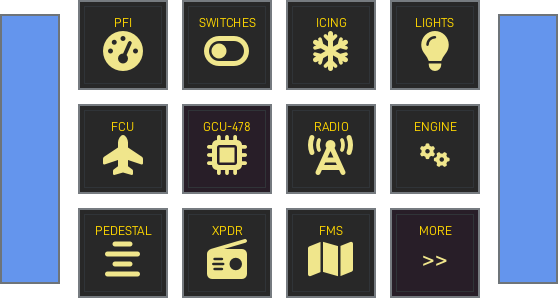

Home

<a href="https://github.com/dlicudi/cockpitdecks-configs/blob/main/decks/cirrus-sr22/deckconfig/loupedecklive1/index.yaml">index.yaml</a>

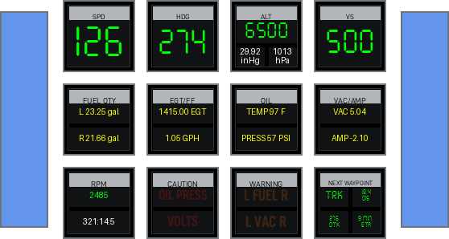

PFI

<a href="https://github.com/dlicudi/cockpitdecks-configs/blob/main/decks/cirrus-sr22/deckconfig/loupedecklive1/pfi.yaml">pfi.yaml</a>

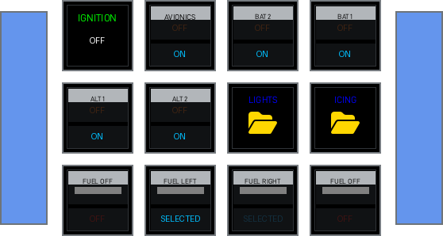

Switches

<a href="https://github.com/dlicudi/cockpitdecks-configs/blob/main/decks/cirrus-sr22/deckconfig/loupedecklive1/switches.yaml">switches.yaml</a>

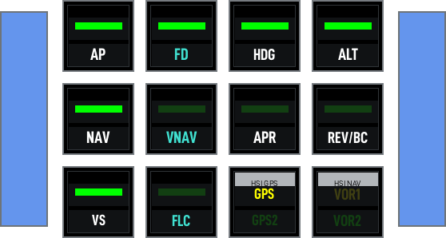

FCU

<a href="https://github.com/dlicudi/cockpitdecks-configs/blob/main/decks/cirrus-sr22/deckconfig/loupedecklive1/fcu.yaml">fcu.yaml</a>

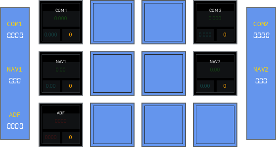

Radio

<a href="https://github.com/dlicudi/cockpitdecks-configs/blob/main/decks/cirrus-sr22/deckconfig/loupedecklive1/radio.yaml">radio.yaml</a>

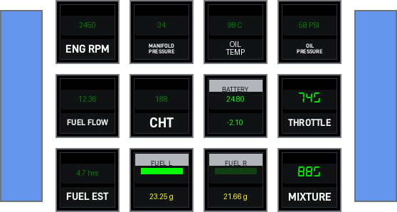

Engine

<a href="https://github.com/dlicudi/cockpitdecks-configs/blob/main/decks/cirrus-sr22/deckconfig/loupedecklive1/engine.yaml">engine.yaml</a>

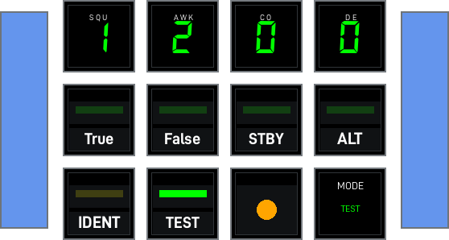

Transponder

<a href="https://github.com/dlicudi/cockpitdecks-configs/blob/main/decks/cirrus-sr22/deckconfig/loupedecklive1/transponder.yaml">transponder.yaml</a>

GCU478

<a href="https://github.com/dlicudi/cockpitdecks-configs/blob/main/decks/cirrus-sr22/deckconfig/loupedecklive1/gcu478.yaml">gcu478.yaml</a>

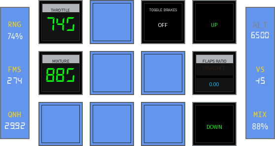

Pedestal

<a href="https://github.com/dlicudi/cockpitdecks-configs/blob/main/decks/cirrus-sr22/deckconfig/loupedecklive1/pedestal.yaml">pedestal.yaml</a>

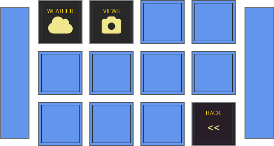

Index2

<a href="https://github.com/dlicudi/cockpitdecks-configs/blob/main/decks/cirrus-sr22/deckconfig/loupedecklive1/index2.yaml">index2.yaml</a>

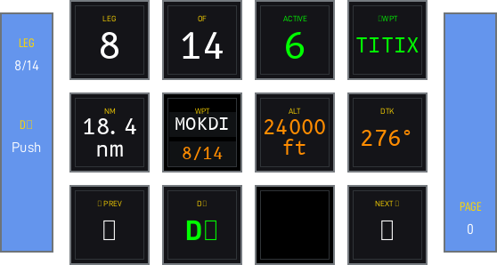

Fms Leg

<a href="https://github.com/dlicudi/cockpitdecks-configs/blob/main/decks/cirrus-sr22/deckconfig/loupedecklive1/fms_leg.yaml">fms_leg.yaml</a>

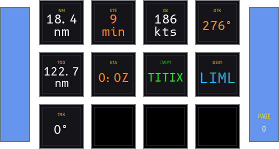

Fms Nav

<a href="https://github.com/dlicudi/cockpitdecks-configs/blob/main/decks/cirrus-sr22/deckconfig/loupedecklive1/fms_nav.yaml">fms_nav.yaml</a>

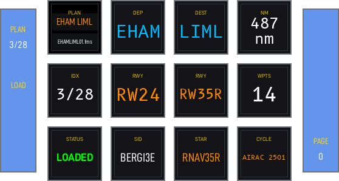

Fms Plan

<a href="https://github.com/dlicudi/cockpitdecks-configs/blob/main/decks/cirrus-sr22/deckconfig/loupedecklive1/fms_plan.yaml">fms_plan.yaml</a>

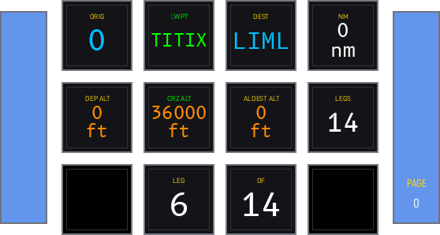

Fms Route

<a href="https://github.com/dlicudi/cockpitdecks-configs/blob/main/decks/cirrus-sr22/deckconfig/loupedecklive1/fms_route.yaml">fms_route.yaml</a>

Views

<a href="https://github.com/dlicudi/cockpitdecks-configs/blob/main/decks/cirrus-sr22/deckconfig/loupedecklive1/views.yaml">views.yaml</a>

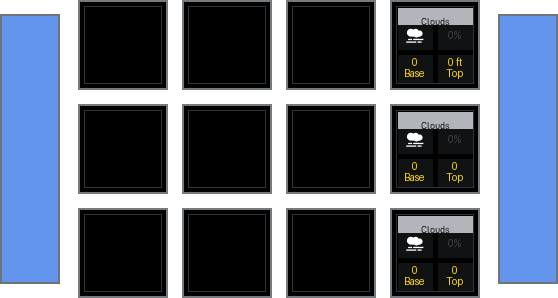

Weather

<a href="https://github.com/dlicudi/cockpitdecks-configs/blob/main/decks/cirrus-sr22/deckconfig/loupedecklive1/weather.yaml">weather.yaml</a>

### Stream Deck XL

🔧 <strong>Active Development</strong>&emsp;📄 15 pages&emsp;🎮 Stream Deck XL

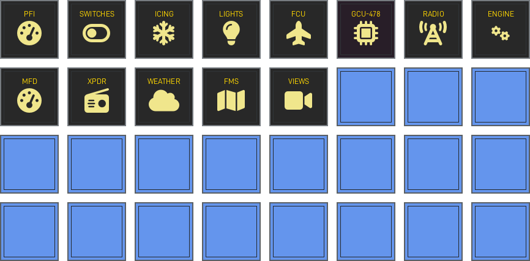

Home

<a href="https://github.com/dlicudi/cockpitdecks-configs/blob/main/decks/cirrus-sr22/deckconfig/streamdeckxl1/index.yaml">index.yaml</a>

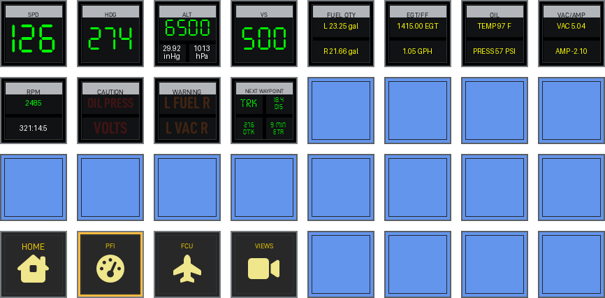

PFI

<a href="https://github.com/dlicudi/cockpitdecks-configs/blob/main/decks/cirrus-sr22/deckconfig/streamdeckxl1/pfi.yaml">pfi.yaml</a>

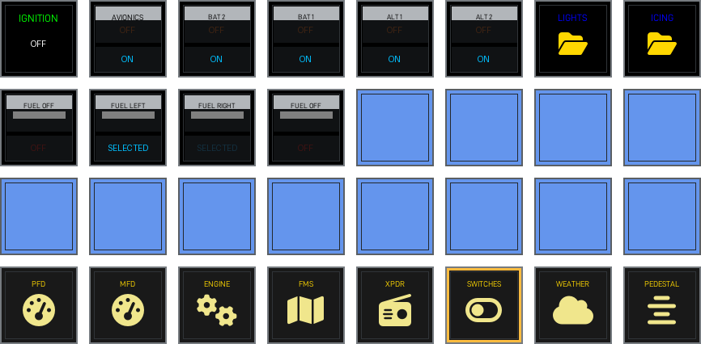

Switches

<a href="https://github.com/dlicudi/cockpitdecks-configs/blob/main/decks/cirrus-sr22/deckconfig/streamdeckxl1/switches.yaml">switches.yaml</a>

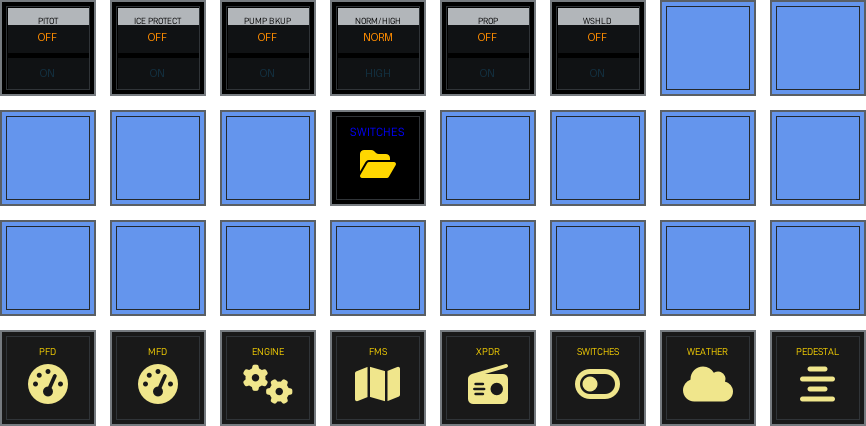

Switch Panel

<a href="https://github.com/dlicudi/cockpitdecks-configs/blob/main/decks/cirrus-sr22/deckconfig/streamdeckxl1/icing.yaml">icing.yaml</a>

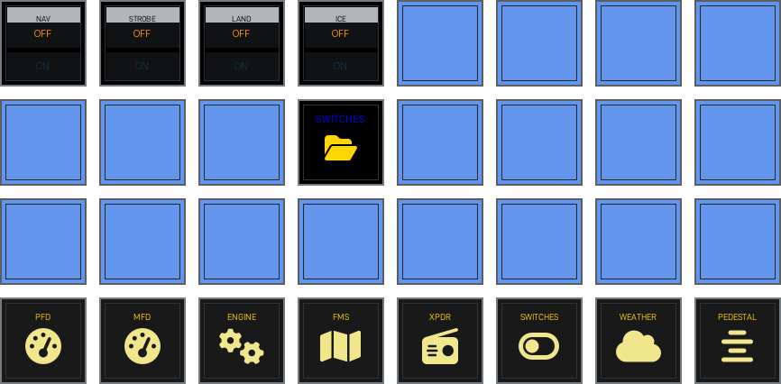

Switch Panel

<a href="https://github.com/dlicudi/cockpitdecks-configs/blob/main/decks/cirrus-sr22/deckconfig/streamdeckxl1/lights.yaml">lights.yaml</a>

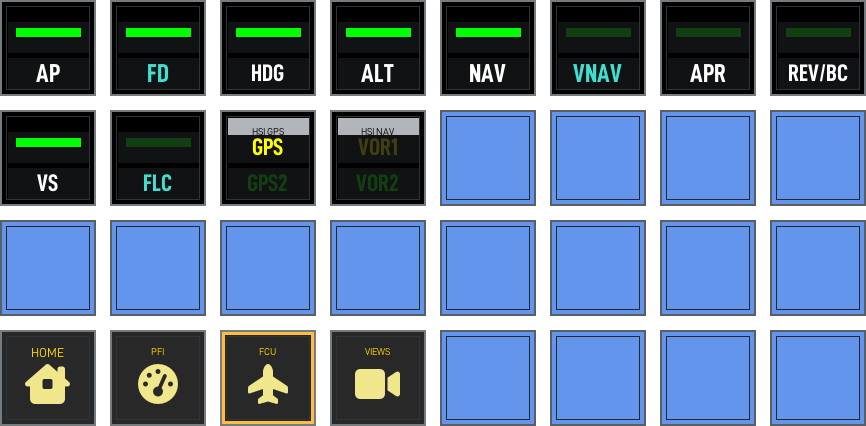

FCU

<a href="https://github.com/dlicudi/cockpitdecks-configs/blob/main/decks/cirrus-sr22/deckconfig/streamdeckxl1/fcu.yaml">fcu.yaml</a>

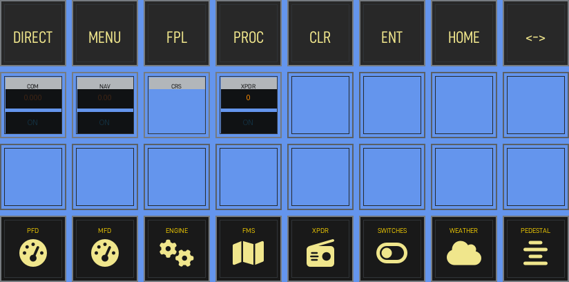

GCU478

<a href="https://github.com/dlicudi/cockpitdecks-configs/blob/main/decks/cirrus-sr22/deckconfig/streamdeckxl1/gcu478.yaml">gcu478.yaml</a>

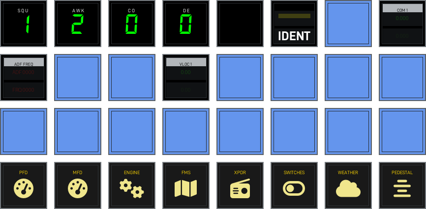

Radio

<a href="https://github.com/dlicudi/cockpitdecks-configs/blob/main/decks/cirrus-sr22/deckconfig/streamdeckxl1/radio.yaml">radio.yaml</a>

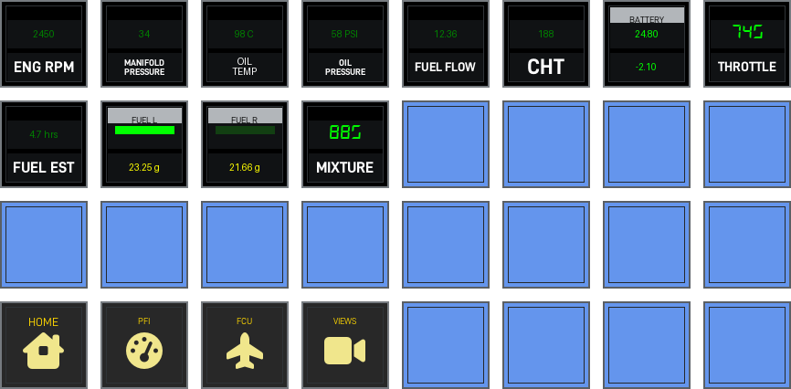

Engine

<a href="https://github.com/dlicudi/cockpitdecks-configs/blob/main/decks/cirrus-sr22/deckconfig/streamdeckxl1/engine.yaml">engine.yaml</a>

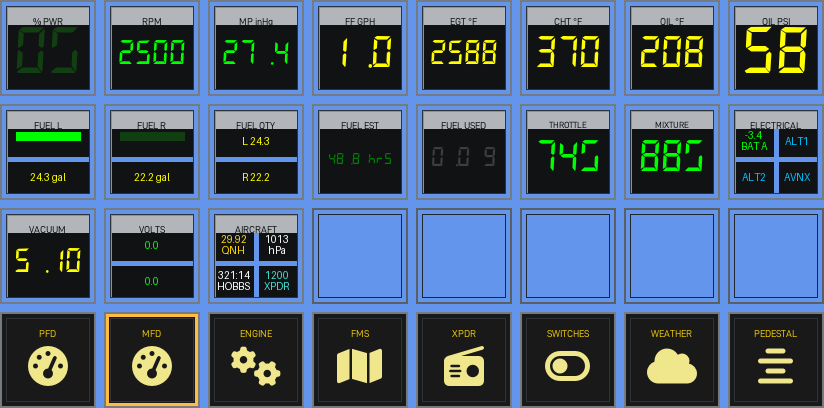

MFD

<a href="https://github.com/dlicudi/cockpitdecks-configs/blob/main/decks/cirrus-sr22/deckconfig/streamdeckxl1/mfd.yaml">mfd.yaml</a>

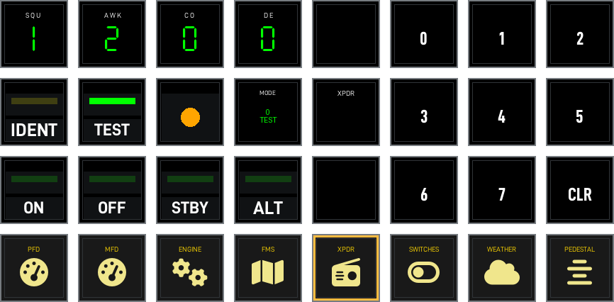

Transponder

<a href="https://github.com/dlicudi/cockpitdecks-configs/blob/main/decks/cirrus-sr22/deckconfig/streamdeckxl1/transponder.yaml">transponder.yaml</a>

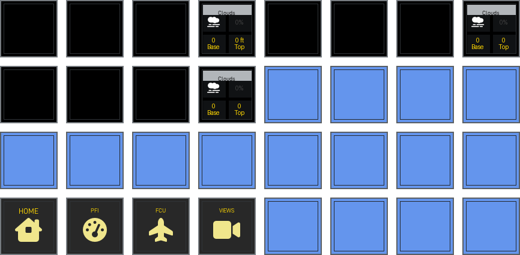

Weather

<a href="https://github.com/dlicudi/cockpitdecks-configs/blob/main/decks/cirrus-sr22/deckconfig/streamdeckxl1/weather.yaml">weather.yaml</a>

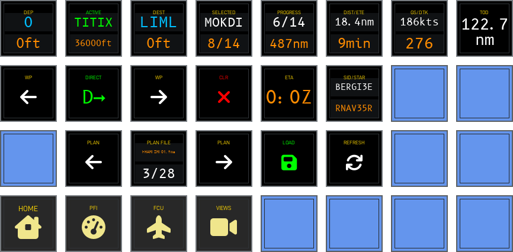

Fms

<a href="https://github.com/dlicudi/cockpitdecks-configs/blob/main/decks/cirrus-sr22/deckconfig/streamdeckxl1/fms.yaml">fms.yaml</a>

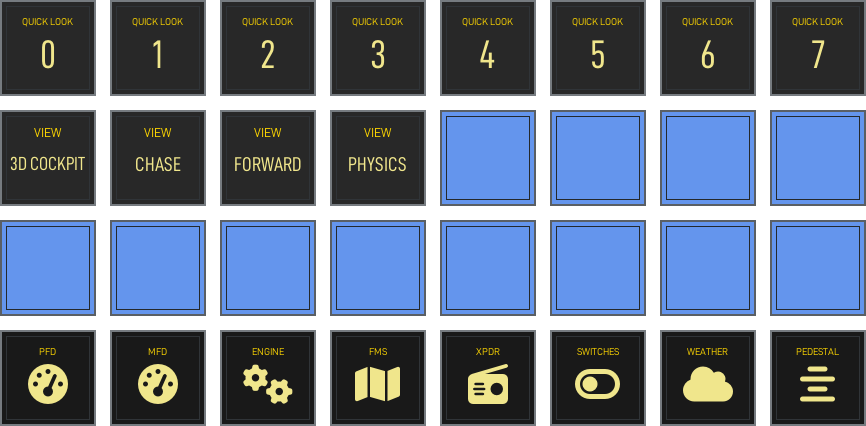

Views

<a href="https://github.com/dlicudi/cockpitdecks-configs/blob/main/decks/cirrus-sr22/deckconfig/streamdeckxl1/views.yaml">views.yaml</a>

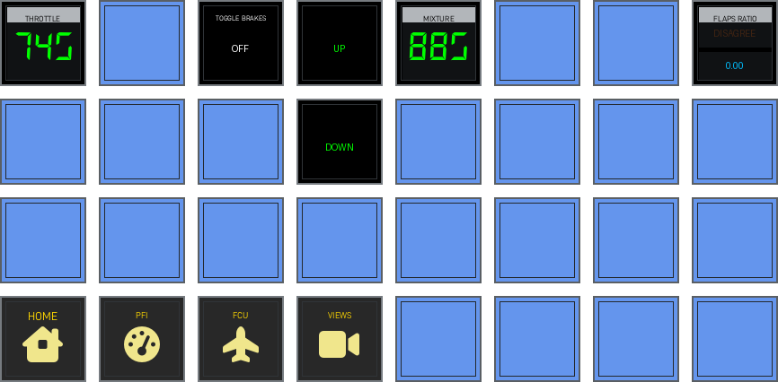

Pedestal

<a href="https://github.com/dlicudi/cockpitdecks-configs/blob/main/decks/cirrus-sr22/deckconfig/streamdeckxl1/pedestal.yaml">pedestal.yaml</a>

