# Embraer E-Jets Family

!!! note "Auto-generated"
    This page is generated by `scripts/generate_deck_docs.py` — do not edit directly.

### Loupedeck Live

🚧 <strong>Work in Progress</strong>&emsp;📄 28 pages&emsp;🎮 Loupedeck Live

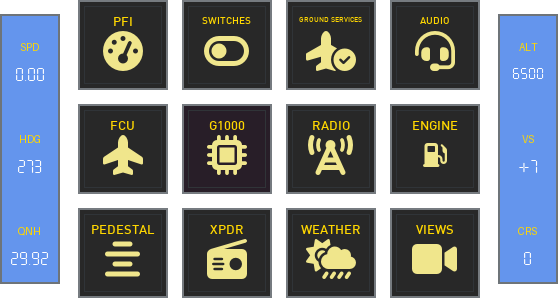

Home

<a href="https://github.com/dlicudi/cockpitdecks-configs/blob/main/decks/embraer-e-jets-family/deckconfig/loupedecklive1/index.yaml">index.yaml</a>

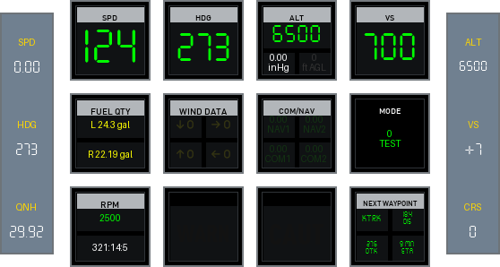

PFI

<a href="https://github.com/dlicudi/cockpitdecks-configs/blob/main/decks/embraer-e-jets-family/deckconfig/loupedecklive1/pfi.yaml">pfi.yaml</a>

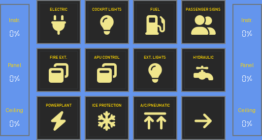

Switches

<a href="https://github.com/dlicudi/cockpitdecks-configs/blob/main/decks/embraer-e-jets-family/deckconfig/loupedecklive1/switches.yaml">switches.yaml</a>

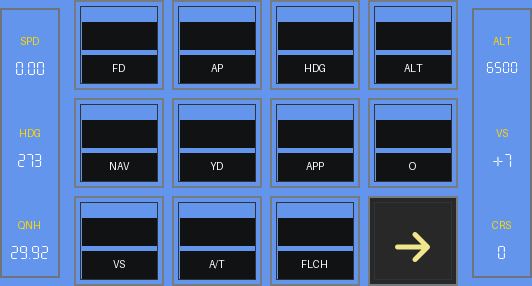

FCU

<a href="https://github.com/dlicudi/cockpitdecks-configs/blob/main/decks/embraer-e-jets-family/deckconfig/loupedecklive1/fcu.yaml">fcu.yaml</a>

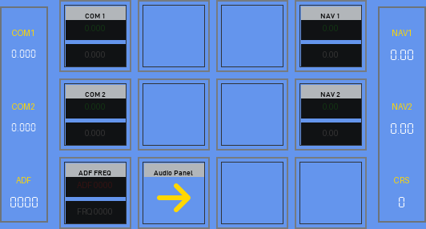

Radio

<a href="https://github.com/dlicudi/cockpitdecks-configs/blob/main/decks/embraer-e-jets-family/deckconfig/loupedecklive1/radio.yaml">radio.yaml</a>

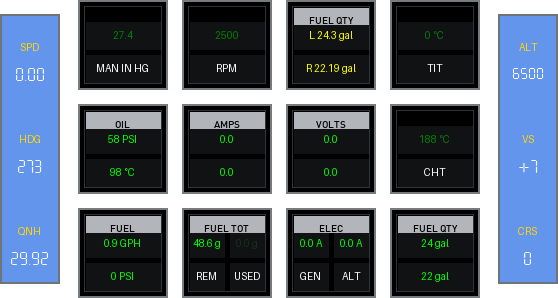

Engine

<a href="https://github.com/dlicudi/cockpitdecks-configs/blob/main/decks/embraer-e-jets-family/deckconfig/loupedecklive1/engine.yaml">engine.yaml</a>

Weather

<a href="https://github.com/dlicudi/cockpitdecks-configs/blob/main/decks/embraer-e-jets-family/deckconfig/loupedecklive1/weather.yaml">weather.yaml</a>

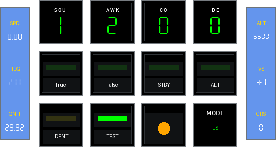

Transponder

<a href="https://github.com/dlicudi/cockpitdecks-configs/blob/main/decks/embraer-e-jets-family/deckconfig/loupedecklive1/transponder.yaml">transponder.yaml</a>

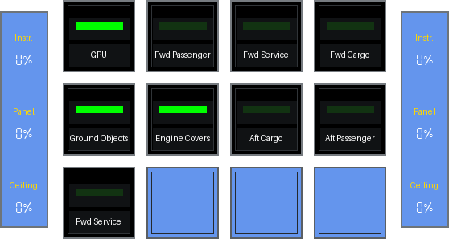

Ground Services

<a href="https://github.com/dlicudi/cockpitdecks-configs/blob/main/decks/embraer-e-jets-family/deckconfig/loupedecklive1/ground_services.yaml">ground_services.yaml</a>

Audio Panel

<a href="https://github.com/dlicudi/cockpitdecks-configs/blob/main/decks/embraer-e-jets-family/deckconfig/loupedecklive1/audiopanel.yaml">audiopanel.yaml</a>

G1000

<a href="https://github.com/dlicudi/cockpitdecks-configs/blob/main/decks/embraer-e-jets-family/deckconfig/loupedecklive1/g1000.yaml">g1000.yaml</a>

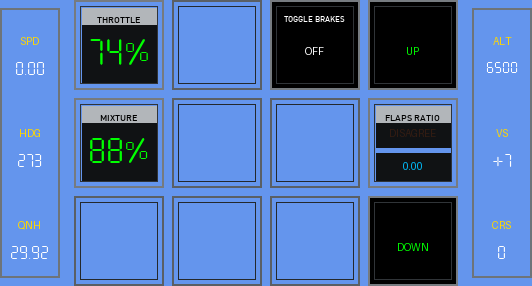

Pedestal

<a href="https://github.com/dlicudi/cockpitdecks-configs/blob/main/decks/embraer-e-jets-family/deckconfig/loupedecklive1/pedestal.yaml">pedestal.yaml</a>

Views

<a href="https://github.com/dlicudi/cockpitdecks-configs/blob/main/decks/embraer-e-jets-family/deckconfig/loupedecklive1/views.yaml">views.yaml</a>

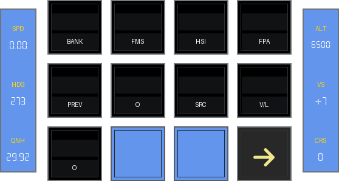

FCU 2

<a href="https://github.com/dlicudi/cockpitdecks-configs/blob/main/decks/embraer-e-jets-family/deckconfig/loupedecklive1/fcu2.yaml">fcu2.yaml</a>

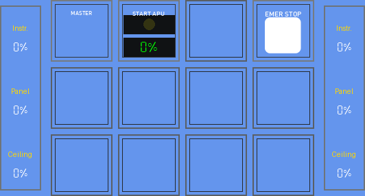

APU Control

<a href="https://github.com/dlicudi/cockpitdecks-configs/blob/main/decks/embraer-e-jets-family/deckconfig/loupedecklive1/overhead_apu_control.yaml">overhead_apu_control.yaml</a>

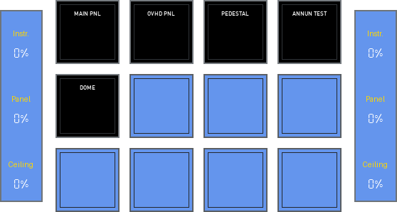

Cockpit Lights

<a href="https://github.com/dlicudi/cockpitdecks-configs/blob/main/decks/embraer-e-jets-family/deckconfig/loupedecklive1/overhead_cockpit_lights.yaml">overhead_cockpit_lights.yaml</a>

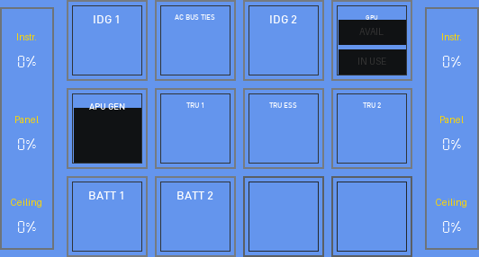

Electric

<a href="https://github.com/dlicudi/cockpitdecks-configs/blob/main/decks/embraer-e-jets-family/deckconfig/loupedecklive1/overhead_electric.yaml">overhead_electric.yaml</a>

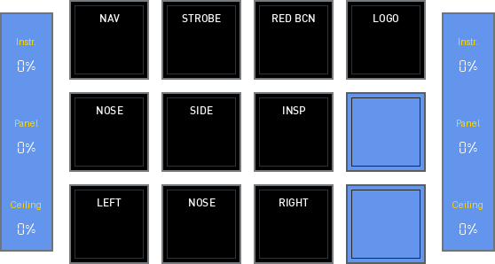

External Lights

<a href="https://github.com/dlicudi/cockpitdecks-configs/blob/main/decks/embraer-e-jets-family/deckconfig/loupedecklive1/overhead_external_lights.yaml">overhead_external_lights.yaml</a>

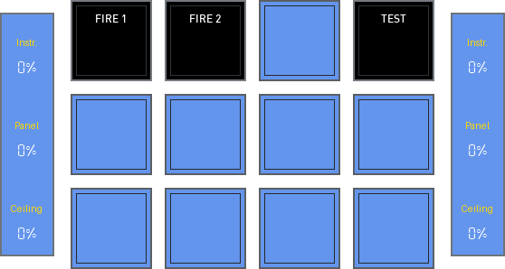

Fire Extinguisher

<a href="https://github.com/dlicudi/cockpitdecks-configs/blob/main/decks/embraer-e-jets-family/deckconfig/loupedecklive1/overhead_fire_extinguisher.yaml">overhead_fire_extinguisher.yaml</a>

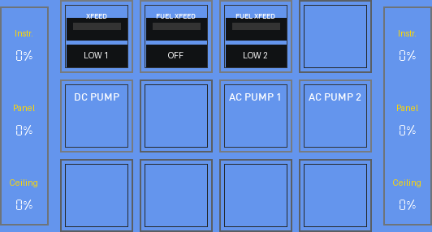

Fuel

<a href="https://github.com/dlicudi/cockpitdecks-configs/blob/main/decks/embraer-e-jets-family/deckconfig/loupedecklive1/overhead_fuel.yaml">overhead_fuel.yaml</a>

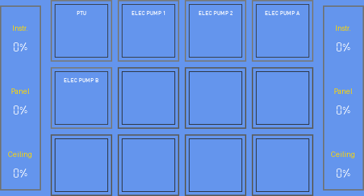

Hydraulic

<a href="https://github.com/dlicudi/cockpitdecks-configs/blob/main/decks/embraer-e-jets-family/deckconfig/loupedecklive1/overhead_hydraulic.yaml">overhead_hydraulic.yaml</a>

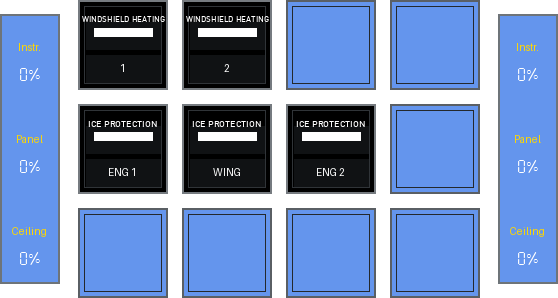

Ice Protection

<a href="https://github.com/dlicudi/cockpitdecks-configs/blob/main/decks/embraer-e-jets-family/deckconfig/loupedecklive1/overhead_ice_protection.yaml">overhead_ice_protection.yaml</a>

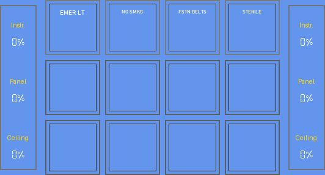

Passenger Signs

<a href="https://github.com/dlicudi/cockpitdecks-configs/blob/main/decks/embraer-e-jets-family/deckconfig/loupedecklive1/overhead_passenger_signs.yaml">overhead_passenger_signs.yaml</a>

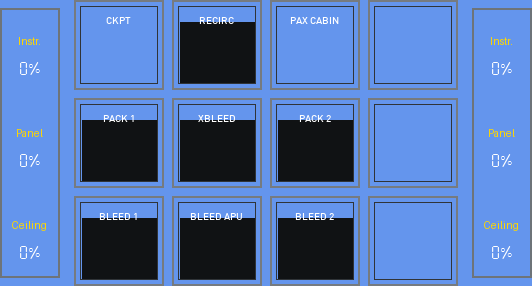

Pneumatic

<a href="https://github.com/dlicudi/cockpitdecks-configs/blob/main/decks/embraer-e-jets-family/deckconfig/loupedecklive1/overhead_pneumatic.yaml">overhead_pneumatic.yaml</a>

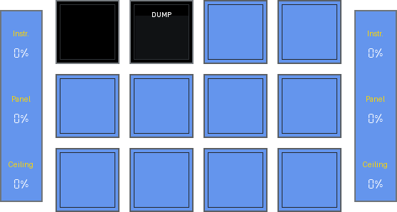

Pressurization

<a href="https://github.com/dlicudi/cockpitdecks-configs/blob/main/decks/embraer-e-jets-family/deckconfig/loupedecklive1/overhead_pressurization.yaml">overhead_pressurization.yaml</a>

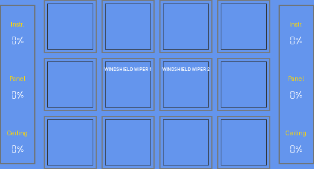

Windshield Wiper

<a href="https://github.com/dlicudi/cockpitdecks-configs/blob/main/decks/embraer-e-jets-family/deckconfig/loupedecklive1/overhead_windshield_wiper.yaml">overhead_windshield_wiper.yaml</a>

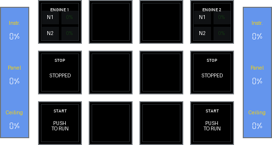

Powerplant

<a href="https://github.com/dlicudi/cockpitdecks-configs/blob/main/decks/embraer-e-jets-family/deckconfig/loupedecklive1/pedestal_powerplant.yaml">pedestal_powerplant.yaml</a>

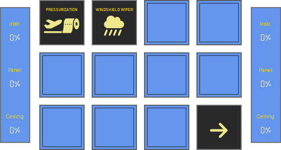

Switches 2

<a href="https://github.com/dlicudi/cockpitdecks-configs/blob/main/decks/embraer-e-jets-family/deckconfig/loupedecklive1/switches2.yaml">switches2.yaml</a>

### Stream Deck XL

🚧 <strong>Work in Progress</strong>&emsp;📄 14 pages&emsp;🎮 Stream Deck XL

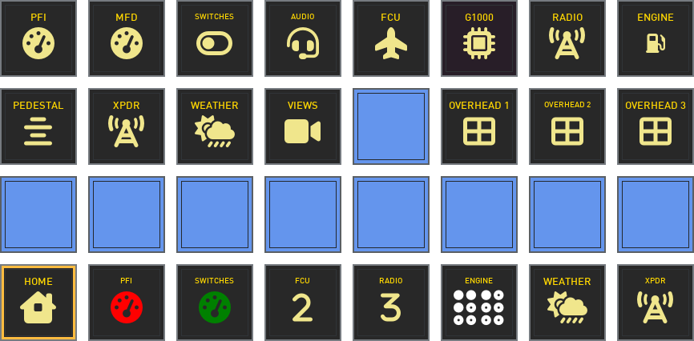

Home

<a href="https://github.com/dlicudi/cockpitdecks-configs/blob/main/decks/embraer-e-jets-family/deckconfig/streamdeckxl1/index.yaml">index.yaml</a>

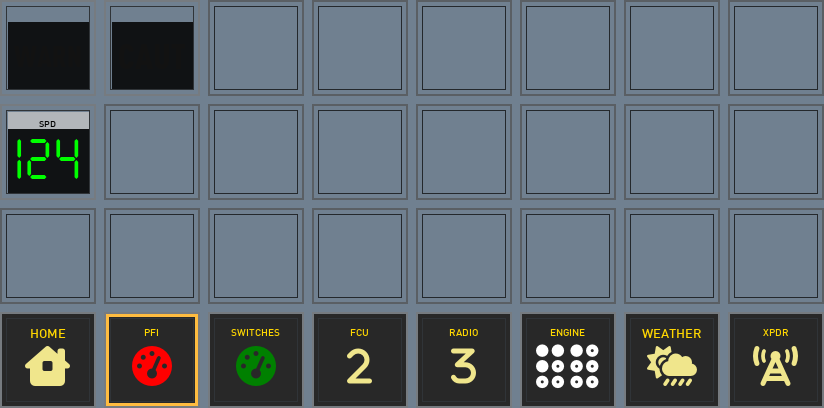

PFI

<a href="https://github.com/dlicudi/cockpitdecks-configs/blob/main/decks/embraer-e-jets-family/deckconfig/streamdeckxl1/pfi.yaml">pfi.yaml</a>

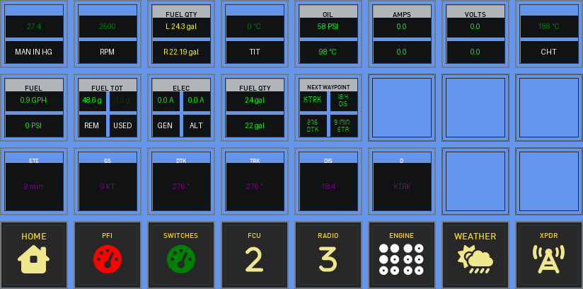

MFD

<a href="https://github.com/dlicudi/cockpitdecks-configs/blob/main/decks/embraer-e-jets-family/deckconfig/streamdeckxl1/mfd.yaml">mfd.yaml</a>

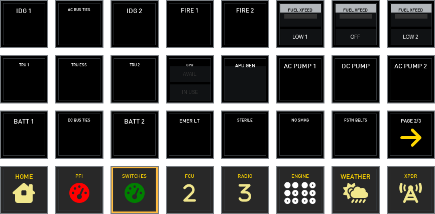

Switches

<a href="https://github.com/dlicudi/cockpitdecks-configs/blob/main/decks/embraer-e-jets-family/deckconfig/streamdeckxl1/switches.yaml">switches.yaml</a>

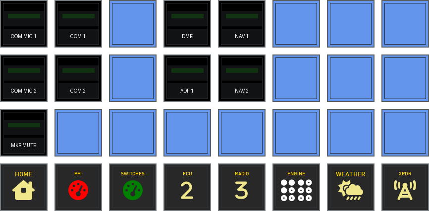

Audio Panel

<a href="https://github.com/dlicudi/cockpitdecks-configs/blob/main/decks/embraer-e-jets-family/deckconfig/streamdeckxl1/audiopanel.yaml">audiopanel.yaml</a>

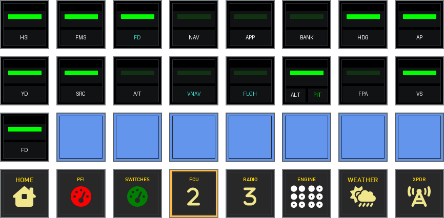

FCU

<a href="https://github.com/dlicudi/cockpitdecks-configs/blob/main/decks/embraer-e-jets-family/deckconfig/streamdeckxl1/fcu.yaml">fcu.yaml</a>

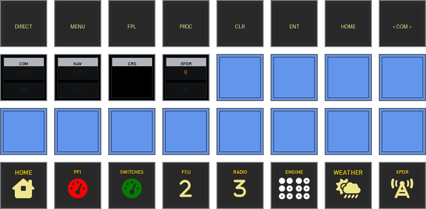

G1000

<a href="https://github.com/dlicudi/cockpitdecks-configs/blob/main/decks/embraer-e-jets-family/deckconfig/streamdeckxl1/g1000.yaml">g1000.yaml</a>

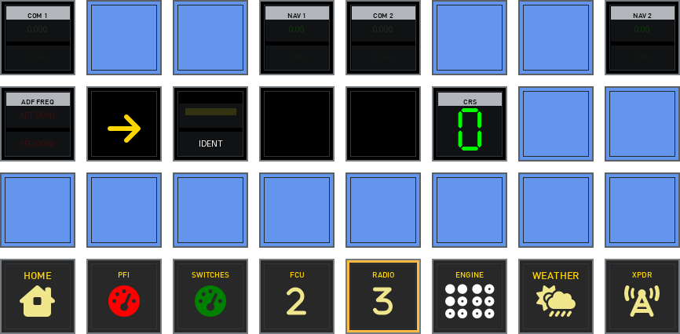

Radio

<a href="https://github.com/dlicudi/cockpitdecks-configs/blob/main/decks/embraer-e-jets-family/deckconfig/streamdeckxl1/radio.yaml">radio.yaml</a>

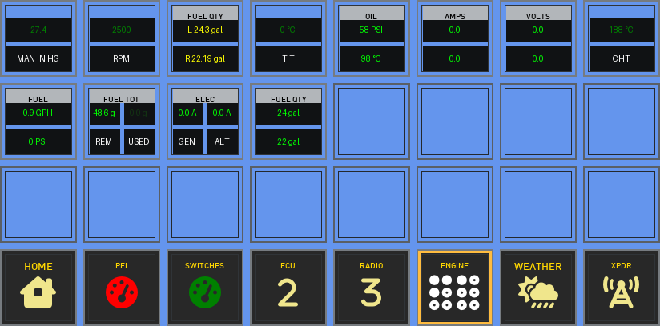

Engine

<a href="https://github.com/dlicudi/cockpitdecks-configs/blob/main/decks/embraer-e-jets-family/deckconfig/streamdeckxl1/engine.yaml">engine.yaml</a>

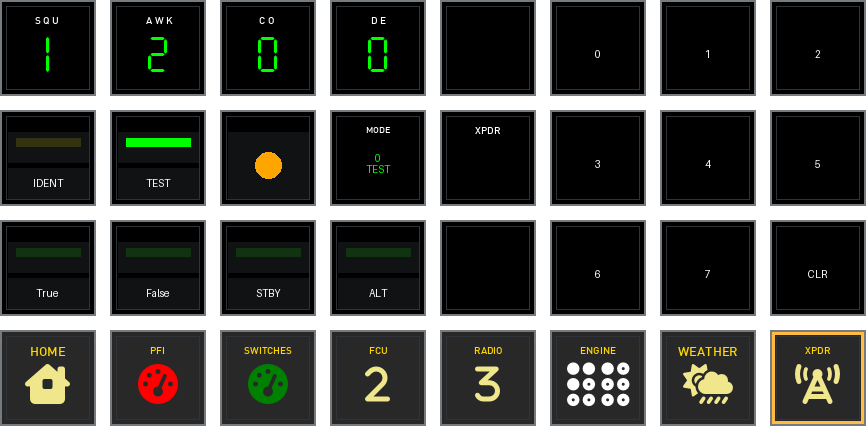

Transponder

<a href="https://github.com/dlicudi/cockpitdecks-configs/blob/main/decks/embraer-e-jets-family/deckconfig/streamdeckxl1/transponder.yaml">transponder.yaml</a>

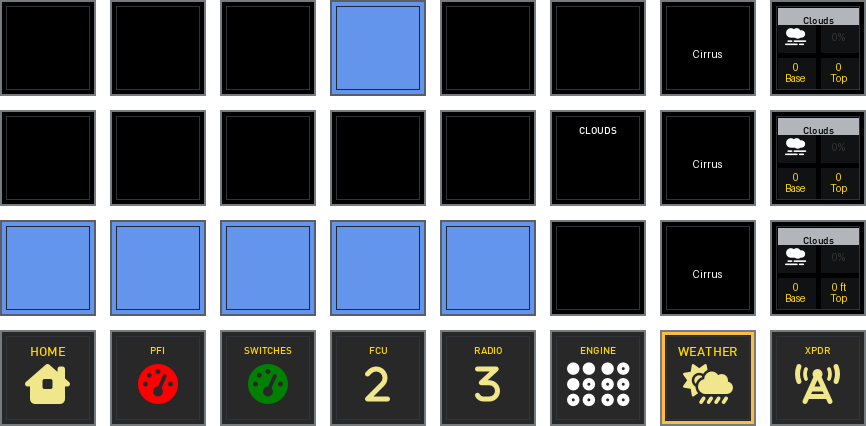

Weather

<a href="https://github.com/dlicudi/cockpitdecks-configs/blob/main/decks/embraer-e-jets-family/deckconfig/streamdeckxl1/weather.yaml">weather.yaml</a>

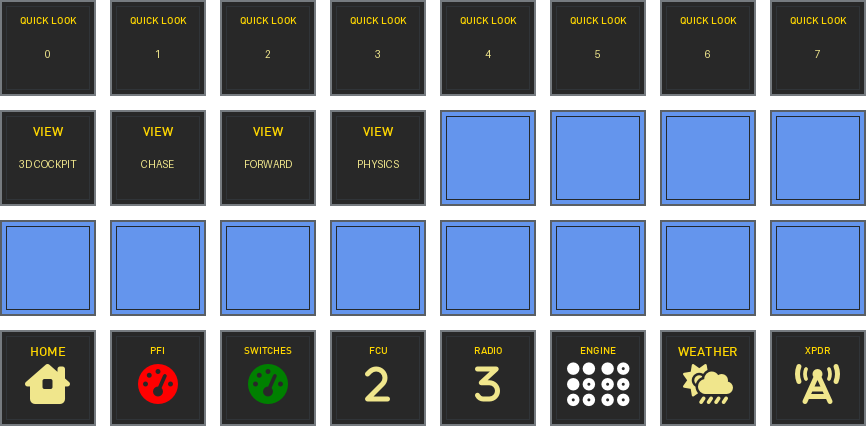

Views

<a href="https://github.com/dlicudi/cockpitdecks-configs/blob/main/decks/embraer-e-jets-family/deckconfig/streamdeckxl1/views.yaml">views.yaml</a>

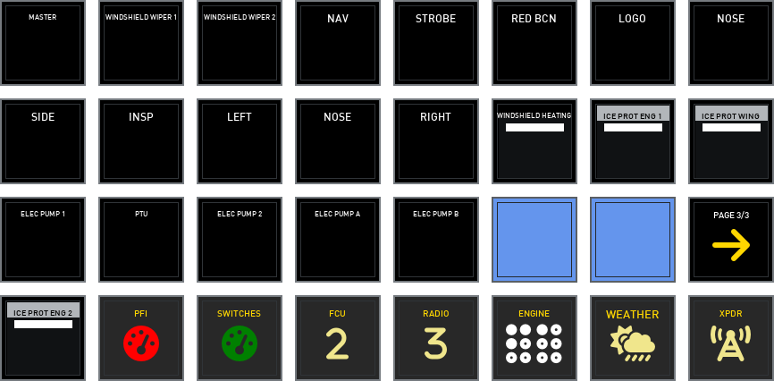

Switches 2

<a href="https://github.com/dlicudi/cockpitdecks-configs/blob/main/decks/embraer-e-jets-family/deckconfig/streamdeckxl1/switches2.yaml">switches2.yaml</a>

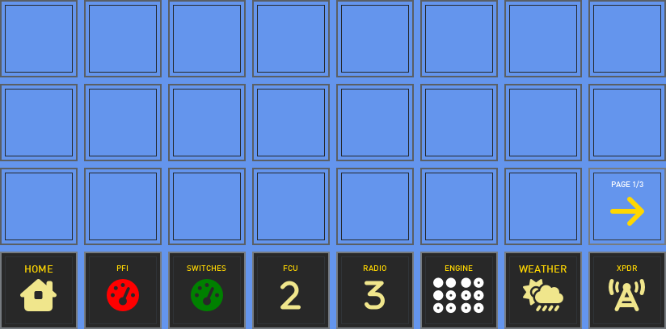

Switches3

<a href="https://github.com/dlicudi/cockpitdecks-configs/blob/main/decks/embraer-e-jets-family/deckconfig/streamdeckxl1/switches3.yaml">switches3.yaml</a>

### e190.overhead.v2

🚧 <strong>Work in Progress</strong>&emsp;📄 1 page&emsp;🎮 e190.overhead.v2

Home

<a href="https://github.com/dlicudi/cockpitdecks-configs/blob/main/decks/embraer-e-jets-family/deckconfig/overhead/index.yaml">index.yaml</a>

