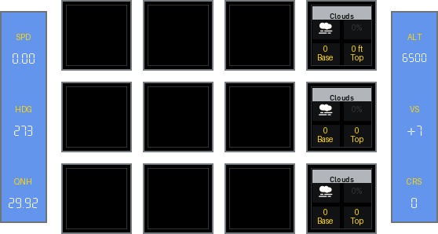

<!-- generated by scripts/generate_deck_docs.py; do not edit directly -->

# Weather

## Source

- [:material-github: `loupedecklive1/weather.yaml`](https://github.com/dlicudi/cockpitdecks-configs/blob/main/decks/embraer-e-jets-family/deckconfig/loupedecklive1/weather.yaml)

- Includes: [:material-source-branch: `pager.yaml`](https://github.com/dlicudi/cockpitdecks-configs/blob/main/decks/embraer-e-jets-family/deckconfig/loupedecklive1/pager.yaml) · [:material-source-branch: `encoders/encoders_fcu.yaml`](https://github.com/dlicudi/cockpitdecks-configs/blob/main/decks/embraer-e-jets-family/deckconfig/loupedecklive1/encoders/encoders_fcu.yaml)
