# Epic E1000G

??? note "Auto-generated"
    This page is generated by `scripts/generate_deck_docs.py` — do not edit directly.

## Loupedeck Live

📄 17 pages&emsp;🎮 Loupedeck Live

<a href="../../assets/images/epic-e1000g/generated/loupedecklive1/home.page.png" data-glightbox data-title="Home">
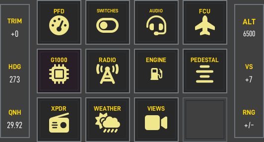
</a>

Home

<a href="https://github.com/dlicudi/cockpitdecks-configs/blob/main/decks/epic-e1000g/deckconfig/loupedecklive1/home.yaml">home.yaml</a>

<a href="../../assets/images/epic-e1000g/generated/loupedecklive1/pfd.page.png" data-glightbox data-title="PFD">
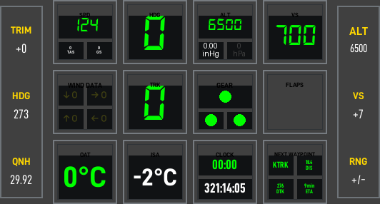
</a>

PFD

<a href="https://github.com/dlicudi/cockpitdecks-configs/blob/main/decks/epic-e1000g/deckconfig/loupedecklive1/pfd.yaml">pfd.yaml</a>

<a href="../../assets/images/epic-e1000g/generated/loupedecklive1/switches_prestart.page.png" data-glightbox data-title="PRE-START">
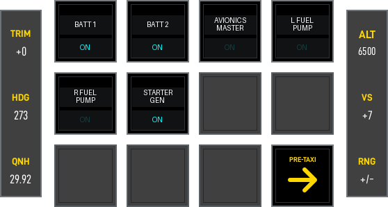
</a>

PRE-START

<a href="https://github.com/dlicudi/cockpitdecks-configs/blob/main/decks/epic-e1000g/deckconfig/loupedecklive1/switches_prestart.yaml">switches_prestart.yaml</a>

<a href="../../assets/images/epic-e1000g/generated/loupedecklive1/fcu.page.png" data-glightbox data-title="FCU">
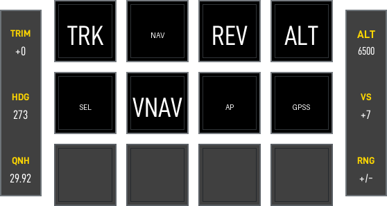
</a>

FCU

<a href="https://github.com/dlicudi/cockpitdecks-configs/blob/main/decks/epic-e1000g/deckconfig/loupedecklive1/fcu.yaml">fcu.yaml</a>

<a href="../../assets/images/epic-e1000g/generated/loupedecklive1/radio.page.png" data-glightbox data-title="Radio">
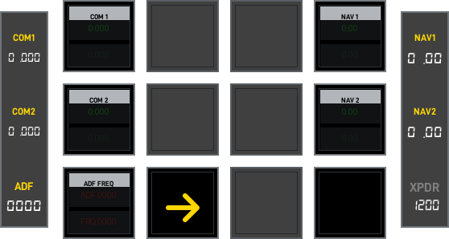
</a>

Radio

<a href="https://github.com/dlicudi/cockpitdecks-configs/blob/main/decks/epic-e1000g/deckconfig/loupedecklive1/radio.yaml">radio.yaml</a>

<a href="../../assets/images/epic-e1000g/generated/loupedecklive1/engine.page.png" data-glightbox data-title="Engine">
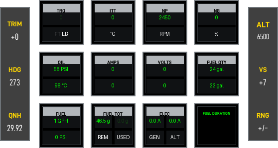
</a>

Engine

<a href="https://github.com/dlicudi/cockpitdecks-configs/blob/main/decks/epic-e1000g/deckconfig/loupedecklive1/engine.yaml">engine.yaml</a>

<a href="../../assets/images/epic-e1000g/generated/loupedecklive1/pedestal.page.png" data-glightbox data-title="Pedestal">
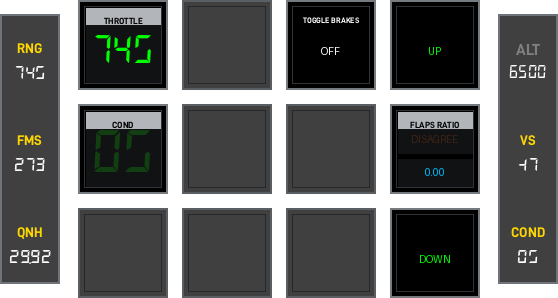
</a>

Pedestal

<a href="https://github.com/dlicudi/cockpitdecks-configs/blob/main/decks/epic-e1000g/deckconfig/loupedecklive1/pedestal.yaml">pedestal.yaml</a>

<a href="../../assets/images/epic-e1000g/generated/loupedecklive1/transponder.page.png" data-glightbox data-title="Transponder">
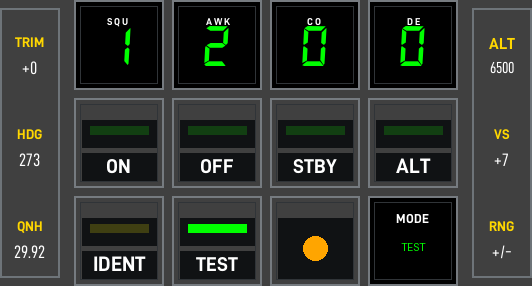
</a>

Transponder

<a href="https://github.com/dlicudi/cockpitdecks-configs/blob/main/decks/epic-e1000g/deckconfig/loupedecklive1/transponder.yaml">transponder.yaml</a>

<a href="../../assets/images/epic-e1000g/generated/loupedecklive1/audiopanel.page.png" data-glightbox data-title="Audio Panel">
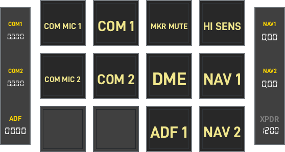
</a>

Audio Panel

<a href="https://github.com/dlicudi/cockpitdecks-configs/blob/main/decks/epic-e1000g/deckconfig/loupedecklive1/audiopanel.yaml">audiopanel.yaml</a>

<a href="../../assets/images/epic-e1000g/generated/loupedecklive1/g1000.page.png" data-glightbox data-title="G1000">
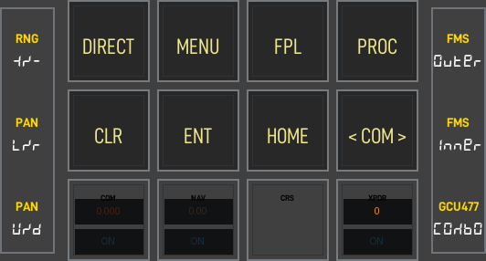
</a>

G1000

<a href="https://github.com/dlicudi/cockpitdecks-configs/blob/main/decks/epic-e1000g/deckconfig/loupedecklive1/g1000.yaml">g1000.yaml</a>

<a href="../../assets/images/epic-e1000g/generated/loupedecklive1/weather.page.png" data-glightbox data-title="Weather">
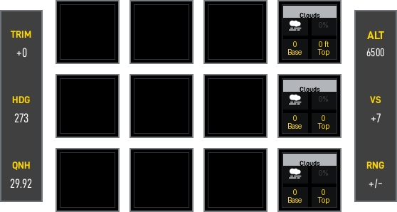
</a>

Weather

<a href="https://github.com/dlicudi/cockpitdecks-configs/blob/main/decks/epic-e1000g/deckconfig/loupedecklive1/weather.yaml">weather.yaml</a>

<a href="../../assets/images/epic-e1000g/generated/loupedecklive1/views.page.png" data-glightbox data-title="Views">
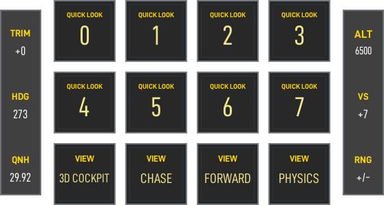
</a>

Views

<a href="https://github.com/dlicudi/cockpitdecks-configs/blob/main/decks/epic-e1000g/deckconfig/loupedecklive1/views.yaml">views.yaml</a>

<a href="../../assets/images/epic-e1000g/generated/loupedecklive1/switches.page.png" data-glightbox data-title="Switch panel hub">
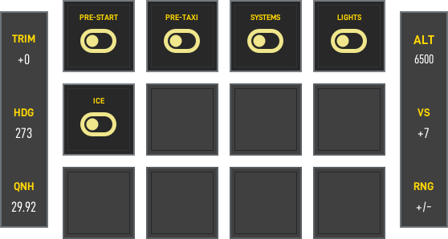
</a>

Switch panel hub

<a href="https://github.com/dlicudi/cockpitdecks-configs/blob/main/decks/epic-e1000g/deckconfig/loupedecklive1/switches.yaml">switches.yaml</a>

<a href="../../assets/images/epic-e1000g/generated/loupedecklive1/switches_ice.page.png" data-glightbox data-title="ICE">
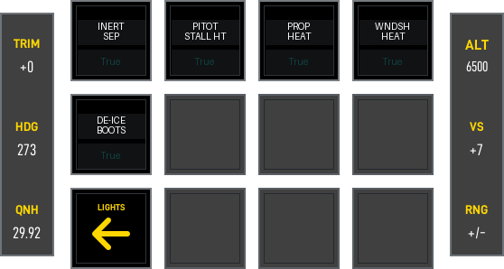
</a>

ICE

<a href="https://github.com/dlicudi/cockpitdecks-configs/blob/main/decks/epic-e1000g/deckconfig/loupedecklive1/switches_ice.yaml">switches_ice.yaml</a>

<a href="../../assets/images/epic-e1000g/generated/loupedecklive1/switches_lights.page.png" data-glightbox data-title="LIGHTS">
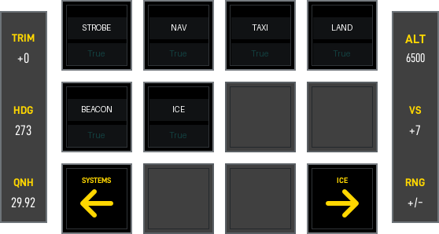
</a>

LIGHTS

<a href="https://github.com/dlicudi/cockpitdecks-configs/blob/main/decks/epic-e1000g/deckconfig/loupedecklive1/switches_lights.yaml">switches_lights.yaml</a>

<a href="../../assets/images/epic-e1000g/generated/loupedecklive1/switches_pretaxi.page.png" data-glightbox data-title="PRE-TAXI">
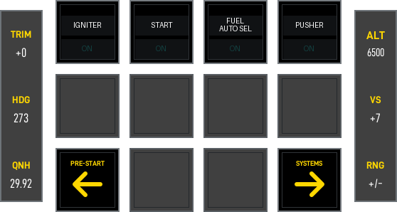
</a>

PRE-TAXI

<a href="https://github.com/dlicudi/cockpitdecks-configs/blob/main/decks/epic-e1000g/deckconfig/loupedecklive1/switches_pretaxi.yaml">switches_pretaxi.yaml</a>

<a href="../../assets/images/epic-e1000g/generated/loupedecklive1/switches_systems.page.png" data-glightbox data-title="SYSTEMS">
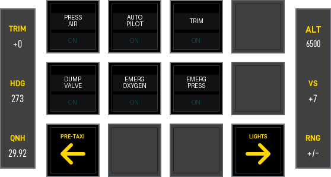
</a>

SYSTEMS

<a href="https://github.com/dlicudi/cockpitdecks-configs/blob/main/decks/epic-e1000g/deckconfig/loupedecklive1/switches_systems.yaml">switches_systems.yaml</a>

## Stream Deck XL

📄 2 pages&emsp;🎮 Stream Deck XL

<a href="../../assets/images/epic-e1000g/generated/streamdeckxl1/switches.page.png" data-glightbox data-title="Switches">
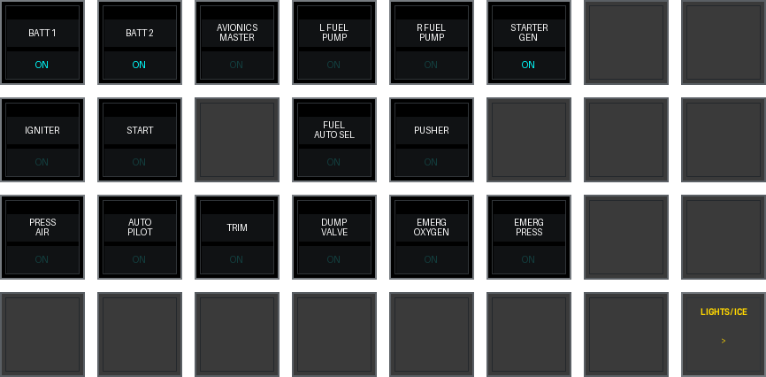
</a>

Switches

<a href="https://github.com/dlicudi/cockpitdecks-configs/blob/main/decks/epic-e1000g/deckconfig/streamdeckxl1/switches.yaml">switches.yaml</a>

<a href="../../assets/images/epic-e1000g/generated/streamdeckxl1/switches2.page.png" data-glightbox data-title="Lights and Ice">
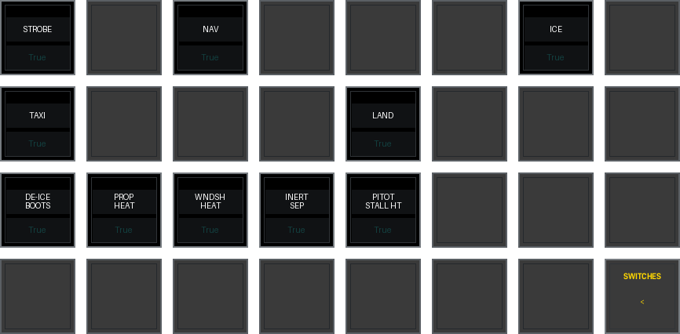
</a>

Lights and Ice

<a href="https://github.com/dlicudi/cockpitdecks-configs/blob/main/decks/epic-e1000g/deckconfig/streamdeckxl1/switches2.yaml">switches2.yaml</a>

