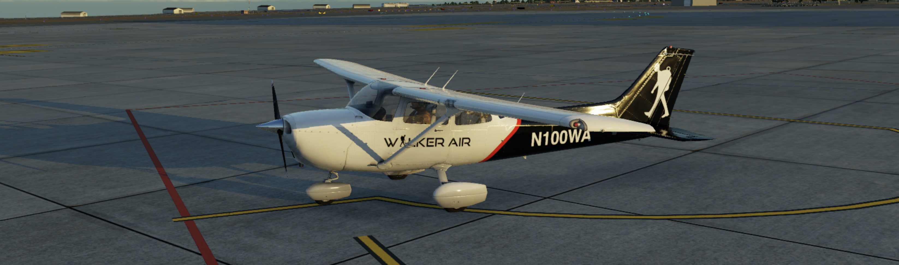
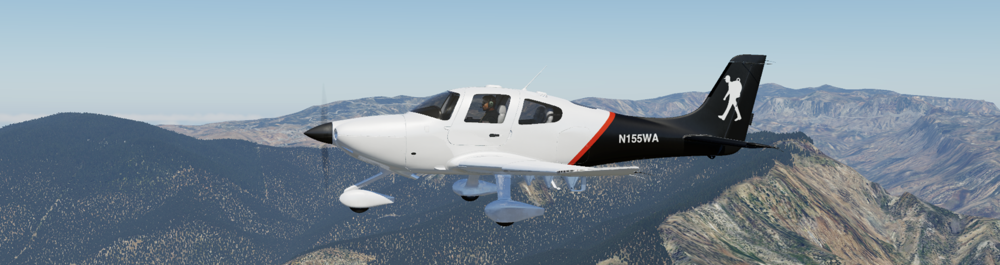
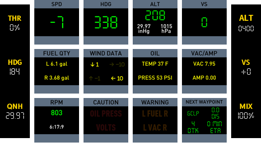

# Aircraft

Browse the available aircraft-specific Cockpitdecks layouts.

  <a class="cdx-card" href="cessna-172-sp/">
    
    

      <h3>Cessna 172 SP</h3>
      
Core GA workflow with radios, engine, transponder, weather, and G1000-style pages.

    

  </a>
  <a class="cdx-card" href="cirrus-sr22/">
    
    

      <h3>Cirrus SR22</h3>
      
G1000-oriented layout with FCU, GCU478, PFI, transponder, weather, and system pages.

    

  </a>
  <a class="cdx-card" href="beechcraft-baron-58/">
    
    

      <h3>Beechcraft Baron 58</h3>
      
Twin-engine focus with dedicated engine and aircraft-system coverage.

    

  </a>
  <a class="cdx-card" href="lancair-evolution/">
    
    

      <h3>Lancair Evolution</h3>
      
Glass-cockpit workflow with G1000-style navigation, audio, weather, and systems pages.

    

  </a>
  <a class="cdx-card" href="toliss-airbus-A321-neo/">
    
    

      <h3>ToLiss Airbus A321 NEO</h3>
      
Airliner-oriented layouts for cockpit flows that differ substantially from GA aircraft.

    

  </a>
  <a class="cdx-card" href="toliss-airbus-A320-neo/">
    
    

      <h3>ToLiss Airbus A320 NEO</h3>
      
Work-in-progress Airbus layout and reference page for the smaller ToLiss variant.

    

  </a>
  <a class="cdx-card" href="aerobask-robin-dr401/">
    
    

      <h3>Aerobask Robin DR401</h3>
      
Light-aircraft reference layout with practical examples you can adapt.

    

  </a>

