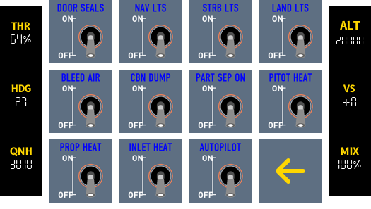
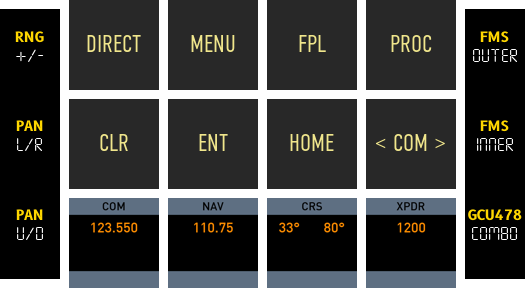

# Lancair Evolution

{ :width="200" }

## Deck Functions

### Home
{ :width="200" }

Home page can be accessed via button e0 on the Loupedeck Live (button without a number).

### PFI
{ :width="200" }

**Primary Flight Instrument Page** displays speed (in knots), heading, altitude and vertical speed.

Fuel quantity for left and right tanks in gallons.

Wind data as is displayed by G1000 is provided (as 4 vectors, headwind, tailwind and left/right crosswinds).

The gear annunciator closely resembles the display on the Lancair Evolution. Gear up shows as dimmed green dots, when gear is down these will change to bright green.

The flaps button is displayed as a switch.

**Fuel duration** (a calculation of time remaining based on fuel flow and fuel quantity).

Caution/Warning annunciators.

Information on the next waypoint in flight plan. This now includes the actual waypoint name.

### SWITCHES
{ :width="100" }
{ :width="100" }

Switches is spread across two pages.

Primarily "Battery and Electrical Panel", Ignition, Fuel Pump and Fuel tank selector functions.

The second page covers lights and icing switches. 

### AUDIO PANEL
 
{ :width="100" }

Provides a close replica of the audio panel (Garmin GMA-1347) on the Lancair Evolution.

### FCU
{ :width="200" }

Functions for TS Sorceror autopilot module. 

### G1000
{ :width="200" }

G1000 page adapted from GCU-478 page (work in progress).

### RADIO
{ :width="200" }

COM1/COM2, NAV1/NAV2, ADF and XPDR functions.

### ENGINE
{ :width="200" }

Provides a close replica of the G1000 MFD (Multi Function Display) EIS (Engine Indication System). See https://x-plane.com/manuals/G1000_Manual.pdf page 54.

The configuration for reference: Configuration 4, Single-Engine Turboprop, Lancair Evolution and similar.  

### PEDESTAL
{ :width="200" }

Intended for flaps, gear, brakes and other functions usually found in pedestal area.

### TRANSPONDER
{ :width="200" }

Dedicated transponder page (transponder mode and id functions can also be found in radio page).

### WEATHER
{ :width="200" }

This page provides comprehensive weather data including coverage for different cloud layers and tropo data.

### VIEWS
{ :width="200" }

Provides functions to views and ability to set views with long press.