# Lancair Evolution

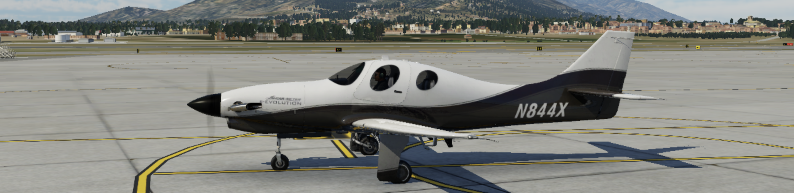{ :width="200" }

## Deck Functions

### Home
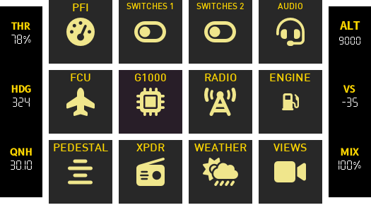{ :width="200" }

### PFI
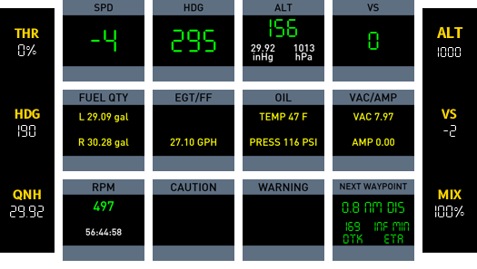{ :width="200" }

Central to this page is data you would consider primary flight instruments.
The **speed**, **bearing**, **altitude** and **vertical speed** fill the first row.

The second row consists of engine data in a more compact form than that found in the engine page.

The third row consists of:

- Fuel duration (a calculation of time remaining based on fuel flow and fuel quantity).
- Caution annunciators.
- Warning annunciators.
- Information on the next waypoint in flight plan.

### SWITCHES
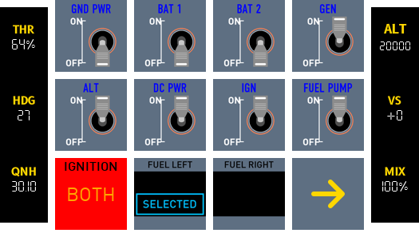{ :width="200" }

Primarily "Battery and Electrical Panel", Ignition, Fuel Pump and Fuel tank selector functions.

### ICING
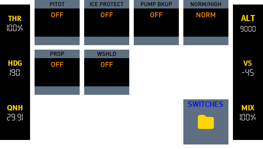{ :width="200" }

### LIGHTS
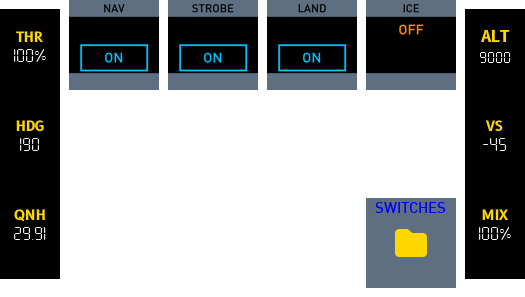{ :width="200" }

### FCU
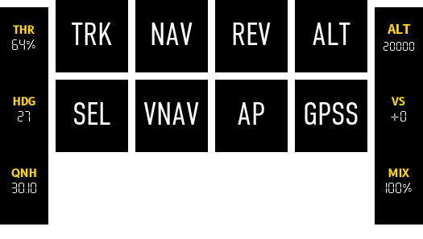{ :width="200" }

Functions for TS Sorceror autopilot module. 

### GCU-478
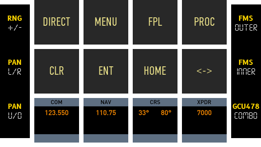{ :width="200" }

Though most of these functions should work, it will be updated to relflect G1000 functions.

### RADIO
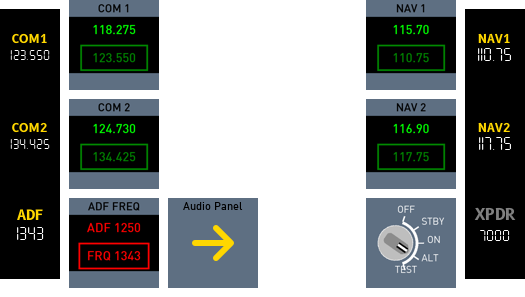{ :width="200" }

COM1/COM2, NAV1/NAV2, ADF and XPDR functions.

### ENGINE
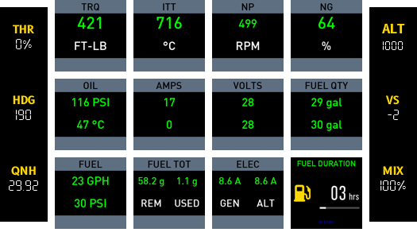{ :width="200" }

### PEDESTAL
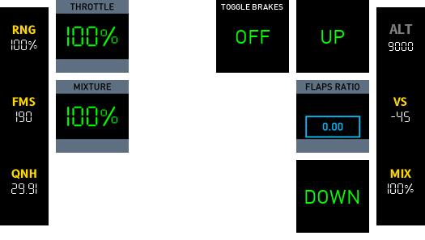{ :width="200" }

### TRANSPONDER
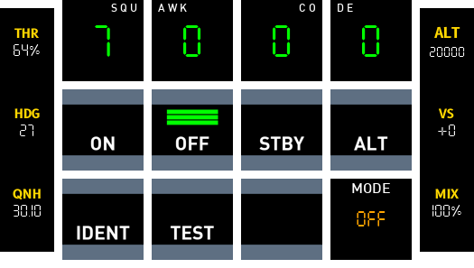{ :width="200" }

### WEATHER
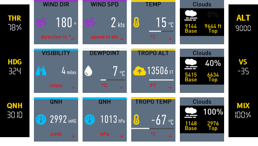{ :width="200" }

This page provides comprehensive weather data including coverage for different cloud layers and tropo data.

### VIEWS
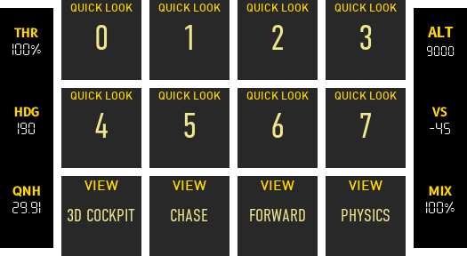{ :width="200" }

Provides functions to views and ability to set views with long press.