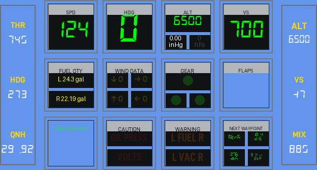
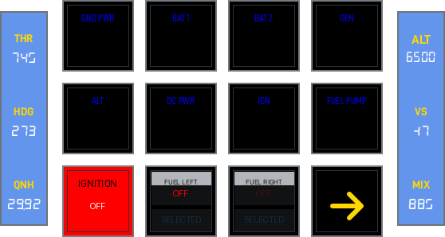
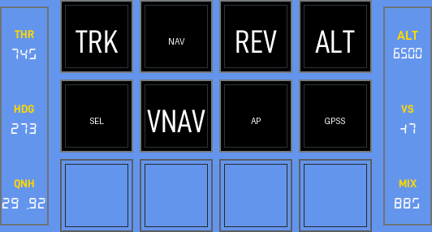
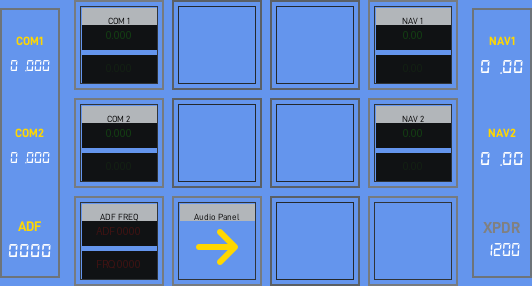
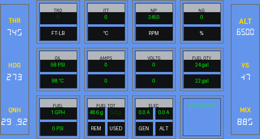
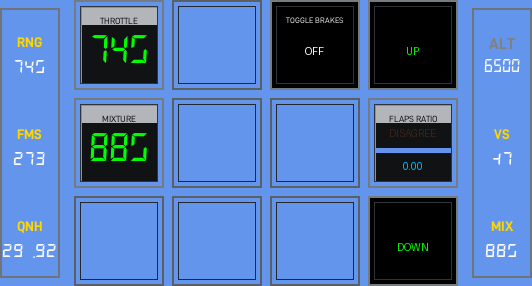
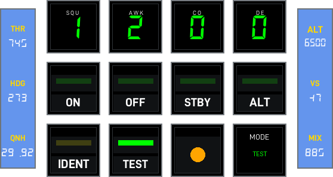
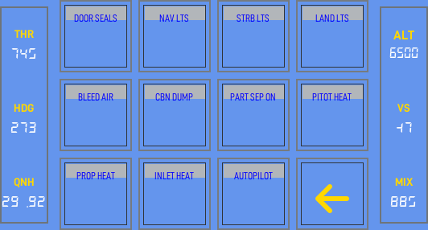
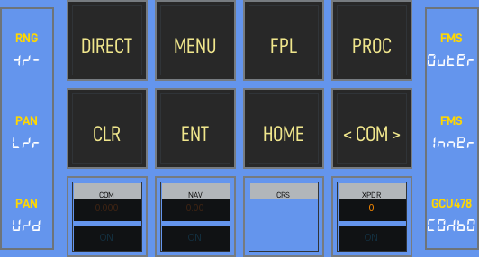
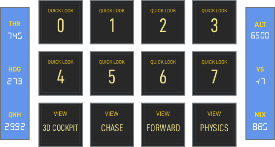

<!-- generated by scripts/generate_deck_docs.py; do not edit directly -->

# Lancair Evolution

Decks for Lancair Evolution

## Loupedeck Live

`LoupedeckLive` layout with 13 pages.

### Home

[:material-github: `loupedecklive1/home.yaml`](https://github.com/dlicudi/cockpitdecks-configs/blob/main/decks/lancair-evolution/deckconfig/loupedecklive1/home.yaml)

Includes: [:material-source-branch: `pager.yaml`](https://github.com/dlicudi/cockpitdecks-configs/blob/main/decks/lancair-evolution/deckconfig/loupedecklive1/pager.yaml) · [:material-source-branch: `encoders/encoders_fcu.yaml`](https://github.com/dlicudi/cockpitdecks-configs/blob/main/decks/lancair-evolution/deckconfig/loupedecklive1/encoders/encoders_fcu.yaml)

### PFI

[:material-github: `loupedecklive1/pfi.yaml`](https://github.com/dlicudi/cockpitdecks-configs/blob/main/decks/lancair-evolution/deckconfig/loupedecklive1/pfi.yaml)

Includes: [:material-source-branch: `pager.yaml`](https://github.com/dlicudi/cockpitdecks-configs/blob/main/decks/lancair-evolution/deckconfig/loupedecklive1/pager.yaml) · [:material-source-branch: `encoders/encoders_fcu.yaml`](https://github.com/dlicudi/cockpitdecks-configs/blob/main/decks/lancair-evolution/deckconfig/loupedecklive1/encoders/encoders_fcu.yaml)

### Switches

[:material-github: `loupedecklive1/switches.yaml`](https://github.com/dlicudi/cockpitdecks-configs/blob/main/decks/lancair-evolution/deckconfig/loupedecklive1/switches.yaml)

Includes: [:material-source-branch: `pager.yaml`](https://github.com/dlicudi/cockpitdecks-configs/blob/main/decks/lancair-evolution/deckconfig/loupedecklive1/pager.yaml) · [:material-source-branch: `encoders/encoders_fcu.yaml`](https://github.com/dlicudi/cockpitdecks-configs/blob/main/decks/lancair-evolution/deckconfig/loupedecklive1/encoders/encoders_fcu.yaml)

### FCU

[:material-github: `loupedecklive1/fcu.yaml`](https://github.com/dlicudi/cockpitdecks-configs/blob/main/decks/lancair-evolution/deckconfig/loupedecklive1/fcu.yaml)

Includes: [:material-source-branch: `pager.yaml`](https://github.com/dlicudi/cockpitdecks-configs/blob/main/decks/lancair-evolution/deckconfig/loupedecklive1/pager.yaml) · [:material-source-branch: `encoders/encoders_fcu.yaml`](https://github.com/dlicudi/cockpitdecks-configs/blob/main/decks/lancair-evolution/deckconfig/loupedecklive1/encoders/encoders_fcu.yaml)

### Radio

[:material-github: `loupedecklive1/radio.yaml`](https://github.com/dlicudi/cockpitdecks-configs/blob/main/decks/lancair-evolution/deckconfig/loupedecklive1/radio.yaml)

Includes: [:material-source-branch: `pager.yaml`](https://github.com/dlicudi/cockpitdecks-configs/blob/main/decks/lancair-evolution/deckconfig/loupedecklive1/pager.yaml) · [:material-source-branch: `encoders/encoders_radio.yaml`](https://github.com/dlicudi/cockpitdecks-configs/blob/main/decks/lancair-evolution/deckconfig/loupedecklive1/encoders/encoders_radio.yaml)

### Engine

[:material-github: `loupedecklive1/engine.yaml`](https://github.com/dlicudi/cockpitdecks-configs/blob/main/decks/lancair-evolution/deckconfig/loupedecklive1/engine.yaml)

Includes: [:material-source-branch: `pager.yaml`](https://github.com/dlicudi/cockpitdecks-configs/blob/main/decks/lancair-evolution/deckconfig/loupedecklive1/pager.yaml) · [:material-source-branch: `encoders/encoders_fcu.yaml`](https://github.com/dlicudi/cockpitdecks-configs/blob/main/decks/lancair-evolution/deckconfig/loupedecklive1/encoders/encoders_fcu.yaml)

### Pedestal

[:material-github: `loupedecklive1/pedestal.yaml`](https://github.com/dlicudi/cockpitdecks-configs/blob/main/decks/lancair-evolution/deckconfig/loupedecklive1/pedestal.yaml)

Includes: [:material-source-branch: `pager.yaml`](https://github.com/dlicudi/cockpitdecks-configs/blob/main/decks/lancair-evolution/deckconfig/loupedecklive1/pager.yaml) · [:material-source-branch: `encoders/encoders_pedestal.yaml`](https://github.com/dlicudi/cockpitdecks-configs/blob/main/decks/lancair-evolution/deckconfig/loupedecklive1/encoders/encoders_pedestal.yaml)

### Transponder

[:material-github: `loupedecklive1/transponder.yaml`](https://github.com/dlicudi/cockpitdecks-configs/blob/main/decks/lancair-evolution/deckconfig/loupedecklive1/transponder.yaml)

Includes: [:material-source-branch: `pager.yaml`](https://github.com/dlicudi/cockpitdecks-configs/blob/main/decks/lancair-evolution/deckconfig/loupedecklive1/pager.yaml) · [:material-source-branch: `encoders/encoders_fcu.yaml`](https://github.com/dlicudi/cockpitdecks-configs/blob/main/decks/lancair-evolution/deckconfig/loupedecklive1/encoders/encoders_fcu.yaml)

### Switches 2

[:material-github: `loupedecklive1/switches2.yaml`](https://github.com/dlicudi/cockpitdecks-configs/blob/main/decks/lancair-evolution/deckconfig/loupedecklive1/switches2.yaml)

Includes: [:material-source-branch: `pager.yaml`](https://github.com/dlicudi/cockpitdecks-configs/blob/main/decks/lancair-evolution/deckconfig/loupedecklive1/pager.yaml) · [:material-source-branch: `encoders/encoders_fcu.yaml`](https://github.com/dlicudi/cockpitdecks-configs/blob/main/decks/lancair-evolution/deckconfig/loupedecklive1/encoders/encoders_fcu.yaml)

### Audio Panel

[:material-github: `loupedecklive1/audiopanel.yaml`](https://github.com/dlicudi/cockpitdecks-configs/blob/main/decks/lancair-evolution/deckconfig/loupedecklive1/audiopanel.yaml)

Includes: [:material-source-branch: `pager.yaml`](https://github.com/dlicudi/cockpitdecks-configs/blob/main/decks/lancair-evolution/deckconfig/loupedecklive1/pager.yaml) · [:material-source-branch: `encoders/encoders_radio.yaml`](https://github.com/dlicudi/cockpitdecks-configs/blob/main/decks/lancair-evolution/deckconfig/loupedecklive1/encoders/encoders_radio.yaml)

### G1000

[:material-github: `loupedecklive1/g1000.yaml`](https://github.com/dlicudi/cockpitdecks-configs/blob/main/decks/lancair-evolution/deckconfig/loupedecklive1/g1000.yaml)

Includes: [:material-source-branch: `pager.yaml`](https://github.com/dlicudi/cockpitdecks-configs/blob/main/decks/lancair-evolution/deckconfig/loupedecklive1/pager.yaml) · [:material-source-branch: `encoders/encoders_g1000.yaml`](https://github.com/dlicudi/cockpitdecks-configs/blob/main/decks/lancair-evolution/deckconfig/loupedecklive1/encoders/encoders_g1000.yaml)

### Weather

[:material-github: `loupedecklive1/weather.yaml`](https://github.com/dlicudi/cockpitdecks-configs/blob/main/decks/lancair-evolution/deckconfig/loupedecklive1/weather.yaml)

Includes: [:material-source-branch: `pager.yaml`](https://github.com/dlicudi/cockpitdecks-configs/blob/main/decks/lancair-evolution/deckconfig/loupedecklive1/pager.yaml) · [:material-source-branch: `encoders/encoders_fcu.yaml`](https://github.com/dlicudi/cockpitdecks-configs/blob/main/decks/lancair-evolution/deckconfig/loupedecklive1/encoders/encoders_fcu.yaml)

### Views

[:material-github: `loupedecklive1/views.yaml`](https://github.com/dlicudi/cockpitdecks-configs/blob/main/decks/lancair-evolution/deckconfig/loupedecklive1/views.yaml)

Includes: [:material-source-branch: `pager.yaml`](https://github.com/dlicudi/cockpitdecks-configs/blob/main/decks/lancair-evolution/deckconfig/loupedecklive1/pager.yaml) · [:material-source-branch: `encoders/encoders_fcu.yaml`](https://github.com/dlicudi/cockpitdecks-configs/blob/main/decks/lancair-evolution/deckconfig/loupedecklive1/encoders/encoders_fcu.yaml)

## Stream Deck XL

`Stream Deck XL` layout with 11 pages.

### Home

[:material-github: `streamdeckxl1/index.yaml`](https://github.com/dlicudi/cockpitdecks-configs/blob/main/decks/lancair-evolution/deckconfig/streamdeckxl1/index.yaml)

Includes: [:material-source-branch: `includes/pagerfull.yaml`](https://github.com/dlicudi/cockpitdecks-configs/blob/main/decks/lancair-evolution/deckconfig/streamdeckxl1/includes/pagerfull.yaml)

### Engine

[:material-github: `streamdeckxl1/engine.yaml`](https://github.com/dlicudi/cockpitdecks-configs/blob/main/decks/lancair-evolution/deckconfig/streamdeckxl1/engine.yaml)

Includes: [:material-source-branch: `includes/pagerfull.yaml`](https://github.com/dlicudi/cockpitdecks-configs/blob/main/decks/lancair-evolution/deckconfig/streamdeckxl1/includes/pagerfull.yaml)

### PFI

[:material-github: `streamdeckxl1/pfi.yaml`](https://github.com/dlicudi/cockpitdecks-configs/blob/main/decks/lancair-evolution/deckconfig/streamdeckxl1/pfi.yaml)

Includes: [:material-source-branch: `includes/pagerfull.yaml`](https://github.com/dlicudi/cockpitdecks-configs/blob/main/decks/lancair-evolution/deckconfig/streamdeckxl1/includes/pagerfull.yaml) · [:material-source-branch: `includes/annunciators.yaml`](https://github.com/dlicudi/cockpitdecks-configs/blob/main/decks/lancair-evolution/deckconfig/streamdeckxl1/includes/annunciators.yaml)

### G1000

[:material-github: `streamdeckxl1/g1000.yaml`](https://github.com/dlicudi/cockpitdecks-configs/blob/main/decks/lancair-evolution/deckconfig/streamdeckxl1/g1000.yaml)

Includes: [:material-source-branch: `includes/pagerfull.yaml`](https://github.com/dlicudi/cockpitdecks-configs/blob/main/decks/lancair-evolution/deckconfig/streamdeckxl1/includes/pagerfull.yaml)

### Audio Panel

[:material-github: `streamdeckxl1/audiopanel.yaml`](https://github.com/dlicudi/cockpitdecks-configs/blob/main/decks/lancair-evolution/deckconfig/streamdeckxl1/audiopanel.yaml)

Includes: [:material-source-branch: `includes/pagerfull.yaml`](https://github.com/dlicudi/cockpitdecks-configs/blob/main/decks/lancair-evolution/deckconfig/streamdeckxl1/includes/pagerfull.yaml)

### Transponder

[:material-github: `streamdeckxl1/transponder.yaml`](https://github.com/dlicudi/cockpitdecks-configs/blob/main/decks/lancair-evolution/deckconfig/streamdeckxl1/transponder.yaml)

Includes: [:material-source-branch: `includes/pagerfull.yaml`](https://github.com/dlicudi/cockpitdecks-configs/blob/main/decks/lancair-evolution/deckconfig/streamdeckxl1/includes/pagerfull.yaml)

### Switches

[:material-github: `streamdeckxl1/switches.yaml`](https://github.com/dlicudi/cockpitdecks-configs/blob/main/decks/lancair-evolution/deckconfig/streamdeckxl1/switches.yaml)

Includes: [:material-source-branch: `includes/pagerfull.yaml`](https://github.com/dlicudi/cockpitdecks-configs/blob/main/decks/lancair-evolution/deckconfig/streamdeckxl1/includes/pagerfull.yaml)

### Weather

[:material-github: `streamdeckxl1/weather.yaml`](https://github.com/dlicudi/cockpitdecks-configs/blob/main/decks/lancair-evolution/deckconfig/streamdeckxl1/weather.yaml)

Includes: [:material-source-branch: `includes/pagerfull.yaml`](https://github.com/dlicudi/cockpitdecks-configs/blob/main/decks/lancair-evolution/deckconfig/streamdeckxl1/includes/pagerfull.yaml)

### Views

[:material-github: `streamdeckxl1/views.yaml`](https://github.com/dlicudi/cockpitdecks-configs/blob/main/decks/lancair-evolution/deckconfig/streamdeckxl1/views.yaml)

Includes: [:material-source-branch: `includes/pagerfull.yaml`](https://github.com/dlicudi/cockpitdecks-configs/blob/main/decks/lancair-evolution/deckconfig/streamdeckxl1/includes/pagerfull.yaml)

### Radio

[:material-github: `streamdeckxl1/radio.yaml`](https://github.com/dlicudi/cockpitdecks-configs/blob/main/decks/lancair-evolution/deckconfig/streamdeckxl1/radio.yaml)

Includes: [:material-source-branch: `includes/pagerfull.yaml`](https://github.com/dlicudi/cockpitdecks-configs/blob/main/decks/lancair-evolution/deckconfig/streamdeckxl1/includes/pagerfull.yaml)

### FCU

[:material-github: `streamdeckxl1/fcu.yaml`](https://github.com/dlicudi/cockpitdecks-configs/blob/main/decks/lancair-evolution/deckconfig/streamdeckxl1/fcu.yaml)

Includes: [:material-source-branch: `includes/pagerfull.yaml`](https://github.com/dlicudi/cockpitdecks-configs/blob/main/decks/lancair-evolution/deckconfig/streamdeckxl1/includes/pagerfull.yaml)

## Status

!!! success "State: Stable"

!!! tip "Planned"

    - Stream Deck XL: complete page parity with the Loupedeck Live layout.
