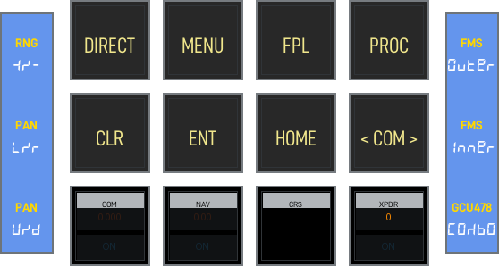

<!-- generated by scripts/generate_deck_docs.py; do not edit directly -->

# G1000

## Source

[:material-github: Page config](https://github.com/dlicudi/cockpitdecks-configs/blob/main/decks/lancair-evolution/deckconfig/loupedecklive1/g1000.yaml)

Includes: [:material-source-branch: `pager.yaml`](https://github.com/dlicudi/cockpitdecks-configs/blob/main/decks/lancair-evolution/deckconfig/loupedecklive1/pager.yaml) · [:material-source-branch: `encoders/encoders_g1000.yaml`](https://github.com/dlicudi/cockpitdecks-configs/blob/main/decks/lancair-evolution/deckconfig/loupedecklive1/encoders/encoders_g1000.yaml)
