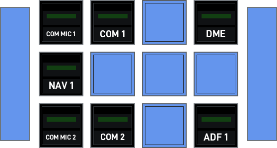
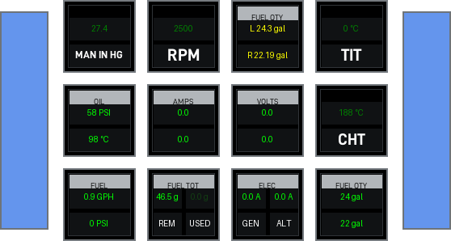
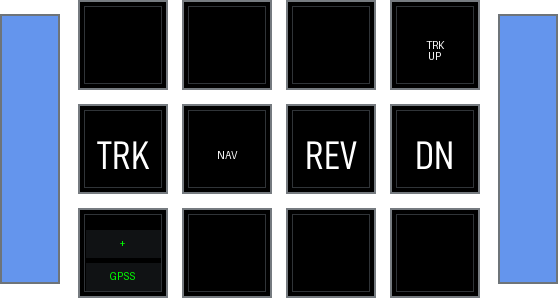
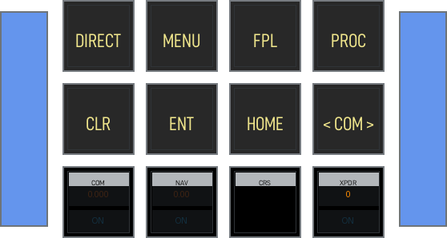
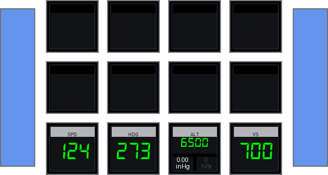
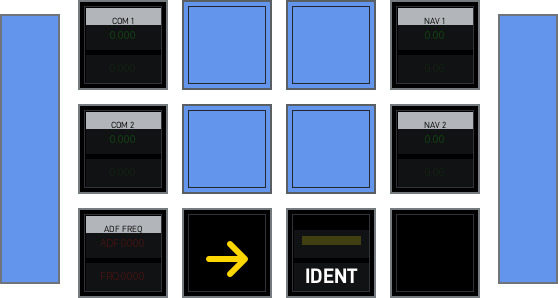
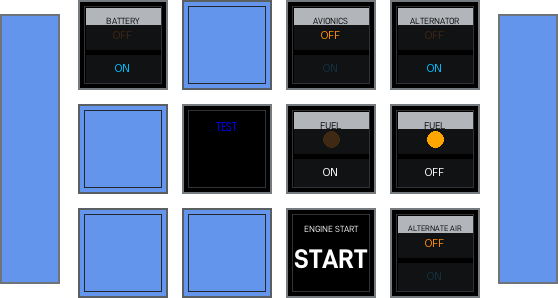
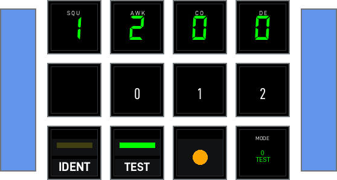
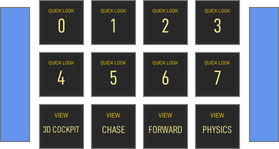
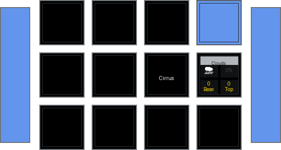

<!-- generated by scripts/generate_deck_docs.py; do not edit directly -->

# Stream Deck XL

Stream Deck XL layout for Lancair Evolution.

## Pages

  <a class="cdx-card" href="audiopanel/#lancair-evolution-streamdeckxl1-audiopanel-preview">
    
    

      <h3>Audio Panel</h3>
      
Page config and preview.

    

  </a>
  <a class="cdx-card" href="engine/#lancair-evolution-streamdeckxl1-engine-preview">
    
    

      <h3>Engine</h3>
      
Page config and preview.

    

  </a>
  <a class="cdx-card" href="fcu/#lancair-evolution-streamdeckxl1-fcu-preview">
    
    

      <h3>FCU</h3>
      
Page config and preview.

    

  </a>
  <a class="cdx-card" href="g1000/#lancair-evolution-streamdeckxl1-g1000-preview">
    
    

      <h3>G1000</h3>
      
Page config and preview.

    

  </a>
  <a class="cdx-card" href="index/#lancair-evolution-streamdeckxl1-index-preview">
    
    

      <h3>Home</h3>
      
Page config and preview.

    

  </a>
  <a class="cdx-card" href="pfi/#lancair-evolution-streamdeckxl1-pfi-preview">
    
    

      <h3>PFI</h3>
      
Page config and preview.

    

  </a>
  <a class="cdx-card" href="radio/#lancair-evolution-streamdeckxl1-radio-preview">
    
    

      <h3>Radio</h3>
      
Page config and preview.

    

  </a>
  <a class="cdx-card" href="switches/#lancair-evolution-streamdeckxl1-switches-preview">
    
    

      <h3>Switches</h3>
      
Page config and preview.

    

  </a>
  <a class="cdx-card" href="transponder/#lancair-evolution-streamdeckxl1-transponder-preview">
    
    

      <h3>Transponder</h3>
      
Page config and preview.

    

  </a>
  <a class="cdx-card" href="views/#lancair-evolution-streamdeckxl1-views-preview">
    
    

      <h3>Views</h3>
      
Page config and preview.

    

  </a>
  <a class="cdx-card" href="weather/#lancair-evolution-streamdeckxl1-weather-preview">
    
    

      <h3>Weather</h3>
      
Page config and preview.

    

  </a>

