<!-- generated by scripts/generate_deck_docs.py; do not edit directly -->

# Airbus A320neo

!!! abstract ""

    Decks for Toliss Airbus A320neo

=== "Loupedeck Live"

    Loupedeck Live layout with 7 pages.

    

    -   **Home**

        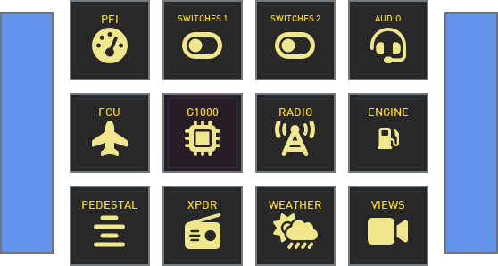

        [:material-github: `index.yaml`](https://github.com/dlicudi/cockpitdecks-configs/blob/main/decks/toliss-airbus-a320-neo/deckconfig/loupedecklive1/index.yaml)

    -   **PFI**

        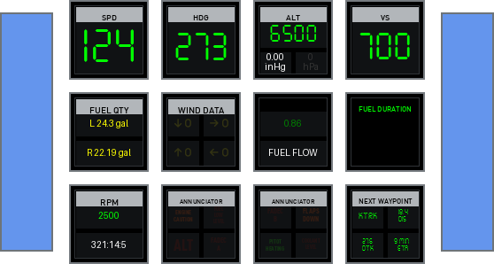

        [:material-github: `pfi.yaml`](https://github.com/dlicudi/cockpitdecks-configs/blob/main/decks/toliss-airbus-a320-neo/deckconfig/loupedecklive1/pfi.yaml)

    -   **FCU**

        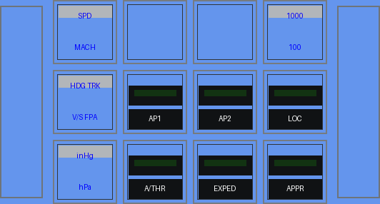

        [:material-github: `fcu.yaml`](https://github.com/dlicudi/cockpitdecks-configs/blob/main/decks/toliss-airbus-a320-neo/deckconfig/loupedecklive1/fcu.yaml)

    -   **Radio**

        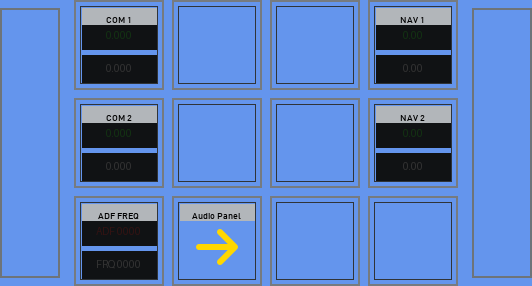

        [:material-github: `radio.yaml`](https://github.com/dlicudi/cockpitdecks-configs/blob/main/decks/toliss-airbus-a320-neo/deckconfig/loupedecklive1/radio.yaml)

    -   **Transponder**

        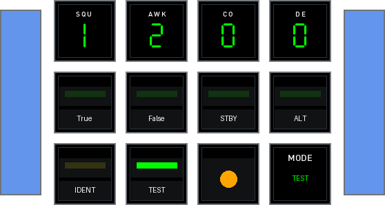

        [:material-github: `transponder.yaml`](https://github.com/dlicudi/cockpitdecks-configs/blob/main/decks/toliss-airbus-a320-neo/deckconfig/loupedecklive1/transponder.yaml)

    -   **Weather**

        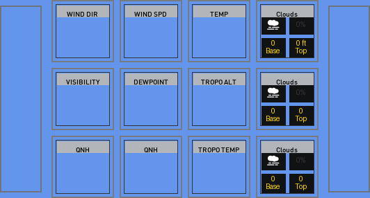

        [:material-github: `weather.yaml`](https://github.com/dlicudi/cockpitdecks-configs/blob/main/decks/toliss-airbus-a320-neo/deckconfig/loupedecklive1/weather.yaml)

    -   **Views**

        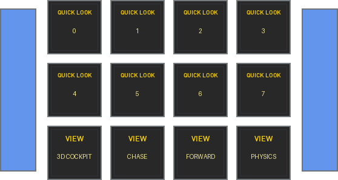

        [:material-github: `views.yaml`](https://github.com/dlicudi/cockpitdecks-configs/blob/main/decks/toliss-airbus-a320-neo/deckconfig/loupedecklive1/views.yaml)

    

=== "Stream Deck XL"

    Stream Deck XL layout with 14 pages.

    

    -   **Home**

        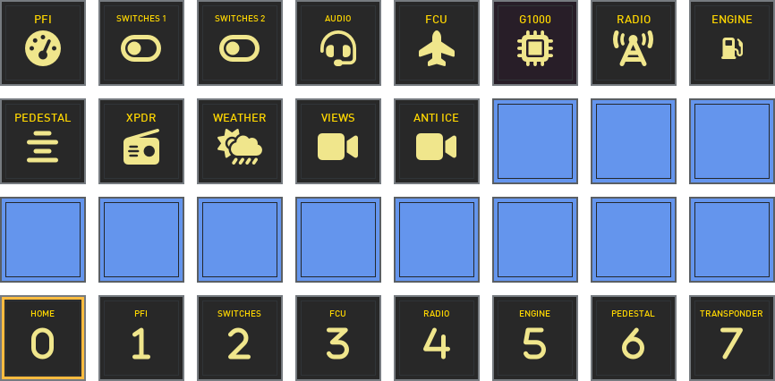

        [:material-github: `home.yaml`](https://github.com/dlicudi/cockpitdecks-configs/blob/main/decks/toliss-airbus-a320-neo/deckconfig/streamdeckxl1/home.yaml)

    -   **PFI**

        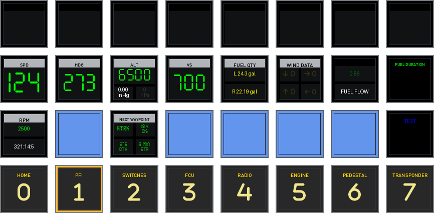

        [:material-github: `pfi.yaml`](https://github.com/dlicudi/cockpitdecks-configs/blob/main/decks/toliss-airbus-a320-neo/deckconfig/streamdeckxl1/pfi.yaml)

    -   **Switches**

        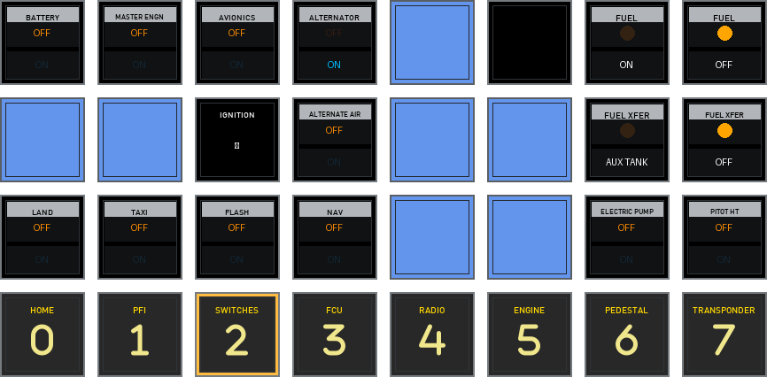

        [:material-github: `switches.yaml`](https://github.com/dlicudi/cockpitdecks-configs/blob/main/decks/toliss-airbus-a320-neo/deckconfig/streamdeckxl1/switches.yaml)

    -   **FCU**

        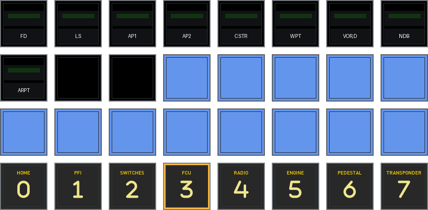

        [:material-github: `fcu.yaml`](https://github.com/dlicudi/cockpitdecks-configs/blob/main/decks/toliss-airbus-a320-neo/deckconfig/streamdeckxl1/fcu.yaml)

    -   **Radio**

        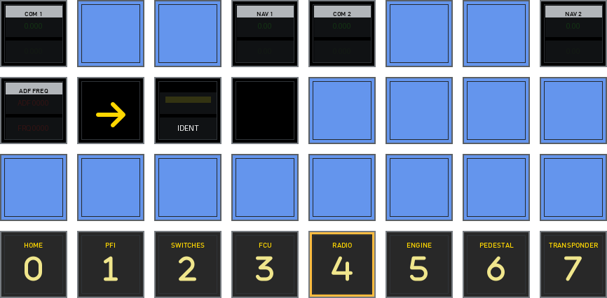

        [:material-github: `radio.yaml`](https://github.com/dlicudi/cockpitdecks-configs/blob/main/decks/toliss-airbus-a320-neo/deckconfig/streamdeckxl1/radio.yaml)

    -   **Engine**

        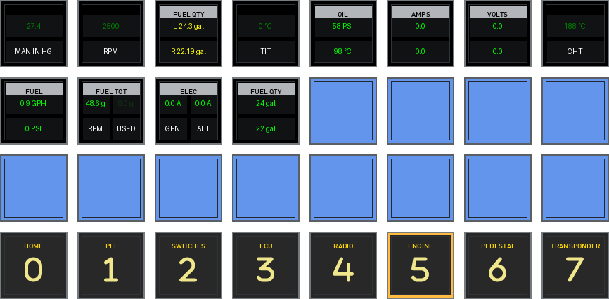

        [:material-github: `engine.yaml`](https://github.com/dlicudi/cockpitdecks-configs/blob/main/decks/toliss-airbus-a320-neo/deckconfig/streamdeckxl1/engine.yaml)

    -   **Pedestal**

        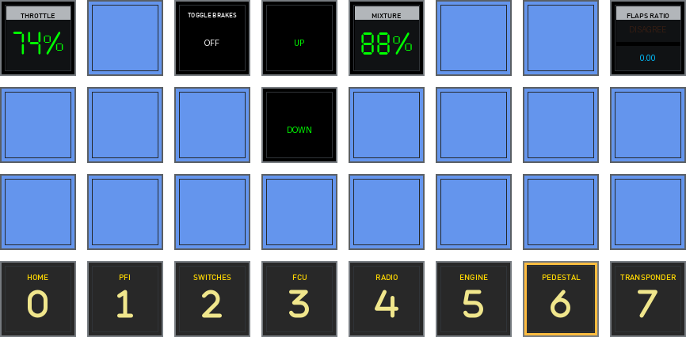

        [:material-github: `pedestal.yaml`](https://github.com/dlicudi/cockpitdecks-configs/blob/main/decks/toliss-airbus-a320-neo/deckconfig/streamdeckxl1/pedestal.yaml)

    -   **Transponder**

        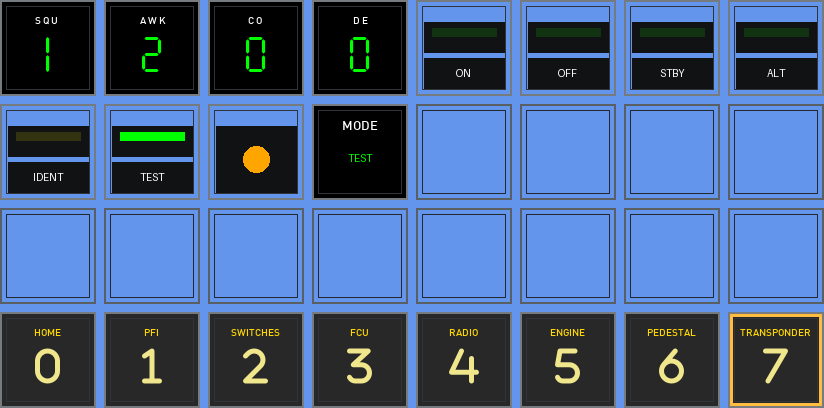

        [:material-github: `transponder.yaml`](https://github.com/dlicudi/cockpitdecks-configs/blob/main/decks/toliss-airbus-a320-neo/deckconfig/streamdeckxl1/transponder.yaml)

    -   **Switches 2**

        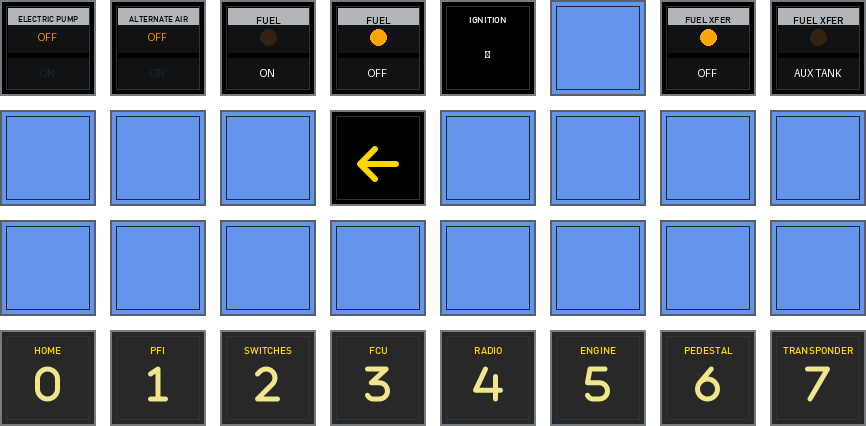

        [:material-github: `switches2.yaml`](https://github.com/dlicudi/cockpitdecks-configs/blob/main/decks/toliss-airbus-a320-neo/deckconfig/streamdeckxl1/switches2.yaml)

    -   **Audio Panel**

        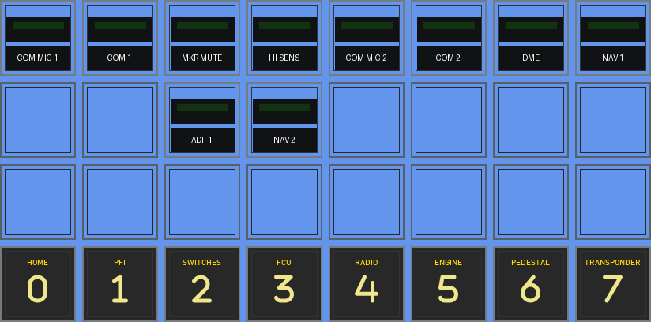

        [:material-github: `audiopanel.yaml`](https://github.com/dlicudi/cockpitdecks-configs/blob/main/decks/toliss-airbus-a320-neo/deckconfig/streamdeckxl1/audiopanel.yaml)

    -   **G1000**

        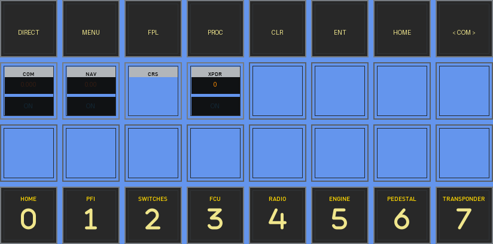

        [:material-github: `g1000.yaml`](https://github.com/dlicudi/cockpitdecks-configs/blob/main/decks/toliss-airbus-a320-neo/deckconfig/streamdeckxl1/g1000.yaml)

    -   **Weather**

        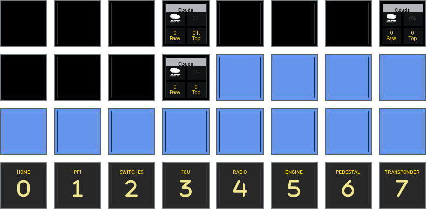

        [:material-github: `weather.yaml`](https://github.com/dlicudi/cockpitdecks-configs/blob/main/decks/toliss-airbus-a320-neo/deckconfig/streamdeckxl1/weather.yaml)

    -   **Views**

        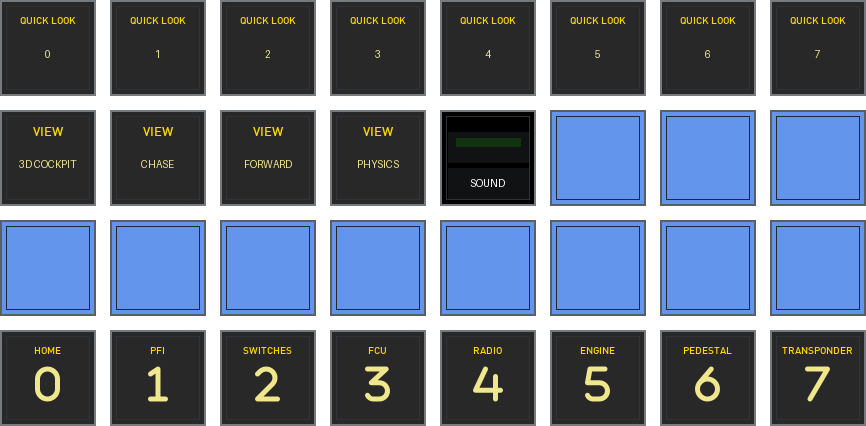

        [:material-github: `views.yaml`](https://github.com/dlicudi/cockpitdecks-configs/blob/main/decks/toliss-airbus-a320-neo/deckconfig/streamdeckxl1/views.yaml)

    -   **ANTI ICE**

        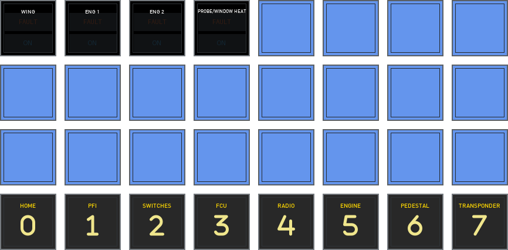

        [:material-github: `overhead_antiice.yaml`](https://github.com/dlicudi/cockpitdecks-configs/blob/main/decks/toliss-airbus-a320-neo/deckconfig/streamdeckxl1/overhead_antiice.yaml)

    

