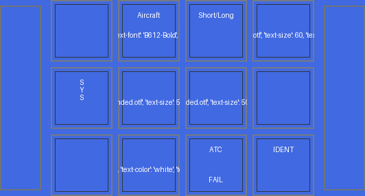
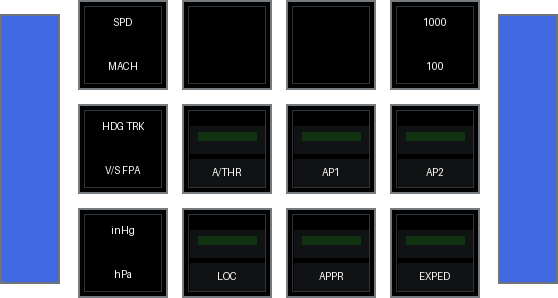
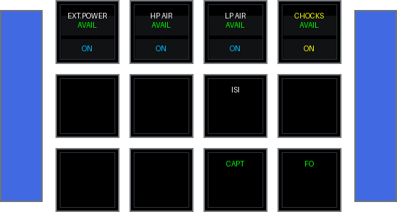
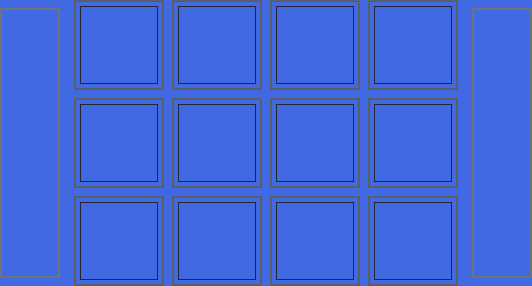
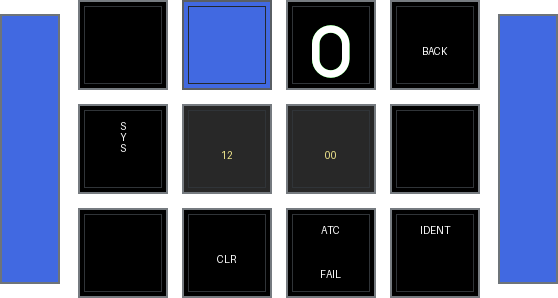

<!-- generated by scripts/generate_deck_docs.py; do not edit directly -->

# Toliss A321neo

Definition of decks for Toliss A321 + neo add-on (neo variant is XLR but all three variants use same cockpit)

## Loupedeck Live

`LoupedeckLive` layout with 6 pages.

### Home

[:material-github: `fcu/index.yaml`](https://github.com/dlicudi/cockpitdecks-configs/blob/main/decks/toliss-airbus-a321-neo/deckconfig/fcu/index.yaml)

### FCU

[:material-github: `fcu/fcu.yaml`](https://github.com/dlicudi/cockpitdecks-configs/blob/main/decks/toliss-airbus-a321-neo/deckconfig/fcu/fcu.yaml)

Includes: [:material-source-branch: `views.yaml`](https://github.com/dlicudi/cockpitdecks-configs/blob/main/decks/toliss-airbus-a321-neo/deckconfig/fcu/views.yaml)

### Transponder and other communication for Loupedeck Live

[:material-github: `fcu/toliss.yaml`](https://github.com/dlicudi/cockpitdecks-configs/blob/main/decks/toliss-airbus-a321-neo/deckconfig/fcu/toliss.yaml)

Includes: [:material-source-branch: `views.yaml`](https://github.com/dlicudi/cockpitdecks-configs/blob/main/decks/toliss-airbus-a321-neo/deckconfig/fcu/views.yaml)

### Include with all display popups for Loupedeck Live

[:material-github: `fcu/popups.yaml`](https://github.com/dlicudi/cockpitdecks-configs/blob/main/decks/toliss-airbus-a321-neo/deckconfig/fcu/popups.yaml)

### Include with all views for Loupedeck Live

[:material-github: `fcu/views.yaml`](https://github.com/dlicudi/cockpitdecks-configs/blob/main/decks/toliss-airbus-a321-neo/deckconfig/fcu/views.yaml)

### Transponder and other communication for Loupedeck Live

[:material-github: `fcu/xpndr.yaml`](https://github.com/dlicudi/cockpitdecks-configs/blob/main/decks/toliss-airbus-a321-neo/deckconfig/fcu/xpndr.yaml)

## Stream Deck Original

`Stream Deck Original` layout with 2 pages.

### Home

[:material-github: `efis-ecam/index.yaml`](https://github.com/dlicudi/cockpitdecks-configs/blob/main/decks/toliss-airbus-a321-neo/deckconfig/efis-ecam/index.yaml)

### EFIS display selector + some FCU commands for Streamdeck 15 keys

[:material-github: `efis-ecam/efis.yaml`](https://github.com/dlicudi/cockpitdecks-configs/blob/main/decks/toliss-airbus-a321-neo/deckconfig/efis-ecam/efis.yaml)

## Stream Deck XL

`Stream Deck XL` layout with 21 pages.

### Home

[:material-github: `panels/index.yaml`](https://github.com/dlicudi/cockpitdecks-configs/blob/main/decks/toliss-airbus-a321-neo/deckconfig/panels/index.yaml)

### Overhead AIR COND Panel with annunciator buttons

[:material-github: `panels/ovrhdaircond.yaml`](https://github.com/dlicudi/cockpitdecks-configs/blob/main/decks/toliss-airbus-a321-neo/deckconfig/panels/ovrhdaircond.yaml)

### Internal lights

[:material-github: `panels/intlights.yaml`](https://github.com/dlicudi/cockpitdecks-configs/blob/main/decks/toliss-airbus-a321-neo/deckconfig/panels/intlights.yaml)

### ALternate index page

[:material-github: `panels/index-alt.yaml`](https://github.com/dlicudi/cockpitdecks-configs/blob/main/decks/toliss-airbus-a321-neo/deckconfig/panels/index-alt.yaml)

Includes: [:material-source-branch: `popups.yaml`](https://github.com/dlicudi/cockpitdecks-configs/blob/main/decks/toliss-airbus-a321-neo/deckconfig/panels/popups.yaml)

### ADIRS Start/stop

[:material-github: `panels/adirs.yaml`](https://github.com/dlicudi/cockpitdecks-configs/blob/main/decks/toliss-airbus-a321-neo/deckconfig/panels/adirs.yaml)

### Airport-navigator dashboard

[:material-github: `panels/aptnav.yaml`](https://github.com/dlicudi/cockpitdecks-configs/blob/main/decks/toliss-airbus-a321-neo/deckconfig/panels/aptnav.yaml)

### Cockpitdecks specific actions, not linked to aircraft

[:material-github: `panels/cockpitdecks.yaml`](https://github.com/dlicudi/cockpitdecks-configs/blob/main/decks/toliss-airbus-a321-neo/deckconfig/panels/cockpitdecks.yaml)

### Cockpitdecks Special Dashboard of A21N

[:material-github: `panels/dashboard.yaml`](https://github.com/dlicudi/cockpitdecks-configs/blob/main/decks/toliss-airbus-a321-neo/deckconfig/panels/dashboard.yaml)

### Cabin and cargo door management

[:material-github: `panels/doors.yaml`](https://github.com/dlicudi/cockpitdecks-configs/blob/main/decks/toliss-airbus-a321-neo/deckconfig/panels/doors.yaml)

### ECAM display selector

[:material-github: `panels/ecam.yaml`](https://github.com/dlicudi/cockpitdecks-configs/blob/main/decks/toliss-airbus-a321-neo/deckconfig/panels/ecam.yaml)

### EFIS display selector + some FCU commands

[:material-github: `panels/efis.yaml`](https://github.com/dlicudi/cockpitdecks-configs/blob/main/decks/toliss-airbus-a321-neo/deckconfig/panels/efis.yaml)

### Overhead ELEC Panel

[:material-github: `panels/ovrhdelec.yaml`](https://github.com/dlicudi/cockpitdecks-configs/blob/main/decks/toliss-airbus-a321-neo/deckconfig/panels/ovrhdelec.yaml)

### Overhead FIRE Panel

[:material-github: `panels/ovrhdfire.yaml`](https://github.com/dlicudi/cockpitdecks-configs/blob/main/decks/toliss-airbus-a321-neo/deckconfig/panels/ovrhdfire.yaml)

### Overhead Fuel Panel

[:material-github: `panels/ovrhdfuel.yaml`](https://github.com/dlicudi/cockpitdecks-configs/blob/main/decks/toliss-airbus-a321-neo/deckconfig/panels/ovrhdfuel.yaml)

### Overhead Hydraulics Panel

[:material-github: `panels/ovrhdhyd.yaml`](https://github.com/dlicudi/cockpitdecks-configs/blob/main/decks/toliss-airbus-a321-neo/deckconfig/panels/ovrhdhyd.yaml)

### Piedestal (partial, project, prototype, uncompleted)

[:material-github: `panels/piedestal.yaml`](https://github.com/dlicudi/cockpitdecks-configs/blob/main/decks/toliss-airbus-a321-neo/deckconfig/panels/piedestal.yaml)

### All popups on pos. 16 to 28

[:material-github: `panels/popups.yaml`](https://github.com/dlicudi/cockpitdecks-configs/blob/main/decks/toliss-airbus-a321-neo/deckconfig/panels/popups.yaml)

### RAdio control

[:material-github: `panels/radio.yaml`](https://github.com/dlicudi/cockpitdecks-configs/blob/main/decks/toliss-airbus-a321-neo/deckconfig/panels/radio.yaml)

### Toliss aircraft specific actions, not available in real aircraft...

[:material-github: `panels/toliss.yaml`](https://github.com/dlicudi/cockpitdecks-configs/blob/main/decks/toliss-airbus-a321-neo/deckconfig/panels/toliss.yaml)

Includes: [:material-source-branch: `popups.yaml`](https://github.com/dlicudi/cockpitdecks-configs/blob/main/decks/toliss-airbus-a321-neo/deckconfig/panels/popups.yaml)

### X-Plane specific actions, not linked to aircraft

[:material-github: `panels/xplane.yaml`](https://github.com/dlicudi/cockpitdecks-configs/blob/main/decks/toliss-airbus-a321-neo/deckconfig/panels/xplane.yaml)

### Transponder and related controls

[:material-github: `panels/xpndr.yaml`](https://github.com/dlicudi/cockpitdecks-configs/blob/main/decks/toliss-airbus-a321-neo/deckconfig/panels/xpndr.yaml)

## Stream Deck +

`Stream Deck +` layout with 1 page.

### Home

[:material-github: `efis/index.yaml`](https://github.com/dlicudi/cockpitdecks-configs/blob/main/decks/toliss-airbus-a321-neo/deckconfig/efis/index.yaml)

## X Touch Mini

`X-Touch Mini` layout with 4 pages.

### Internal lights (all of them, panel lighting, etc.)

[:material-github: `comm-radio/intlights.yaml`](https://github.com/dlicudi/cockpitdecks-configs/blob/main/decks/toliss-airbus-a321-neo/deckconfig/comm-radio/intlights.yaml)

### Encoders and push buttons on "Page A" of X-Touch mini

[:material-github: `comm-radio/a.yaml`](https://github.com/dlicudi/cockpitdecks-configs/blob/main/decks/toliss-airbus-a321-neo/deckconfig/comm-radio/a.yaml)

Includes: [:material-source-branch: `encoders.yaml`](https://github.com/dlicudi/cockpitdecks-configs/blob/main/decks/toliss-airbus-a321-neo/deckconfig/comm-radio/encoders.yaml)

### Encoders and push buttons on "Page B" of X-Touch mini

[:material-github: `comm-radio/b.yaml`](https://github.com/dlicudi/cockpitdecks-configs/blob/main/decks/toliss-airbus-a321-neo/deckconfig/comm-radio/b.yaml)

Includes: [:material-source-branch: `encoders.yaml`](https://github.com/dlicudi/cockpitdecks-configs/blob/main/decks/toliss-airbus-a321-neo/deckconfig/comm-radio/encoders.yaml)

### Encoders common to both pages

[:material-github: `comm-radio/encoders.yaml`](https://github.com/dlicudi/cockpitdecks-configs/blob/main/decks/toliss-airbus-a321-neo/deckconfig/comm-radio/encoders.yaml)
