<!-- generated by scripts/generate_deck_docs.py; do not edit directly -->

# Stream Deck XL

Stream Deck XL layout for Airbus A321-253NY (CFM LEAP-1A33).

## Pages

  <a class="cdx-card" href="adirs/#toliss-airbus-a321-neo-panels-adirs-preview">
    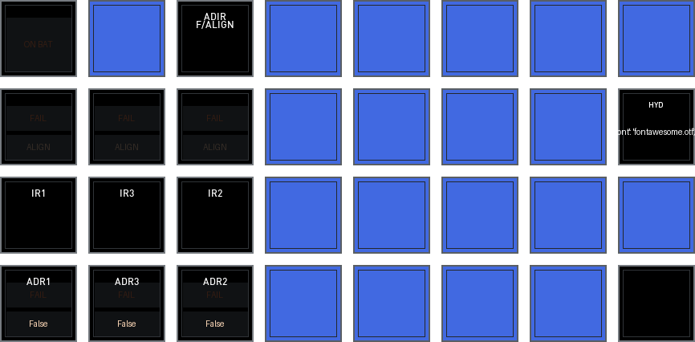
    

      <h3>ADIRS Start/stop</h3>
      
Page config and preview.

    

  </a>
  <a class="cdx-card" href="aptnav/#toliss-airbus-a321-neo-panels-aptnav-preview">
    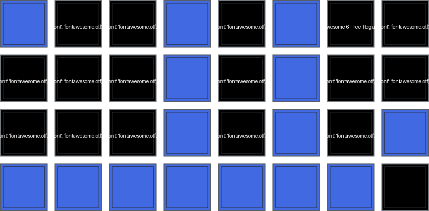
    

      <h3>Airport-navigator dashboard</h3>
      
Page config and preview.

    

  </a>
  <a class="cdx-card" href="cockpitdecks/#toliss-airbus-a321-neo-panels-cockpitdecks-preview">
    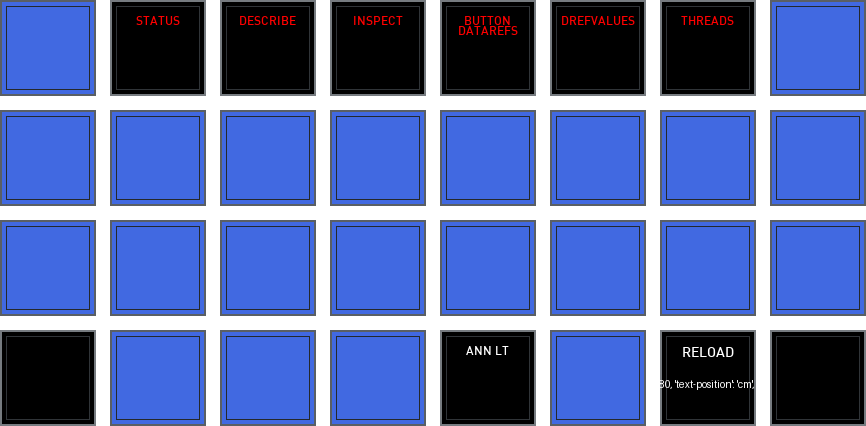
    

      <h3>Cockpitdecks specific actions, not linked to aircraft</h3>
      
Page config and preview.

    

  </a>
  <a class="cdx-card" href="dashboard/#toliss-airbus-a321-neo-panels-dashboard-preview">
    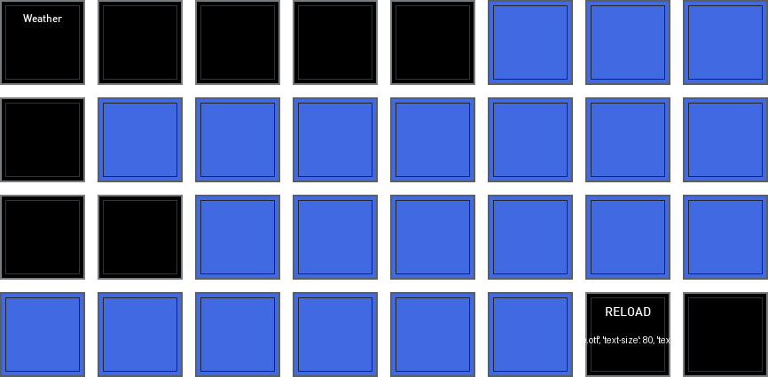
    

      <h3>Cockpitdecks Special Dashboard of A21N</h3>
      
Page config and preview.

    

  </a>
  <a class="cdx-card" href="doors/#toliss-airbus-a321-neo-panels-doors-preview">
    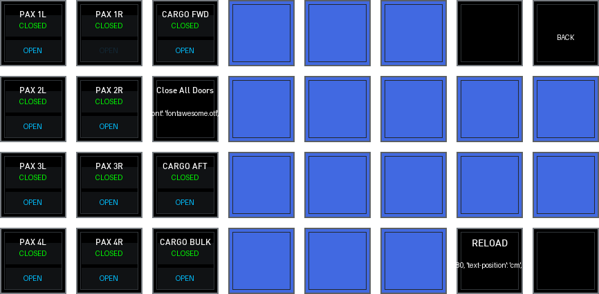
    

      <h3>Cabin and cargo door management</h3>
      
Page config and preview.

    

  </a>
  <a class="cdx-card" href="ecam/#toliss-airbus-a321-neo-panels-ecam-preview">
    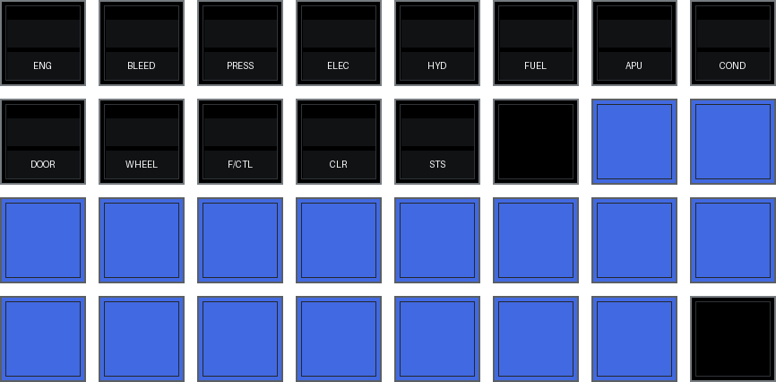
    

      <h3>ECAM display selector</h3>
      
Page config and preview.

    

  </a>
  <a class="cdx-card" href="efis/#toliss-airbus-a321-neo-panels-efis-preview">
    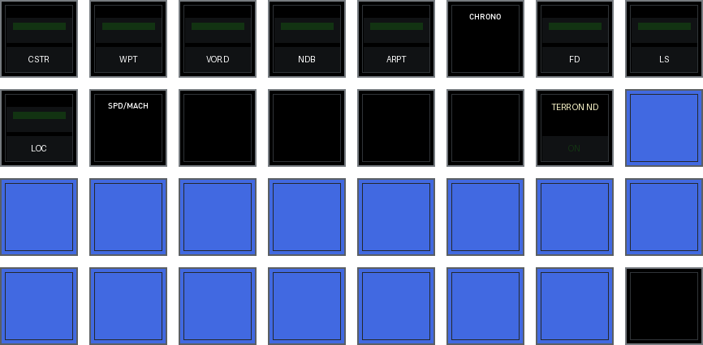
    

      <h3>EFIS display selector + some FCU commands</h3>
      
Page config and preview.

    

  </a>
  <a class="cdx-card" href="index-alt/#toliss-airbus-a321-neo-panels-index-alt-preview">
    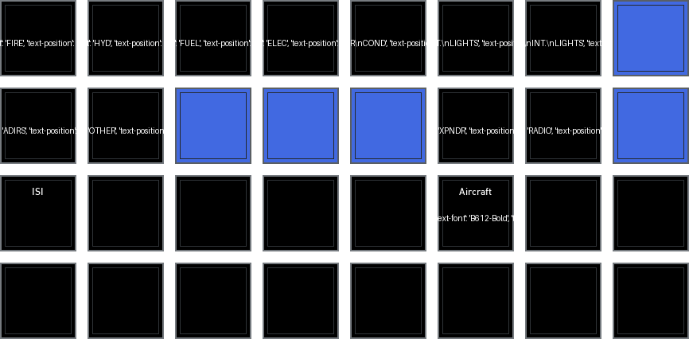
    

      <h3>ALternate index page</h3>
      
Page config and preview.

    

  </a>
  <a class="cdx-card" href="home/#toliss-airbus-a321-neo-panels-index-preview">
    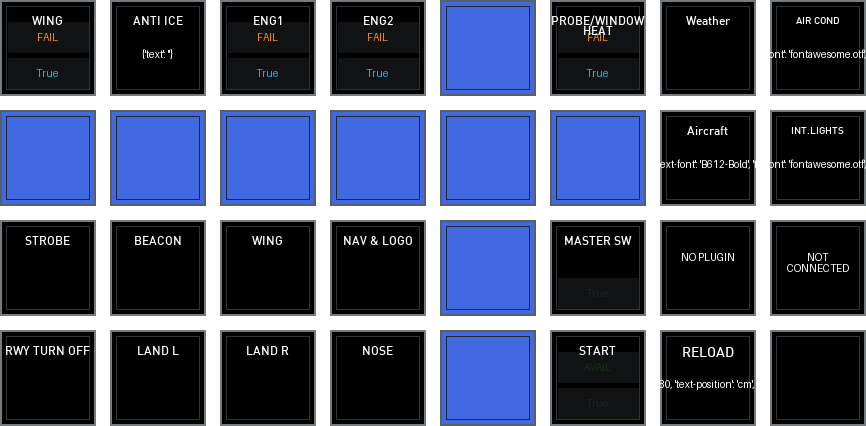
    

      <h3>Home</h3>
      
Page config and preview.

    

  </a>
  <a class="cdx-card" href="intlights/#toliss-airbus-a321-neo-panels-intlights-preview">
    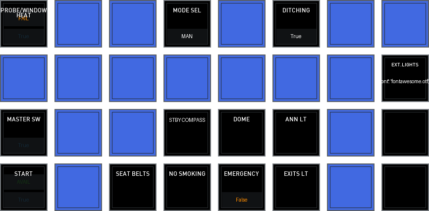
    

      <h3>Internal lights</h3>
      
Page config and preview.

    

  </a>
  <a class="cdx-card" href="ovrhdaircond/#toliss-airbus-a321-neo-panels-ovrhdaircond-preview">
    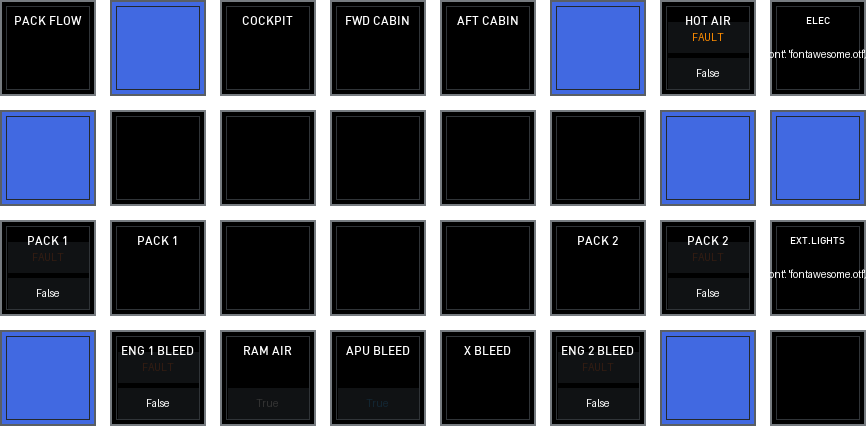
    

      <h3>Overhead AIR COND Panel with annunciator buttons</h3>
      
Page config and preview.

    

  </a>
  <a class="cdx-card" href="ovrhdelec/#toliss-airbus-a321-neo-panels-ovrhdelec-preview">
    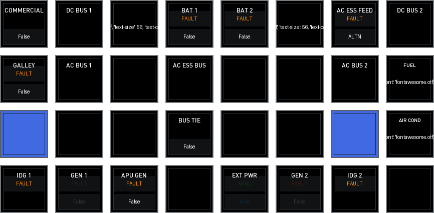
    

      <h3>Overhead ELEC Panel</h3>
      
Page config and preview.

    

  </a>
  <a class="cdx-card" href="ovrhdfire/#toliss-airbus-a321-neo-panels-ovrhdfire-preview">
    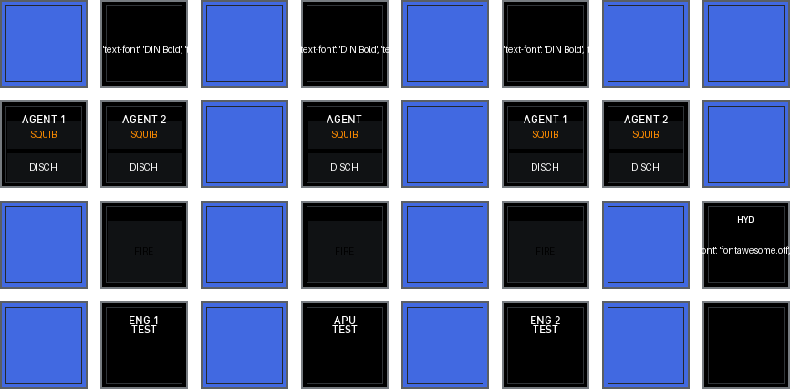
    

      <h3>Overhead FIRE Panel</h3>
      
Page config and preview.

    

  </a>
  <a class="cdx-card" href="ovrhdfuel/#toliss-airbus-a321-neo-panels-ovrhdfuel-preview">
    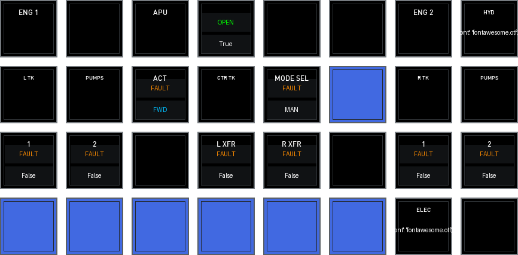
    

      <h3>Overhead Fuel Panel</h3>
      
Page config and preview.

    

  </a>
  <a class="cdx-card" href="ovrhdhyd/#toliss-airbus-a321-neo-panels-ovrhdhyd-preview">
    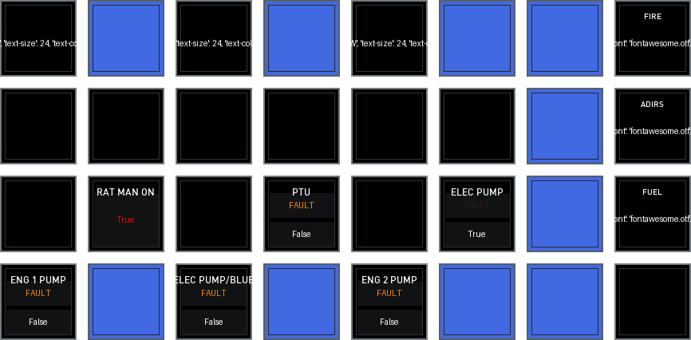
    

      <h3>Overhead Hydraulics Panel</h3>
      
Page config and preview.

    

  </a>
  <a class="cdx-card" href="piedestal/#toliss-airbus-a321-neo-panels-piedestal-preview">
    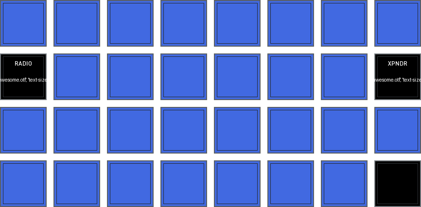
    

      <h3>Piedestal (partial, project, prototype, uncompleted)</h3>
      
Page config and preview.

    

  </a>
  <a class="cdx-card" href="popups/#toliss-airbus-a321-neo-panels-popups-preview">
    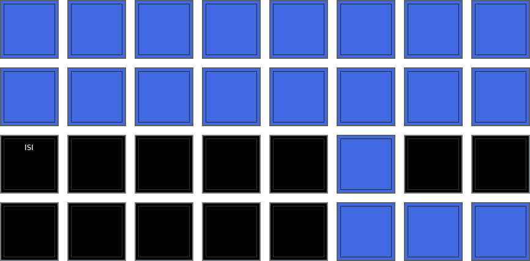
    

      <h3>All popups on pos. 16 to 28</h3>
      
Page config and preview.

    

  </a>
  <a class="cdx-card" href="radio/#toliss-airbus-a321-neo-panels-radio-preview">
    
    

      <h3>RAdio control</h3>
      
Page config and preview.

    

  </a>
  <a class="cdx-card" href="toliss/#toliss-airbus-a321-neo-panels-toliss-preview">
    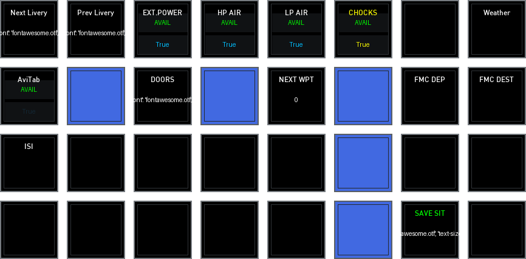
    

      <h3>Toliss aircraft specific actions, not available in real aircraft...</h3>
      
Page config and preview.

    

  </a>
  <a class="cdx-card" href="xplane/#toliss-airbus-a321-neo-panels-xplane-preview">
    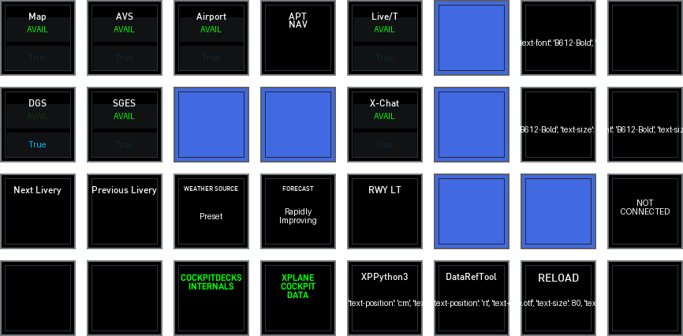
    

      <h3>X-Plane specific actions, not linked to aircraft</h3>
      
Page config and preview.

    

  </a>
  <a class="cdx-card" href="xpndr/#toliss-airbus-a321-neo-panels-xpndr-preview">
    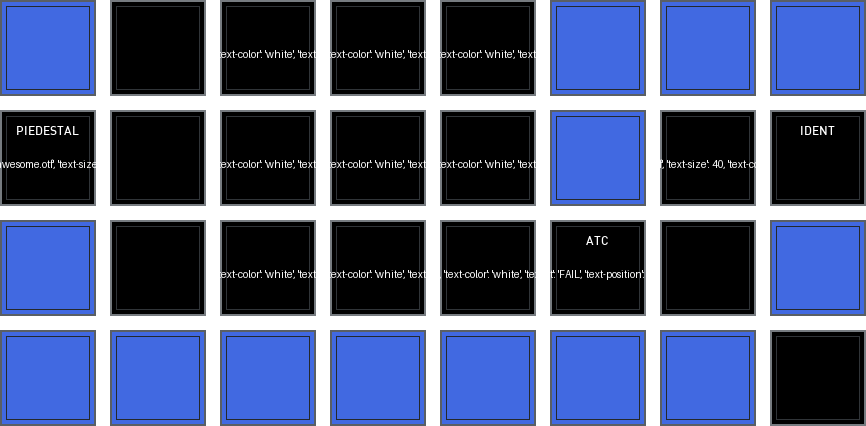
    

      <h3>Transponder and related controls</h3>
      
Page config and preview.

    

  </a>

