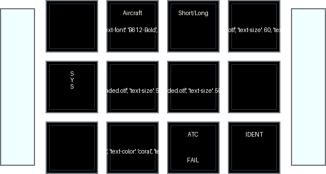
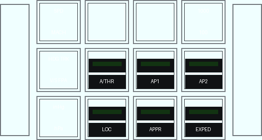
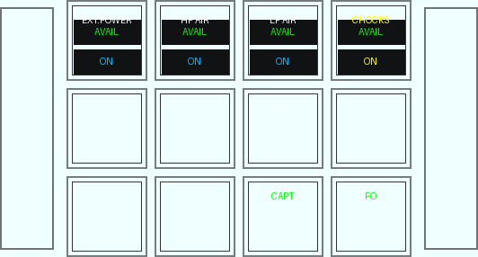
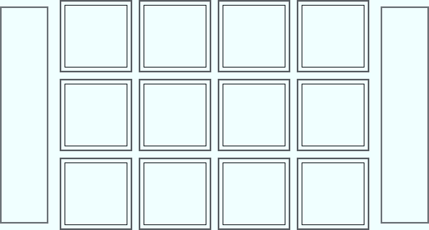
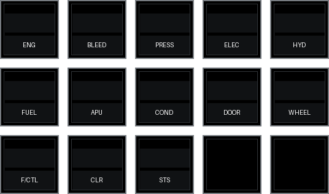
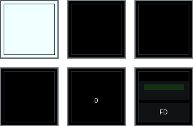

<!-- generated by scripts/generate_deck_docs.py; do not edit directly -->

# ToLiss A330neo

!!! abstract ""

    Definition of decks for ToLiss A330neo

=== "Loupedeck Live"

    `LoupedeckLive` layout with 5 pages.

    

    -   **Home**

        

        [:material-github: `index.yaml`](https://github.com/dlicudi/cockpitdecks-configs/blob/main/decks/toliss-airbus-a330-neo/deckconfig/fcu/index.yaml)

    -   **FCU**

        

        [:material-github: `fcu.yaml`](https://github.com/dlicudi/cockpitdecks-configs/blob/main/decks/toliss-airbus-a330-neo/deckconfig/fcu/fcu.yaml)

    -   **Transponder and other communication for Loupedeck Live**

        

        [:material-github: `toliss.yaml`](https://github.com/dlicudi/cockpitdecks-configs/blob/main/decks/toliss-airbus-a330-neo/deckconfig/fcu/toliss.yaml)

    -   **Include with all display popups for Loupedeck Live**

        

        [:material-github: `popups.yaml`](https://github.com/dlicudi/cockpitdecks-configs/blob/main/decks/toliss-airbus-a330-neo/deckconfig/fcu/popups.yaml)

    -   **Include with all views for Loupedeck Live**

        

        [:material-github: `views.yaml`](https://github.com/dlicudi/cockpitdecks-configs/blob/main/decks/toliss-airbus-a330-neo/deckconfig/fcu/views.yaml)

    

=== "Stream Deck Original"

    `Stream Deck Original` layout with 2 pages.

    

    -   **Home**

        

        [:material-github: `index.yaml`](https://github.com/dlicudi/cockpitdecks-configs/blob/main/decks/toliss-airbus-a330-neo/deckconfig/efis-ecam/index.yaml)

    -   **EFIS display selector + some FCU commands for Streamdeck 15 keys**

        

        [:material-github: `efis.yaml`](https://github.com/dlicudi/cockpitdecks-configs/blob/main/decks/toliss-airbus-a330-neo/deckconfig/efis-ecam/efis.yaml)

    

=== "Stream Deck XL"

    `Stream Deck XL` layout with 21 pages.

    

    -   **Home**

        

        [:material-github: `index.yaml`](https://github.com/dlicudi/cockpitdecks-configs/blob/main/decks/toliss-airbus-a330-neo/deckconfig/panels/index.yaml)

    -   **Overhead AIR COND Panel (ATA 21)**

        

        [:material-github: `ovrhdaircond.yaml`](https://github.com/dlicudi/cockpitdecks-configs/blob/main/decks/toliss-airbus-a330-neo/deckconfig/panels/ovrhdaircond.yaml)

    -   **Internal lights**

        

        [:material-github: `intlights.yaml`](https://github.com/dlicudi/cockpitdecks-configs/blob/main/decks/toliss-airbus-a330-neo/deckconfig/panels/intlights.yaml)

    -   **Alternate index page**

        

        [:material-github: `index-alt.yaml`](https://github.com/dlicudi/cockpitdecks-configs/blob/main/decks/toliss-airbus-a330-neo/deckconfig/panels/index-alt.yaml)

    -   **ADIRS Start/stop**

        

        [:material-github: `adirs.yaml`](https://github.com/dlicudi/cockpitdecks-configs/blob/main/decks/toliss-airbus-a330-neo/deckconfig/panels/adirs.yaml)

    -   **Airport Navigator**

        

        [:material-github: `aptnav.yaml`](https://github.com/dlicudi/cockpitdecks-configs/blob/main/decks/toliss-airbus-a330-neo/deckconfig/panels/aptnav.yaml)

    -   **Cockpitdecks specific actions, not linked to aircraft**

        

        [:material-github: `cockpitdecks.yaml`](https://github.com/dlicudi/cockpitdecks-configs/blob/main/decks/toliss-airbus-a330-neo/deckconfig/panels/cockpitdecks.yaml)

    -   **Cockpitdecks Special Dashboard of A21N**

        

        [:material-github: `dashboard.yaml`](https://github.com/dlicudi/cockpitdecks-configs/blob/main/decks/toliss-airbus-a330-neo/deckconfig/panels/dashboard.yaml)

    -   **Door operations**

        

        [:material-github: `doors.yaml`](https://github.com/dlicudi/cockpitdecks-configs/blob/main/decks/toliss-airbus-a330-neo/deckconfig/panels/doors.yaml)

    -   **ECAM display selector**

        

        [:material-github: `ecam.yaml`](https://github.com/dlicudi/cockpitdecks-configs/blob/main/decks/toliss-airbus-a330-neo/deckconfig/panels/ecam.yaml)

    -   **EFIS display selector + some FCU commands**

        

        [:material-github: `efis.yaml`](https://github.com/dlicudi/cockpitdecks-configs/blob/main/decks/toliss-airbus-a330-neo/deckconfig/panels/efis.yaml)

    -   **Electric panel (ATA 24)**

        

        [:material-github: `ovrhdelec.yaml`](https://github.com/dlicudi/cockpitdecks-configs/blob/main/decks/toliss-airbus-a330-neo/deckconfig/panels/ovrhdelec.yaml)

    -   **Fire panels (ATA 26)**

        

        [:material-github: `ovrhdfire.yaml`](https://github.com/dlicudi/cockpitdecks-configs/blob/main/decks/toliss-airbus-a330-neo/deckconfig/panels/ovrhdfire.yaml)

    -   **Fuel panel (ATA 28)**

        

        [:material-github: `ovrhdfuel.yaml`](https://github.com/dlicudi/cockpitdecks-configs/blob/main/decks/toliss-airbus-a330-neo/deckconfig/panels/ovrhdfuel.yaml)

    -   **Hydraulics (ATA 29)**

        

        [:material-github: `ovrhdhyd.yaml`](https://github.com/dlicudi/cockpitdecks-configs/blob/main/decks/toliss-airbus-a330-neo/deckconfig/panels/ovrhdhyd.yaml)

    -   **Pedestal**

        

        [:material-github: `piedestal.yaml`](https://github.com/dlicudi/cockpitdecks-configs/blob/main/decks/toliss-airbus-a330-neo/deckconfig/panels/piedestal.yaml)

    -   **All popups on pos. 16 to 28**

        

        [:material-github: `popups.yaml`](https://github.com/dlicudi/cockpitdecks-configs/blob/main/decks/toliss-airbus-a330-neo/deckconfig/panels/popups.yaml)

    -   **Radio panel**

        

        [:material-github: `radio.yaml`](https://github.com/dlicudi/cockpitdecks-configs/blob/main/decks/toliss-airbus-a330-neo/deckconfig/panels/radio.yaml)

    -   **ToLiss aircraft specific actions, not available in real aircraft...**

        

        [:material-github: `toliss.yaml`](https://github.com/dlicudi/cockpitdecks-configs/blob/main/decks/toliss-airbus-a330-neo/deckconfig/panels/toliss.yaml)

    -   **X-Plane specific actions, not linked to aircraft**

        

        [:material-github: `xplane.yaml`](https://github.com/dlicudi/cockpitdecks-configs/blob/main/decks/toliss-airbus-a330-neo/deckconfig/panels/xplane.yaml)

    -   **Transponder panel**

        

        [:material-github: `xpndr.yaml`](https://github.com/dlicudi/cockpitdecks-configs/blob/main/decks/toliss-airbus-a330-neo/deckconfig/panels/xpndr.yaml)

    

=== "Stream Deck +"

    `Stream Deck +` layout with 1 page.

    

    -   **Home**

        [:material-github: `index.yaml`](https://github.com/dlicudi/cockpitdecks-configs/blob/main/decks/toliss-airbus-a330-neo/deckconfig/efis/index.yaml)

    

=== "X Touch Mini"

    `X-Touch Mini` layout with 4 pages.

    

    -   **Encoders and push buttons X-Touch mini for control of lighting**

        [:material-github: `intlights.yaml`](https://github.com/dlicudi/cockpitdecks-configs/blob/main/decks/toliss-airbus-a330-neo/deckconfig/comm-radio/intlights.yaml)

    -   **Encoders and push buttons on "Page A" of X-Touch mini**

        [:material-github: `a.yaml`](https://github.com/dlicudi/cockpitdecks-configs/blob/main/decks/toliss-airbus-a330-neo/deckconfig/comm-radio/a.yaml)

    -   **Encoders and push buttons on "Page B" of X-Touch mini**

        [:material-github: `b.yaml`](https://github.com/dlicudi/cockpitdecks-configs/blob/main/decks/toliss-airbus-a330-neo/deckconfig/comm-radio/b.yaml)

    -   **Encoders for X-Touch mini (common to page A and B, included in these pages)**

        [:material-github: `encoders.yaml`](https://github.com/dlicudi/cockpitdecks-configs/blob/main/decks/toliss-airbus-a330-neo/deckconfig/comm-radio/encoders.yaml)

    

=== "Virtual Streamdeck MK.2"

    `Virtual Streamdeck MK.2` layout with 2 pages.

    

    -   **Home**

        

        [:material-github: `index.yaml`](https://github.com/dlicudi/cockpitdecks-configs/blob/main/decks/toliss-airbus-a330-neo/deckconfig/efis-ecam/index.yaml)

    -   **EFIS display selector + some FCU commands for Streamdeck 15 keys**

        

        [:material-github: `efis.yaml`](https://github.com/dlicudi/cockpitdecks-configs/blob/main/decks/toliss-airbus-a330-neo/deckconfig/efis-ecam/efis.yaml)

    

=== "Virtual Streamdeck XL"

    `Virtual Streamdeck XL` layout with 21 pages.

    

    -   **Home**

        

        [:material-github: `index.yaml`](https://github.com/dlicudi/cockpitdecks-configs/blob/main/decks/toliss-airbus-a330-neo/deckconfig/panels/index.yaml)

    -   **Overhead AIR COND Panel (ATA 21)**

        

        [:material-github: `ovrhdaircond.yaml`](https://github.com/dlicudi/cockpitdecks-configs/blob/main/decks/toliss-airbus-a330-neo/deckconfig/panels/ovrhdaircond.yaml)

    -   **Internal lights**

        

        [:material-github: `intlights.yaml`](https://github.com/dlicudi/cockpitdecks-configs/blob/main/decks/toliss-airbus-a330-neo/deckconfig/panels/intlights.yaml)

    -   **Alternate index page**

        

        [:material-github: `index-alt.yaml`](https://github.com/dlicudi/cockpitdecks-configs/blob/main/decks/toliss-airbus-a330-neo/deckconfig/panels/index-alt.yaml)

    -   **ADIRS Start/stop**

        

        [:material-github: `adirs.yaml`](https://github.com/dlicudi/cockpitdecks-configs/blob/main/decks/toliss-airbus-a330-neo/deckconfig/panels/adirs.yaml)

    -   **Airport Navigator**

        

        [:material-github: `aptnav.yaml`](https://github.com/dlicudi/cockpitdecks-configs/blob/main/decks/toliss-airbus-a330-neo/deckconfig/panels/aptnav.yaml)

    -   **Cockpitdecks specific actions, not linked to aircraft**

        

        [:material-github: `cockpitdecks.yaml`](https://github.com/dlicudi/cockpitdecks-configs/blob/main/decks/toliss-airbus-a330-neo/deckconfig/panels/cockpitdecks.yaml)

    -   **Cockpitdecks Special Dashboard of A21N**

        

        [:material-github: `dashboard.yaml`](https://github.com/dlicudi/cockpitdecks-configs/blob/main/decks/toliss-airbus-a330-neo/deckconfig/panels/dashboard.yaml)

    -   **Door operations**

        

        [:material-github: `doors.yaml`](https://github.com/dlicudi/cockpitdecks-configs/blob/main/decks/toliss-airbus-a330-neo/deckconfig/panels/doors.yaml)

    -   **ECAM display selector**

        

        [:material-github: `ecam.yaml`](https://github.com/dlicudi/cockpitdecks-configs/blob/main/decks/toliss-airbus-a330-neo/deckconfig/panels/ecam.yaml)

    -   **EFIS display selector + some FCU commands**

        

        [:material-github: `efis.yaml`](https://github.com/dlicudi/cockpitdecks-configs/blob/main/decks/toliss-airbus-a330-neo/deckconfig/panels/efis.yaml)

    -   **Electric panel (ATA 24)**

        

        [:material-github: `ovrhdelec.yaml`](https://github.com/dlicudi/cockpitdecks-configs/blob/main/decks/toliss-airbus-a330-neo/deckconfig/panels/ovrhdelec.yaml)

    -   **Fire panels (ATA 26)**

        

        [:material-github: `ovrhdfire.yaml`](https://github.com/dlicudi/cockpitdecks-configs/blob/main/decks/toliss-airbus-a330-neo/deckconfig/panels/ovrhdfire.yaml)

    -   **Fuel panel (ATA 28)**

        

        [:material-github: `ovrhdfuel.yaml`](https://github.com/dlicudi/cockpitdecks-configs/blob/main/decks/toliss-airbus-a330-neo/deckconfig/panels/ovrhdfuel.yaml)

    -   **Hydraulics (ATA 29)**

        

        [:material-github: `ovrhdhyd.yaml`](https://github.com/dlicudi/cockpitdecks-configs/blob/main/decks/toliss-airbus-a330-neo/deckconfig/panels/ovrhdhyd.yaml)

    -   **Pedestal**

        

        [:material-github: `piedestal.yaml`](https://github.com/dlicudi/cockpitdecks-configs/blob/main/decks/toliss-airbus-a330-neo/deckconfig/panels/piedestal.yaml)

    -   **All popups on pos. 16 to 28**

        

        [:material-github: `popups.yaml`](https://github.com/dlicudi/cockpitdecks-configs/blob/main/decks/toliss-airbus-a330-neo/deckconfig/panels/popups.yaml)

    -   **Radio panel**

        

        [:material-github: `radio.yaml`](https://github.com/dlicudi/cockpitdecks-configs/blob/main/decks/toliss-airbus-a330-neo/deckconfig/panels/radio.yaml)

    -   **ToLiss aircraft specific actions, not available in real aircraft...**

        

        [:material-github: `toliss.yaml`](https://github.com/dlicudi/cockpitdecks-configs/blob/main/decks/toliss-airbus-a330-neo/deckconfig/panels/toliss.yaml)

    -   **X-Plane specific actions, not linked to aircraft**

        

        [:material-github: `xplane.yaml`](https://github.com/dlicudi/cockpitdecks-configs/blob/main/decks/toliss-airbus-a330-neo/deckconfig/panels/xplane.yaml)

    -   **Transponder panel**

        

        [:material-github: `xpndr.yaml`](https://github.com/dlicudi/cockpitdecks-configs/blob/main/decks/toliss-airbus-a330-neo/deckconfig/panels/xpndr.yaml)

    

=== "Virtual Streamdeck Mini"

    `Virtual Streamdeck Mini` layout with 1 page.

    

    -   **Home**

        

        [:material-github: `index.yaml`](https://github.com/dlicudi/cockpitdecks-configs/blob/main/decks/toliss-airbus-a330-neo/deckconfig/vmini/index.yaml)

    

=== "Virtual Streamdeck +"

    `Virtual Streamdeck +` layout with 1 page.

    

    -   **Home**

        [:material-github: `index.yaml`](https://github.com/dlicudi/cockpitdecks-configs/blob/main/decks/toliss-airbus-a330-neo/deckconfig/efis/index.yaml)

    

=== "Virtual Stream Deck Neo"

    `Virtual Stream Deck Neo` layout with 1 page.

    

    -   **Home**

        [:material-github: `index.yaml`](https://github.com/dlicudi/cockpitdecks-configs/blob/main/decks/toliss-airbus-a330-neo/deckconfig/vneo/index.yaml)

    

=== "Virtual Loupedeck Live"

    `Virtual LoupedeckLive` layout with 5 pages.

    

    -   **Home**

        

        [:material-github: `index.yaml`](https://github.com/dlicudi/cockpitdecks-configs/blob/main/decks/toliss-airbus-a330-neo/deckconfig/fcu/index.yaml)

    -   **FCU**

        

        [:material-github: `fcu.yaml`](https://github.com/dlicudi/cockpitdecks-configs/blob/main/decks/toliss-airbus-a330-neo/deckconfig/fcu/fcu.yaml)

    -   **Transponder and other communication for Loupedeck Live**

        

        [:material-github: `toliss.yaml`](https://github.com/dlicudi/cockpitdecks-configs/blob/main/decks/toliss-airbus-a330-neo/deckconfig/fcu/toliss.yaml)

    -   **Include with all display popups for Loupedeck Live**

        

        [:material-github: `popups.yaml`](https://github.com/dlicudi/cockpitdecks-configs/blob/main/decks/toliss-airbus-a330-neo/deckconfig/fcu/popups.yaml)

    -   **Include with all views for Loupedeck Live**

        

        [:material-github: `views.yaml`](https://github.com/dlicudi/cockpitdecks-configs/blob/main/decks/toliss-airbus-a330-neo/deckconfig/fcu/views.yaml)

    

=== "Virtual X Touch Mini"

    `Virtual X-Touch Mini` layout with 4 pages.

    

    -   **Encoders and push buttons X-Touch mini for control of lighting**

        [:material-github: `intlights.yaml`](https://github.com/dlicudi/cockpitdecks-configs/blob/main/decks/toliss-airbus-a330-neo/deckconfig/comm-radio/intlights.yaml)

    -   **Encoders and push buttons on "Page A" of X-Touch mini**

        [:material-github: `a.yaml`](https://github.com/dlicudi/cockpitdecks-configs/blob/main/decks/toliss-airbus-a330-neo/deckconfig/comm-radio/a.yaml)

    -   **Encoders and push buttons on "Page B" of X-Touch mini**

        [:material-github: `b.yaml`](https://github.com/dlicudi/cockpitdecks-configs/blob/main/decks/toliss-airbus-a330-neo/deckconfig/comm-radio/b.yaml)

    -   **Encoders for X-Touch mini (common to page A and B, included in these pages)**

        [:material-github: `encoders.yaml`](https://github.com/dlicudi/cockpitdecks-configs/blob/main/decks/toliss-airbus-a330-neo/deckconfig/comm-radio/encoders.yaml)

    

