<!-- generated by scripts/generate_deck_docs.py; do not edit directly -->

# Virtual Streamdeck XL

Virtual Streamdeck XL layout for ToLiss A330neo.

## [Home](home.md)

## [Overhead AIR COND Panel (ATA 21)](ovrhdaircond.md)

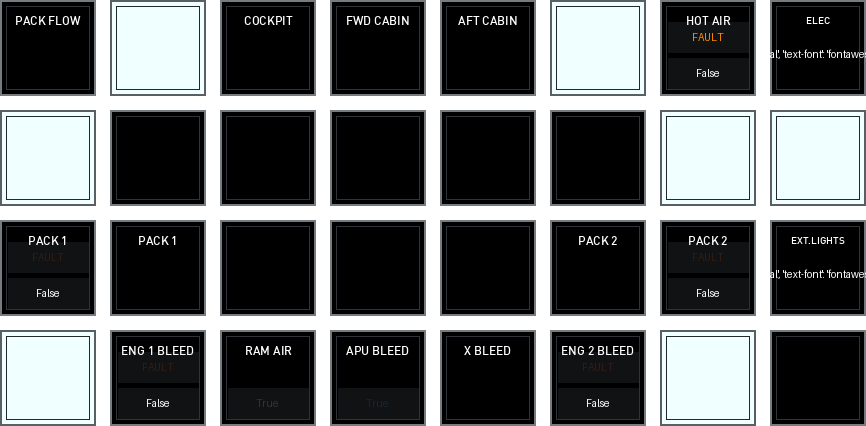

## [Internal lights](intlights.md)

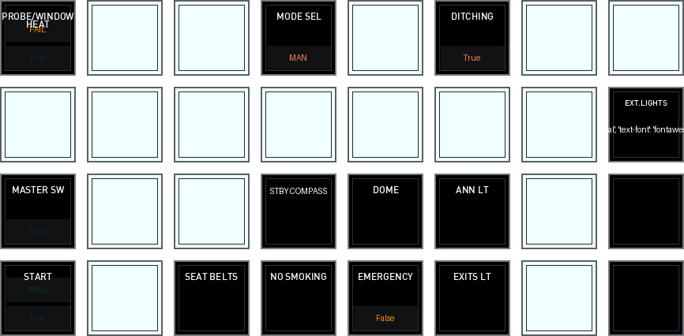

## [Alternate index page](index-alt.md)

## [ADIRS Start/stop](adirs.md)

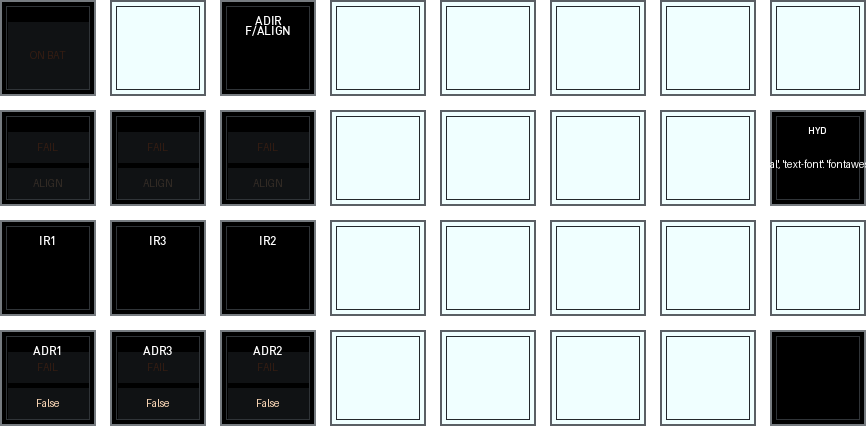

## [Airport Navigator](aptnav.md)

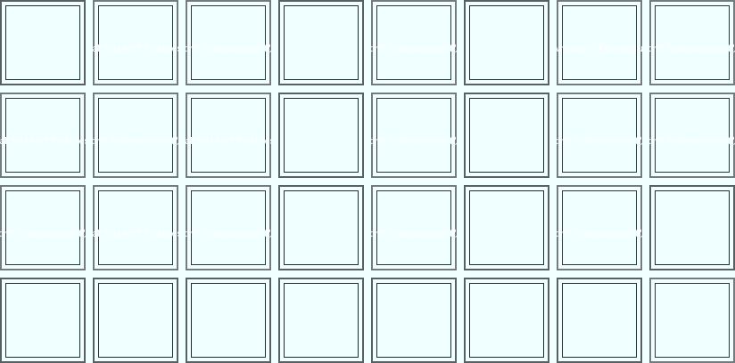

## [Cockpitdecks specific actions, not linked to aircraft](cockpitdecks.md)

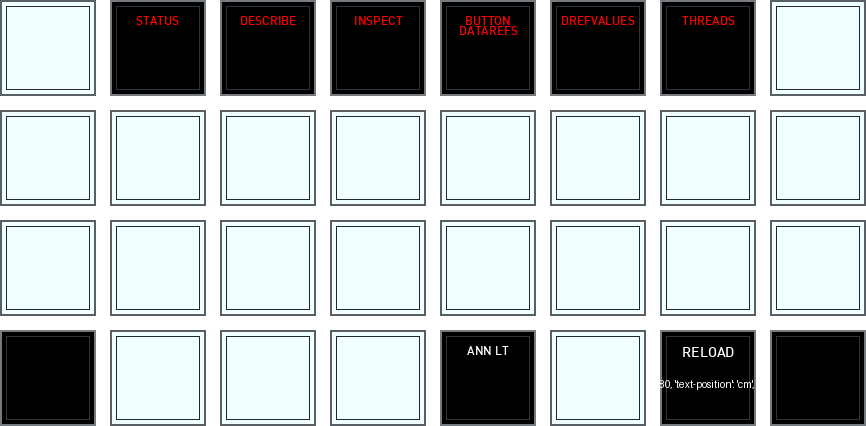

## [Cockpitdecks Special Dashboard of A21N](dashboard.md)

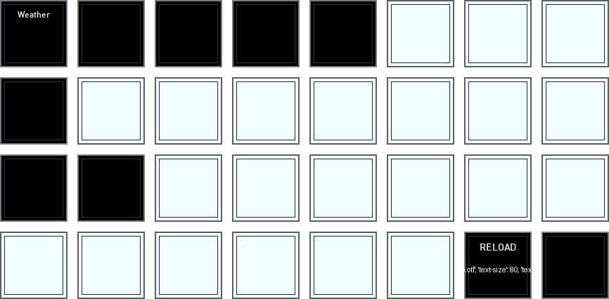

## [Door operations](doors.md)

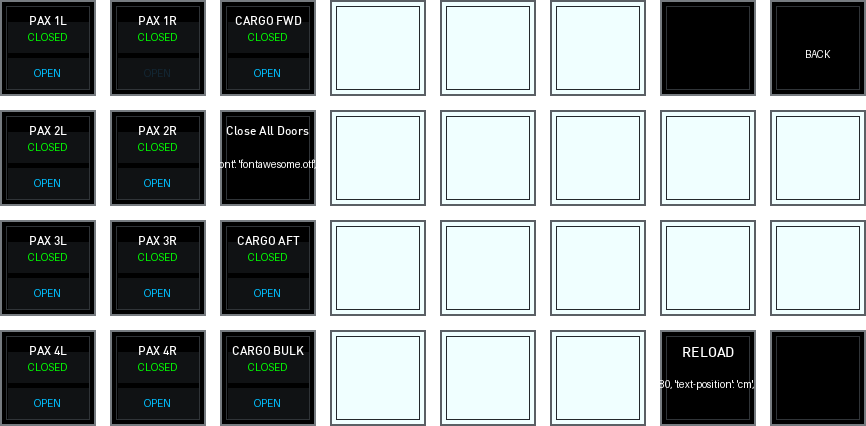

## [ECAM display selector](ecam.md)

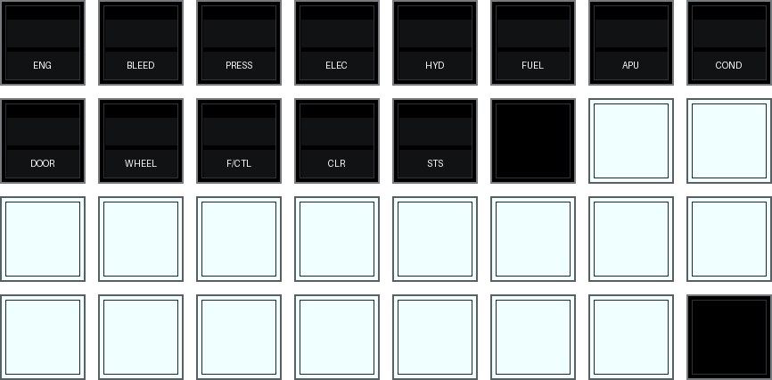

## [EFIS display selector + some FCU commands](efis.md)

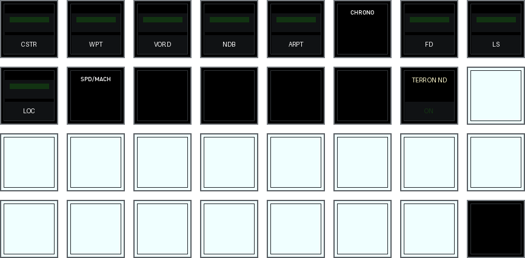

## [Electric panel (ATA 24)](ovrhdelec.md)

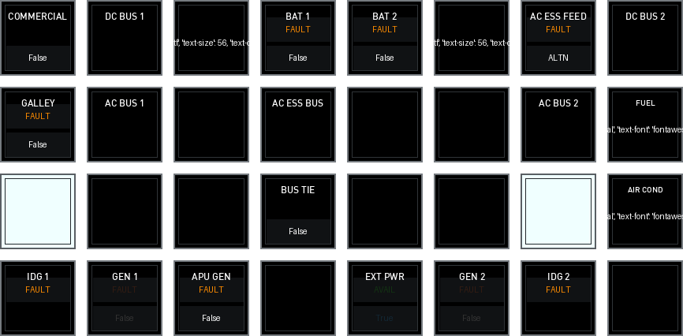

## [Fire panels (ATA 26)](ovrhdfire.md)

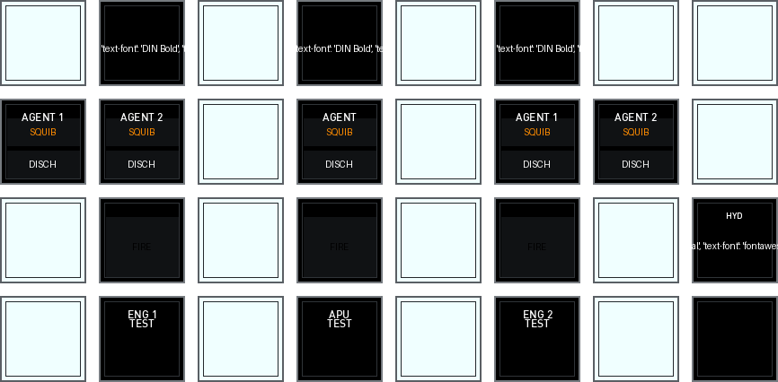

## [Fuel panel (ATA 28)](ovrhdfuel.md)

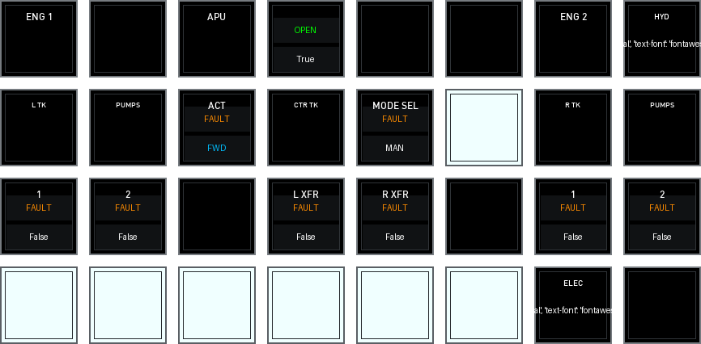

## [Hydraulics (ATA 29)](ovrhdhyd.md)

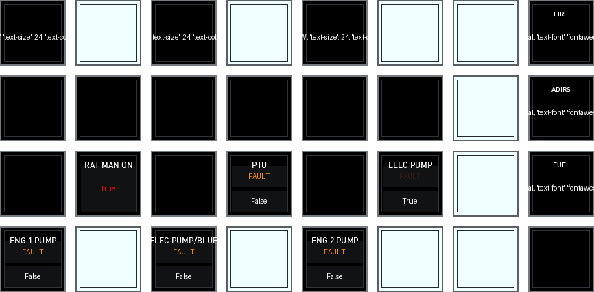

## [Pedestal](piedestal.md)

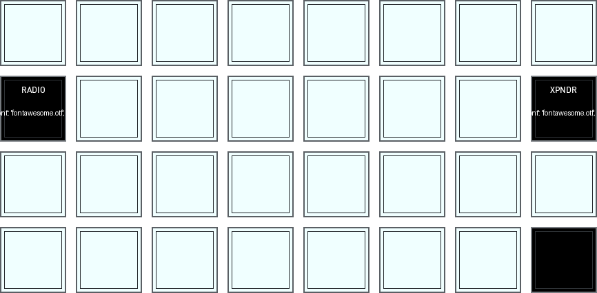

## [All popups on pos. 16 to 28](popups.md)

## [Radio panel](radio.md)

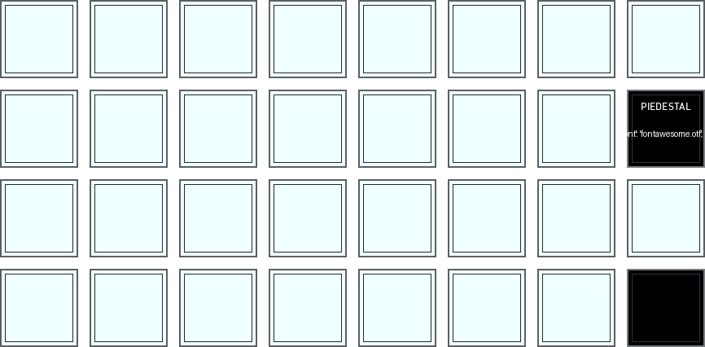

## [ToLiss aircraft specific actions, not available in real aircraft...](toliss.md)

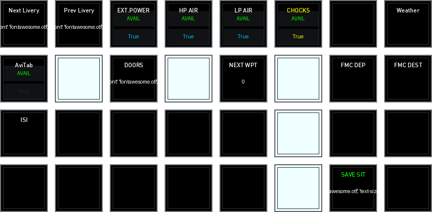

## [X-Plane specific actions, not linked to aircraft](xplane.md)

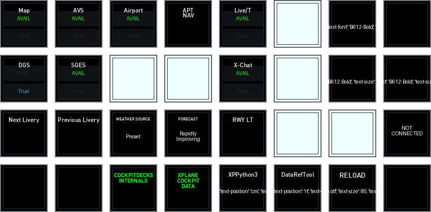

## [Transponder panel](xpndr.md)

