# Van's Aircraft RV-10

!!! note "Auto-generated"
    This page is generated by `scripts/generate_deck_docs.py` — do not edit directly.

Decks for RV-10

### Loupedeck Live

🔧 <strong>Active Development</strong>&emsp;📄 13 pages&emsp;🎮 Loupedeck Live

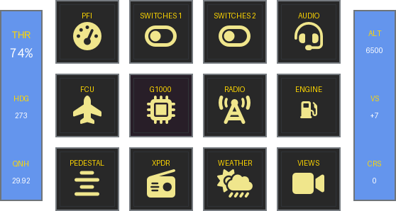

Home

<a href="https://github.com/dlicudi/cockpitdecks-configs/blob/main/decks/vans-aircraft-rv-10/deckconfig/loupedecklive1/index.yaml">index.yaml</a>

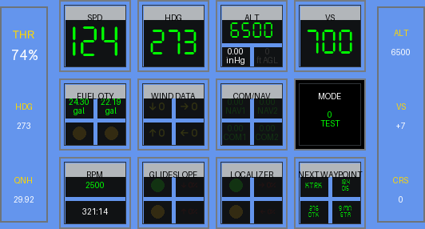

PFI

<a href="https://github.com/dlicudi/cockpitdecks-configs/blob/main/decks/vans-aircraft-rv-10/deckconfig/loupedecklive1/pfi.yaml">pfi.yaml</a>

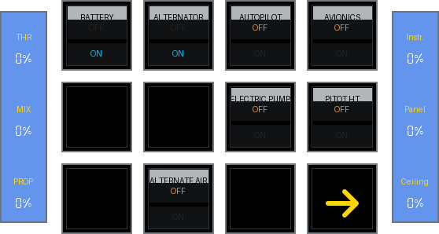

Switches

<a href="https://github.com/dlicudi/cockpitdecks-configs/blob/main/decks/vans-aircraft-rv-10/deckconfig/loupedecklive1/switches.yaml">switches.yaml</a>

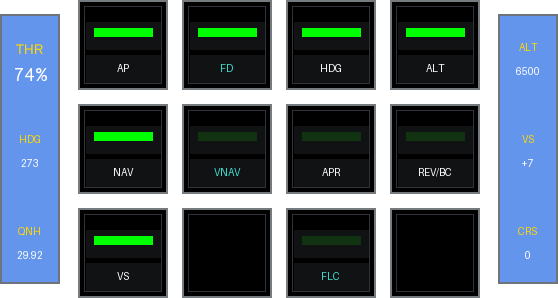

FCU

<a href="https://github.com/dlicudi/cockpitdecks-configs/blob/main/decks/vans-aircraft-rv-10/deckconfig/loupedecklive1/fcu.yaml">fcu.yaml</a>

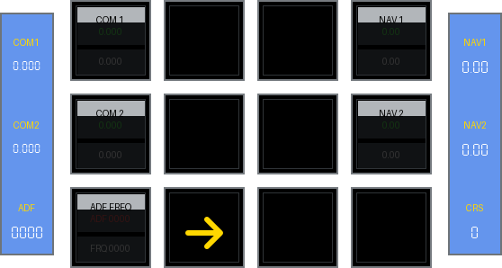

Radio

<a href="https://github.com/dlicudi/cockpitdecks-configs/blob/main/decks/vans-aircraft-rv-10/deckconfig/loupedecklive1/radio.yaml">radio.yaml</a>

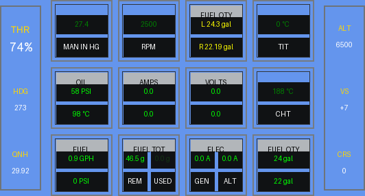

Engine

<a href="https://github.com/dlicudi/cockpitdecks-configs/blob/main/decks/vans-aircraft-rv-10/deckconfig/loupedecklive1/engine.yaml">engine.yaml</a>

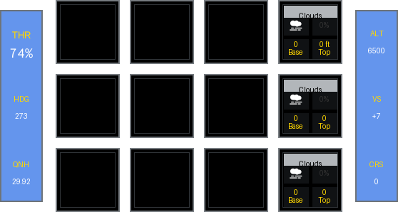

Weather

<a href="https://github.com/dlicudi/cockpitdecks-configs/blob/main/decks/vans-aircraft-rv-10/deckconfig/loupedecklive1/weather.yaml">weather.yaml</a>

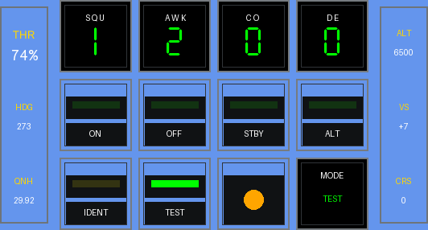

Transponder

<a href="https://github.com/dlicudi/cockpitdecks-configs/blob/main/decks/vans-aircraft-rv-10/deckconfig/loupedecklive1/transponder.yaml">transponder.yaml</a>

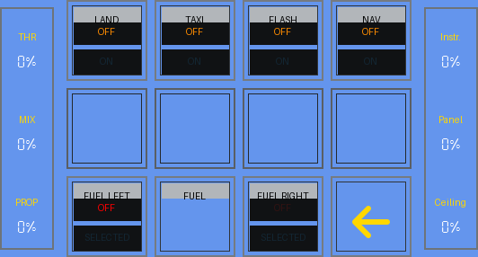

Switches 2

<a href="https://github.com/dlicudi/cockpitdecks-configs/blob/main/decks/vans-aircraft-rv-10/deckconfig/loupedecklive1/switches2.yaml">switches2.yaml</a>

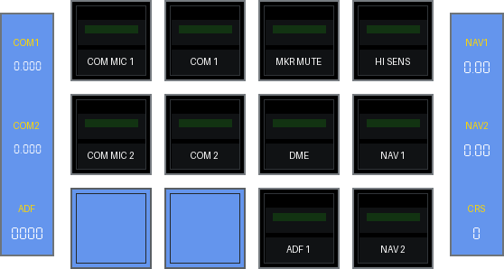

Audio Panel

<a href="https://github.com/dlicudi/cockpitdecks-configs/blob/main/decks/vans-aircraft-rv-10/deckconfig/loupedecklive1/audiopanel.yaml">audiopanel.yaml</a>

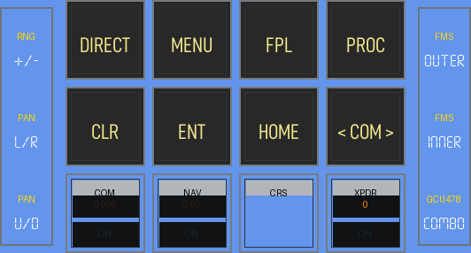

G1000

<a href="https://github.com/dlicudi/cockpitdecks-configs/blob/main/decks/vans-aircraft-rv-10/deckconfig/loupedecklive1/g1000.yaml">g1000.yaml</a>

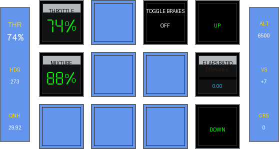

Pedestal

<a href="https://github.com/dlicudi/cockpitdecks-configs/blob/main/decks/vans-aircraft-rv-10/deckconfig/loupedecklive1/pedestal.yaml">pedestal.yaml</a>

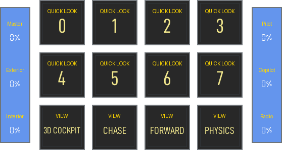

Views

<a href="https://github.com/dlicudi/cockpitdecks-configs/blob/main/decks/vans-aircraft-rv-10/deckconfig/loupedecklive1/views.yaml">views.yaml</a>

### Stream Deck XL

🔧 <strong>Active Development</strong>&emsp;📄 13 pages&emsp;🎮 Stream Deck XL

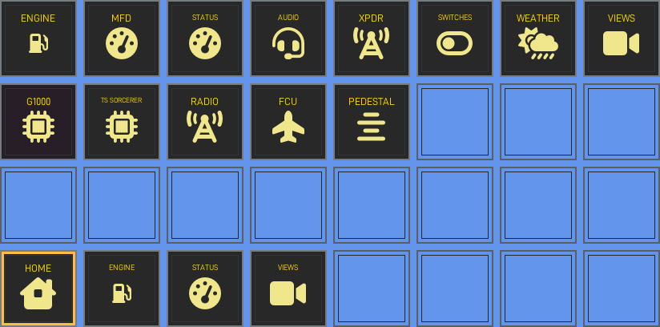

Home

<a href="https://github.com/dlicudi/cockpitdecks-configs/blob/main/decks/vans-aircraft-rv-10/deckconfig/streamdeckxl1/index.yaml">index.yaml</a>

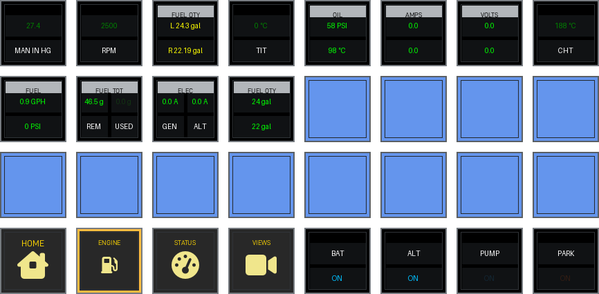

Engine

<a href="https://github.com/dlicudi/cockpitdecks-configs/blob/main/decks/vans-aircraft-rv-10/deckconfig/streamdeckxl1/engine.yaml">engine.yaml</a>

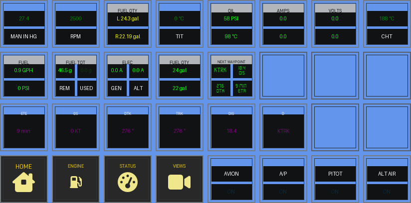

MFD

<a href="https://github.com/dlicudi/cockpitdecks-configs/blob/main/decks/vans-aircraft-rv-10/deckconfig/streamdeckxl1/mfd.yaml">mfd.yaml</a>

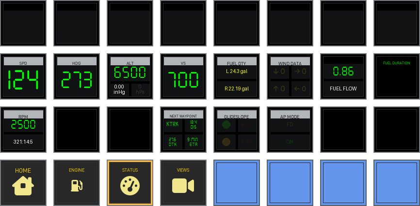

PFI

<a href="https://github.com/dlicudi/cockpitdecks-configs/blob/main/decks/vans-aircraft-rv-10/deckconfig/streamdeckxl1/pfi.yaml">pfi.yaml</a>

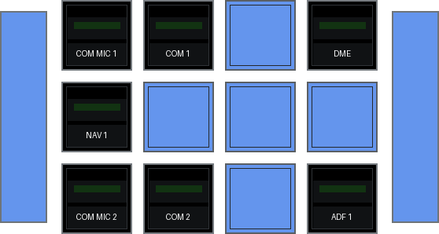

Audio Panel

<a href="https://github.com/dlicudi/cockpitdecks-configs/blob/main/decks/vans-aircraft-rv-10/deckconfig/streamdeckxl1/audiopanel.yaml">audiopanel.yaml</a>

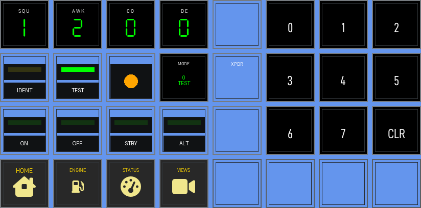

Transponder

<a href="https://github.com/dlicudi/cockpitdecks-configs/blob/main/decks/vans-aircraft-rv-10/deckconfig/streamdeckxl1/transponder.yaml">transponder.yaml</a>

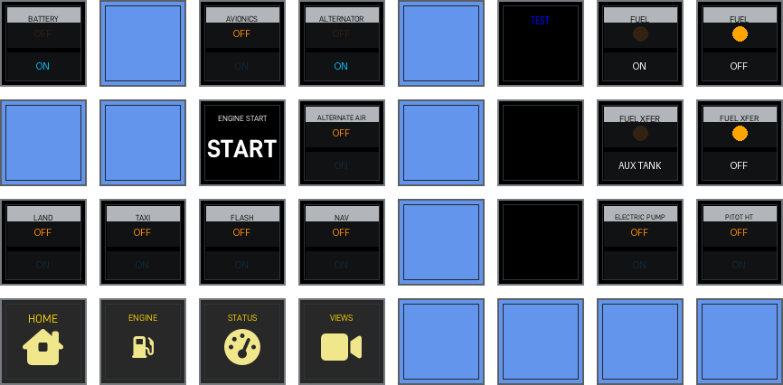

Switches

<a href="https://github.com/dlicudi/cockpitdecks-configs/blob/main/decks/vans-aircraft-rv-10/deckconfig/streamdeckxl1/switches.yaml">switches.yaml</a>

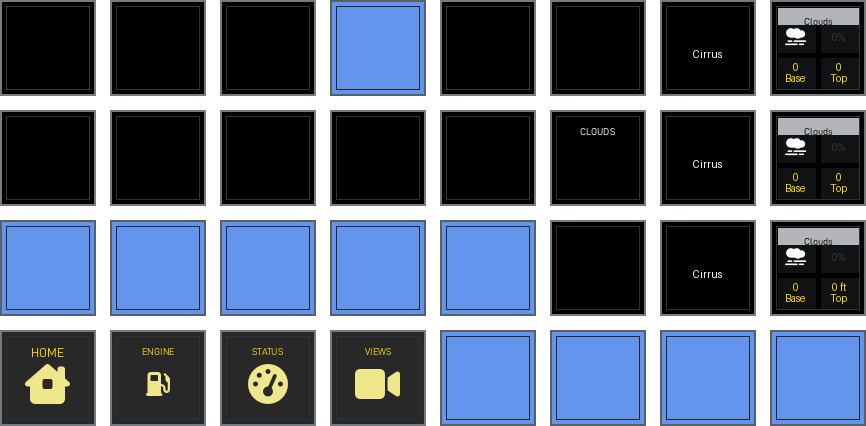

Weather

<a href="https://github.com/dlicudi/cockpitdecks-configs/blob/main/decks/vans-aircraft-rv-10/deckconfig/streamdeckxl1/weather.yaml">weather.yaml</a>

Views

<a href="https://github.com/dlicudi/cockpitdecks-configs/blob/main/decks/vans-aircraft-rv-10/deckconfig/streamdeckxl1/views.yaml">views.yaml</a>

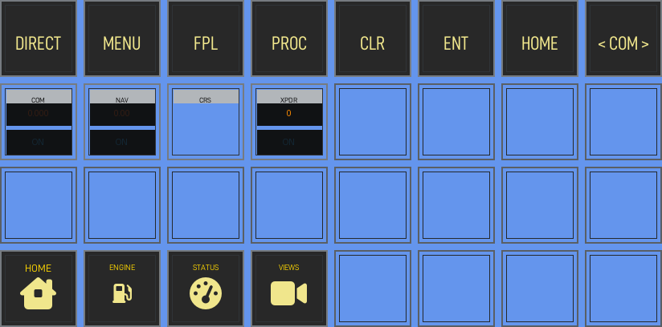

G1000

<a href="https://github.com/dlicudi/cockpitdecks-configs/blob/main/decks/vans-aircraft-rv-10/deckconfig/streamdeckxl1/g1000.yaml">g1000.yaml</a>

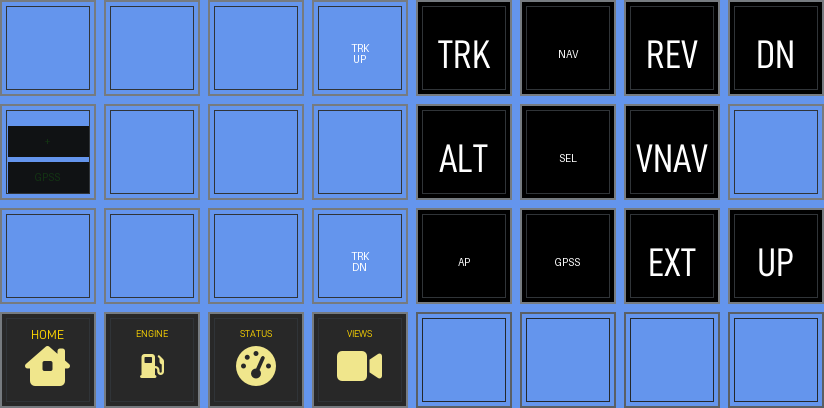

TruTrak Sorcerer

<a href="https://github.com/dlicudi/cockpitdecks-configs/blob/main/decks/vans-aircraft-rv-10/deckconfig/streamdeckxl1/trutrak_sorcerer.yaml">trutrak_sorcerer.yaml</a>

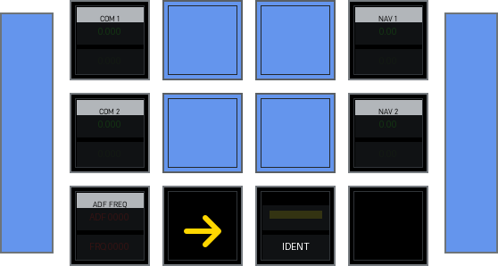

Radio

<a href="https://github.com/dlicudi/cockpitdecks-configs/blob/main/decks/vans-aircraft-rv-10/deckconfig/streamdeckxl1/radio.yaml">radio.yaml</a>

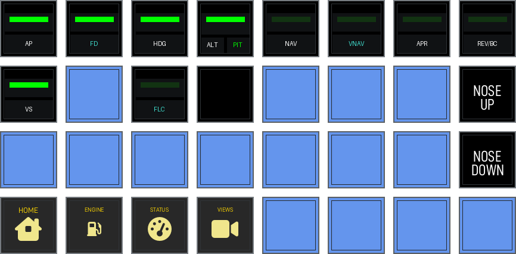

FCU

<a href="https://github.com/dlicudi/cockpitdecks-configs/blob/main/decks/vans-aircraft-rv-10/deckconfig/streamdeckxl1/fcu.yaml">fcu.yaml</a>

