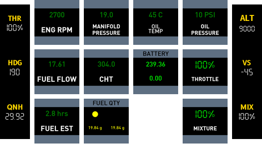
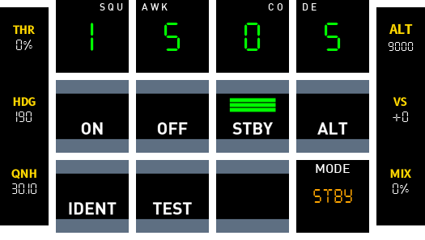

  

    
Cockpitdecks Configs

    <h1>Aircraft-ready deck layouts for X-Plane and Cockpitdecks</h1>
    

      This repository collects practical, flyable deck configurations for real aircraft workflows.
      It is built around X-Plane and tested primarily on the Loupedeck Live.
    

    

      <a class="md-button md-button--primary" href="getting-started/installation/">Get Started</a>
      <a class="md-button" href="decks/">Browse Aircraft</a>
    

  

  

    
  

  

    

      <h2>Designed to fly</h2>
      

        Pages are structured around real in-cockpit tasks: autopilot, engine, radios, transponder,
        PFI, pedestal, weather, and aircraft-specific control panels.
      

    

    

      <h2>Optimised for hardware</h2>
      

        Development and testing focuses on the Loupedeck Live, while many patterns can be re-used
        on other supported decks.
      

    

    

      <h2>Config-first workflow</h2>
      

        `cockpitdecks-configs` is configuration data, not a Python package. Install Cockpitdecks
        with `pip`, then clone this repository and link the aircraft deckconfigs you want to use.
      

    

  

## Supported Aircraft

  <a class="cdx-card" href="decks/cessna-172-sp/">
    
    

      <h3>Cessna 172 SP</h3>
      
Core GA workflow with radios, engine, transponder, weather, and G1000-style pages.

    

  </a>
  <a class="cdx-card" href="decks/cirrus-sr22/">
    
    

      <h3>Cirrus SR22</h3>
      
G1000-oriented layout with FCU, GCU478, PFI, transponder, weather, and system pages.

    

  </a>
  <a class="cdx-card" href="decks/beechcraft-baron-58/">
    
    

      <h3>Beechcraft Baron 58</h3>
      
Twin-engine focus with dedicated engine and aircraft-system coverage.

    

  </a>
  <a class="cdx-card" href="decks/lancair-evolution/">
    
    

      <h3>Lancair Evolution</h3>
      
Glass-cockpit workflow with G1000-style navigation, audio, weather, and systems pages.

    

  </a>
  <a class="cdx-card" href="decks/toliss-airbus-A321-neo/">
    
    

      <h3>ToLiss Airbus A321 NEO</h3>
      
Airliner-oriented layouts for cockpit flows that differ substantially from GA aircraft.

    

  </a>
  <a class="cdx-card" href="decks/aerobask-robin-dr401/">
    
    

      <h3>Aerobask Robin DR401</h3>
      
Another light-aircraft reference layout with practical examples you can adapt.

    

  </a>

## Quick Start

  

    1
    <h3>Install Cockpitdecks</h3>
    
Use `pip` to install the Cockpitdecks build and extras that match your simulator and deck.

  

  

    2
    <h3>Clone Configs</h3>
    
Clone this repository locally and keep the aircraft configs under version control.

  

  

    3
    <h3>Link an Aircraft</h3>
    
Symlink the chosen `deckconfig` into the matching X-Plane aircraft folder and start flying.

  

[Installation Guide](getting-started/installation.md){ .md-button .md-button--primary }
[Development Notes](getting-started/development.md){ .md-button }

## Compatibility

!!! warning "Cockpitdecks build"
    These configs are developed and tested primarily with the [dlicudi/cockpitdecks](https://github.com/dlicudi/cockpitdecks) fork.
    
    Use that fork unless a specific aircraft page says otherwise.

## Examples

  <figure class="cdx-shot">
    
    <figcaption>Home</figcaption>
  </figure>
  <figure class="cdx-shot">
    
    <figcaption>PFI</figcaption>
  </figure>
  <figure class="cdx-shot">
    
    <figcaption>Engine</figcaption>
  </figure>
  <figure class="cdx-shot">
    
    <figcaption>Transponder</figcaption>
  </figure>

## Notes

- The `Examples` section documents stable patterns already in use in configs.
- The `Experimental` section documents custom extensions and prototype behaviours that may require the `dlicudi/cockpitdecks` fork.
